# Private Data Infrastructure (PDI)

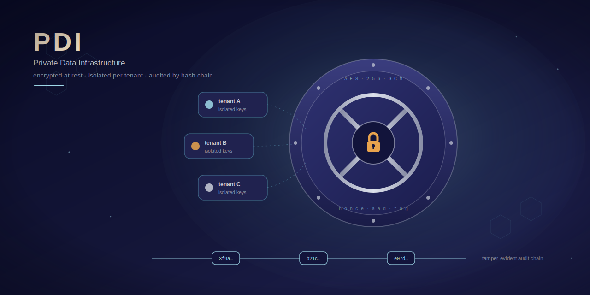

A standalone **secure private data platform** (the "Private Data Infrastructure" enabling seamless support for future AI agent services (**JAN2024 NETWORKED
RESPONSIVE PERSONAL GUIDANCE SYSTEM FOR KNOWN CONDITIONS United States application or CT international application # 19/038,196 ATTORNEY DOCKET # 526.P001 Patent Pending**) through a centralized AI-driven
management system (**FEB2024 SYNTHETIC USER PROFILE MANAGEMENT United States application or CT international application # 19/056,418 ATTORNEY DOCKET # 526.P002 Patent Pending**). When elected
to activate these capabilities, the platform will be equipped to deploy intelligent, role-specific AI agents capable of assisting users,
automating tasks, managing workflows, and enhancing operational decision-making and could potentially run more efficiently, replace
Mundane Outdated Tasks and or Roles within the company.— all within the same secure, private network environment.
A private, encrypted data vault with a
tamper-evident audit log and a tenant registry. It is the infrastructure layer
that AI systems such as QRME and JIM-mini can *optionally* run on top of —
storing sensitive data in PDI's encrypted vault instead of their own databases,
reached only over PDI's HTTP API. Both integrations are live: JIM-mini
vaults its medical and context payloads here, and QRME seals its profile
source material — each as its own tenant with its own token. See
[docs/tandem.md](docs/tandem.md).

## What it provides

- **Private, encrypted data vault** — record values are sealed at rest with
  AES-256-GCM (`pdi/crypto.py`); only ciphertext touches disk. AAD binds each
  record to its tenant + key so ciphertext can't be relocated.
- **Production key management (envelope encryption)** — a key-encryption key
  (KEK) never touches record data; each **key version** owns a random
  data-encryption key (DEK) stored only *wrapped* by the KEK. `POST /keys/rotate`
  mints a new version and re-seals records under it (old versions stay readable
  until `POST /keys/retire`); `GET /keys` reports versions. The KEK lives in the
  env (dev) or a **KMS/HSM** in production (`PDI_KEY_PROVIDER=kms`, a loud
  integration seam — never a silent local fallback).
- **Retention — from a short window up to forever** — per-tenant record
  retention (`7d`/`30d`/`90d`/`180d`/`1y`/`forever`, default **forever**) and a
  global soft-delete recovery window (`PDI_RECOVERY_WINDOW`, default forever);
  `POST /retention/sweep` expires records/purges tombstoned tenants past their
  window — `forever` expires nothing. The audit chain is always kept forever
  (pruning it would break tamper-evidence).
- **Documented audit event schema** — `GET /audit/schema` returns the field
  definitions and the full action catalogue (each action's category and
  meaning); every audit entry carries a derived `category`.
- **Tenant registry** — each integrating system gets a tenant + bearer token;
  data is strictly namespaced per tenant (no cross-tenant reads).
- **Tamper-evident audit log** — every access is recorded in an append-only,
  SHA-256 hash-chained log; `GET /audit/verify` detects any retroactive edit.
- **Disaster-recovery snapshot & restore** — `GET /snapshot` exports
  ciphertext only; `POST /restore` reinserts a snapshot after a loss, with
  AAD still binding every record to its tenant + key.
- **Cloud-model contribution intake** — `POST /contributions` seals
  anonymized model-improvement data from integrating systems under
  `contributions/{source}/…` keys, encrypted and audit-chained;
  `GET /contributions` lists the intake ([docs/cloud-model.md](docs/cloud-model.md)).
- **Position & assistant builder** — `POST /positions` turns a completed
  AI Integration & Role-Mapping Questionnaire (industry-agnostic) into an
  assistant *blueprint* — recommended capabilities, an automation-opportunity
  score, human-in-the-loop guardrails, reskilling paths, and a ready-to-use
  assistant system-prompt. The raw workforce answers are sealed in the vault
  under `positions/{id}`; only the derived blueprint is returned. Decision
  support, never an automated staffing decision
  ([docs/positions.md](docs/positions.md)).
- **Role-based access control** — `POST /tenants/{id}/tokens` issues scoped
  `read`/`write` tokens; read tokens cannot write or delete, and
  `DELETE /tokens/{token}` revokes instantly.
- **Tokens hashed at rest** — only the SHA-256 hash of each tenant/scoped
  token is stored, so a leak of PDI's own database yields no usable
  credential; the plaintext is shown once at issuance. The admin token is
  compared in constant time.
- **Deployment record** — models the on-premises vs. colocation (Tier III+)
  options from the proposal.

## Your data promise

**No raw user data ever leaves your vault.** PDI is the vault.

- Everything stored is AES-256-GCM ciphertext, AAD-bound to its tenant and
  key — one integrating system can never read another's records, and the
  database on disk holds nothing readable.
- PDI's own credentials get the same care as your data: bearer tokens are
  stored only as SHA-256 hashes, shown once at issuance.
- Every access — store, read, erase — lands in a tamper-evident hash-chained
  audit log; `GET /audit/verify` proves nothing was retroactively edited, and
  integrating apps surface a per-user view of it.
- Deletion is real: the owning app purges its keys, tenant deletion offers a
  soft recovery window and then a permanent wipe, and no orphaned ciphertext
  remains. Retention is yours to set — per-tenant, from a short window up to
  **forever** — while the tamper-evident audit chain is always kept forever.
- Deployed on-premises or in colocation — your hardware, your keys
  (`PDI_MASTER_KEY`), your walls.

## Run

```bash
pip install -e .[dev]
export PDI_MASTER_KEY=$(python -c "import base64,os;print(base64.b64encode(os.urandom(32)).decode())")
uvicorn pdi.api:app
```

`PDI_DB` sets the SQLite path (default `pdi.db`). `PDI_MASTER_KEY` is base64 of
32 bytes; in production it belongs in the corporation's own KMS/HSM inside the
private facility (an ephemeral key is generated if unset — dev only).

## Console screens

The PDI operator console in two form factors — a **desktop dashboard** and a **mobile console** — one screen per capability of the vault, in the product's design language (Deep Indigo · Vault Cyan · Soft Silver, SF-style type, liquid-glass cards). It shares the night-indigo universe of QRME and JIM-mini with vault cyan as its accent — one world, three products. Every screen is a self-contained SVG (no fonts, images, or scripts) and maps to a real endpoint.

### Desktop dashboard

Wide, multi-panel operator views — sidebar nav, live tiles, the hash-chain audit table, and the encryption pipeline. Regenerate with `python3 docs/desktop/build.py`.

<table>
  <tr>
    <td align="center" width="50%"><a href="docs/desktop/01-overview.svg">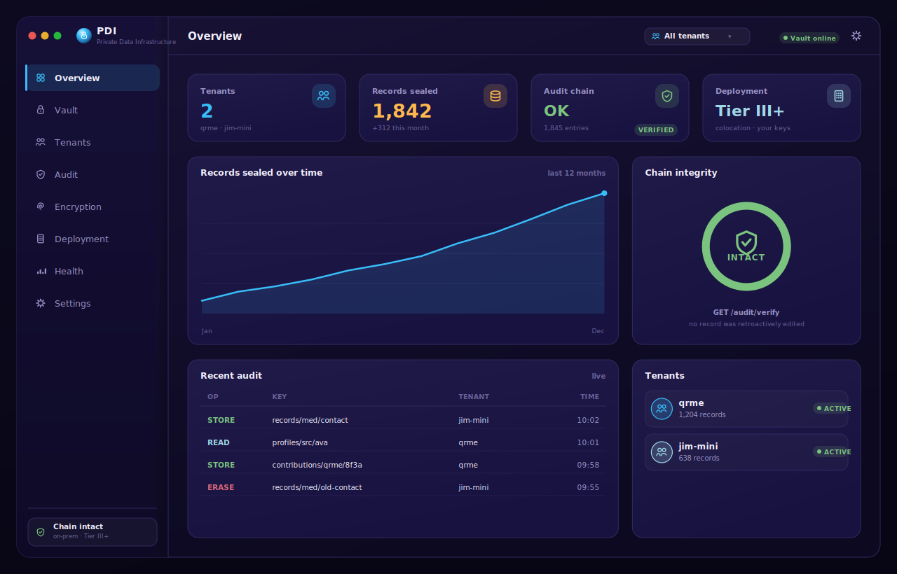</a><br><sub><b>01</b> · Overview</sub></td>
    <td align="center" width="50%"><a href="docs/desktop/02-vault.svg">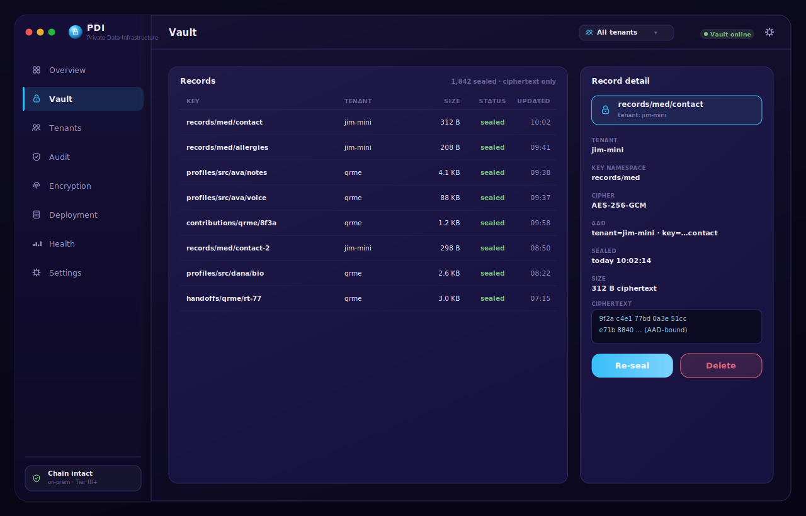</a><br><sub><b>02</b> · Vault</sub></td>
  </tr>
  <tr>
    <td align="center" width="50%"><a href="docs/desktop/03-audit-log.svg">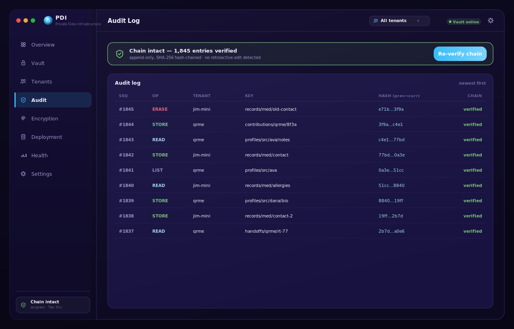</a><br><sub><b>03</b> · Audit Log</sub></td>
    <td align="center" width="50%"><a href="docs/desktop/04-tenants-access.svg">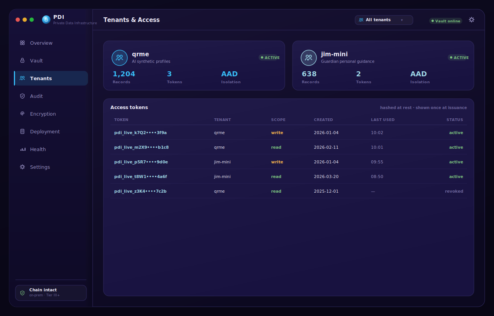</a><br><sub><b>04</b> · Tenants & Access</sub></td>
  </tr>
  <tr>
    <td align="center" width="50%"><a href="docs/desktop/05-encryption-keys.svg">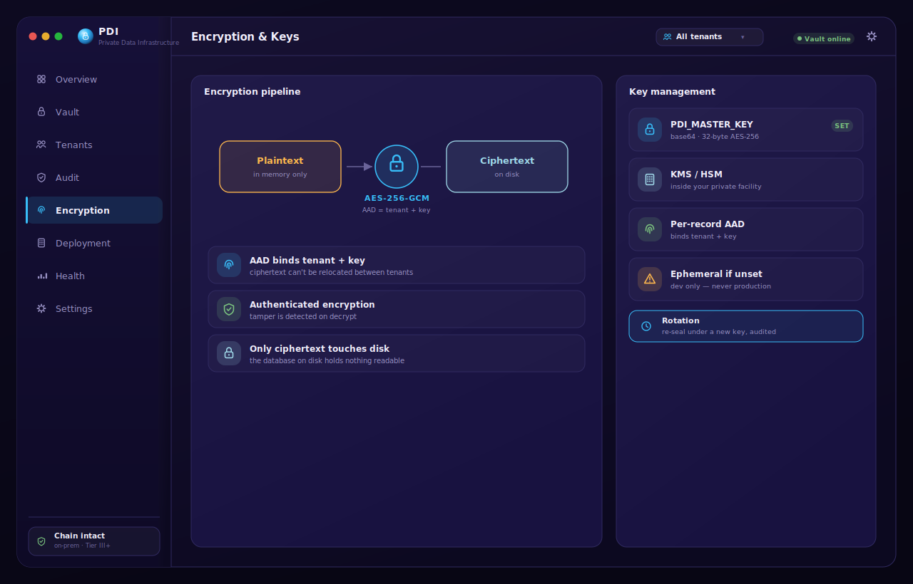</a><br><sub><b>05</b> · Encryption & Keys</sub></td>
    <td align="center" width="50%"><a href="docs/desktop/06-deployment-health.svg">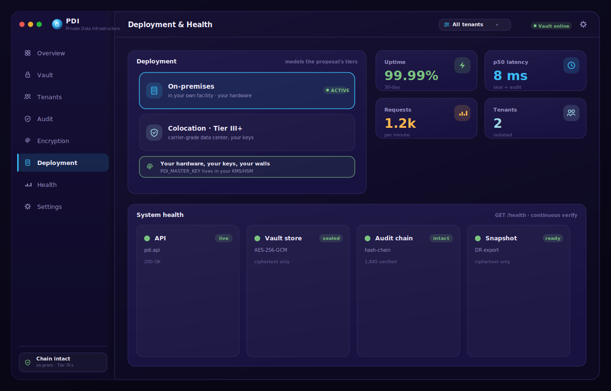</a><br><sub><b>06</b> · Deployment & Health</sub></td>
  </tr>
</table>

### Mobile console

The same system, glanceable on a phone. Regenerate with `python3 docs/screens/build.py`.

**The vault**

<table>
  <tr>
    <td align="center" width="33%"><a href="docs/screens/01-overview.svg">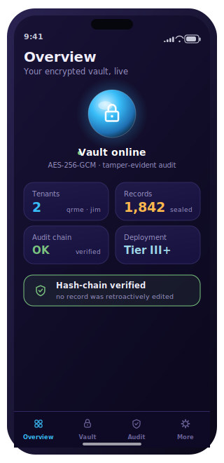</a><br><sub><b>01</b> · Overview</sub></td>
    <td align="center" width="33%"><a href="docs/screens/02-vault.svg">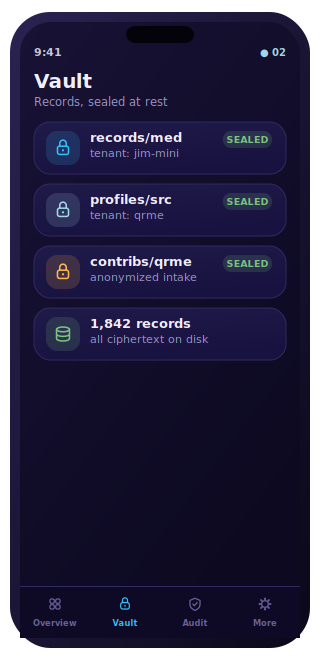</a><br><sub><b>02</b> · Vault</sub></td>
    <td align="center" width="33%"><a href="docs/screens/03-store-a-record.svg">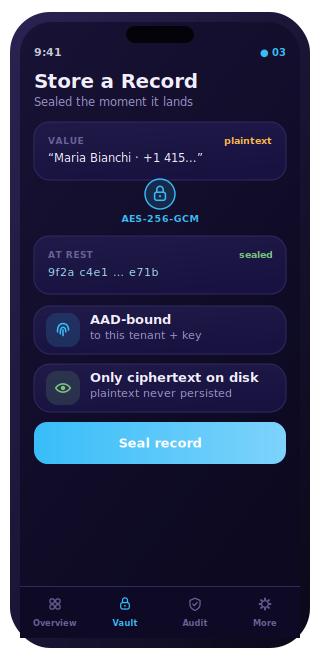</a><br><sub><b>03</b> · Store a Record</sub></td>
  </tr>
  <tr>
    <td align="center" width="33%"><a href="docs/screens/04-encryption.svg">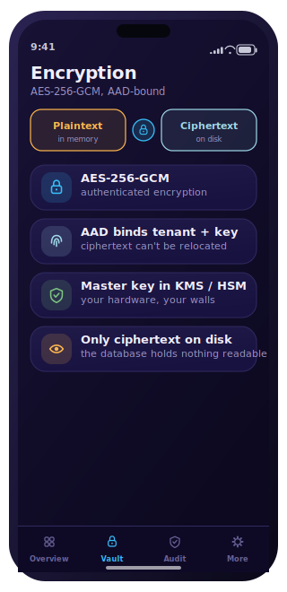</a><br><sub><b>04</b> · Encryption</sub></td>
  </tr>
</table>

**Tenants, access & intake**

<table>
  <tr>
    <td align="center" width="33%"><a href="docs/screens/05-tenants.svg">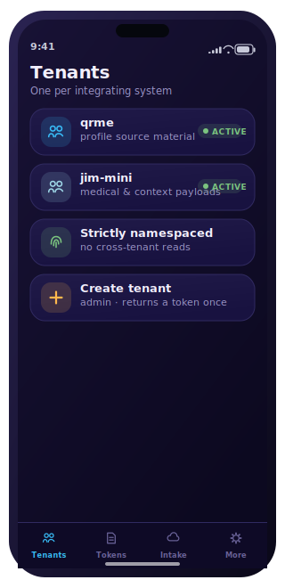</a><br><sub><b>05</b> · Tenants</sub></td>
    <td align="center" width="33%"><a href="docs/screens/06-create-tenant.svg">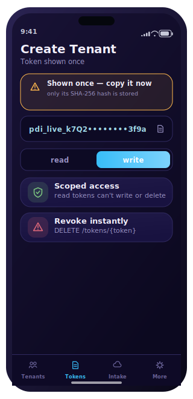</a><br><sub><b>06</b> · Create Tenant</sub></td>
    <td align="center" width="33%"><a href="docs/screens/07-access-control.svg">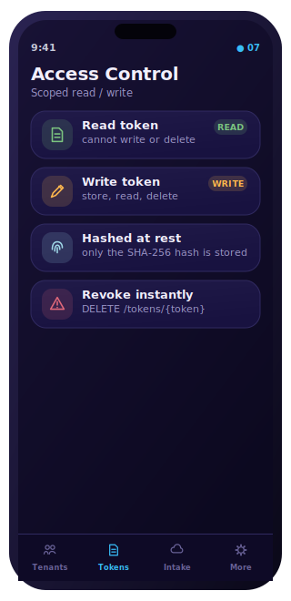</a><br><sub><b>07</b> · Access Control</sub></td>
  </tr>
  <tr>
    <td align="center" width="33%"><a href="docs/screens/10-contributions.svg">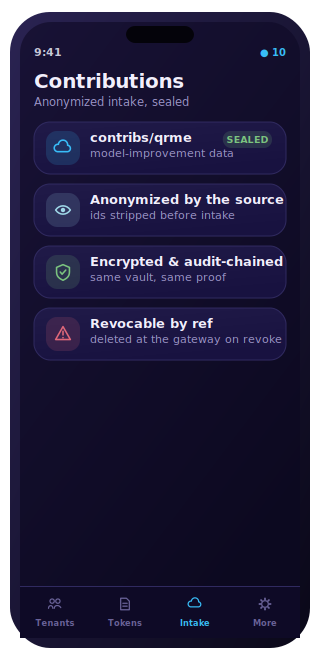</a><br><sub><b>10</b> · Contributions</sub></td>
  </tr>
</table>

**Audit & integrity**

<table>
  <tr>
    <td align="center" width="33%"><a href="docs/screens/08-audit-log.svg">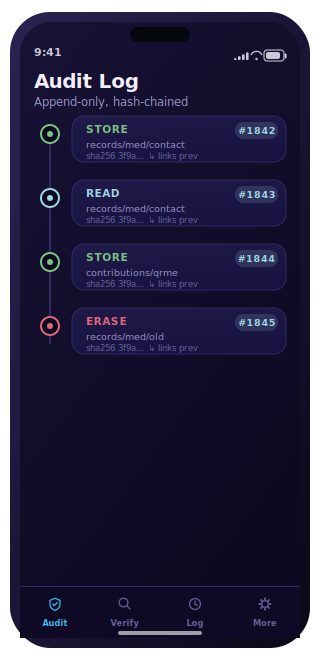</a><br><sub><b>08</b> · Audit Log</sub></td>
    <td align="center" width="33%"><a href="docs/screens/09-verify-chain.svg">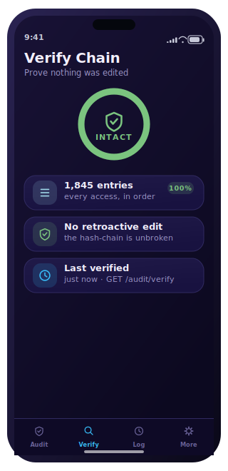</a><br><sub><b>09</b> · Verify Chain</sub></td>
  </tr>
</table>

**Operations & deployment**

<table>
  <tr>
    <td align="center" width="33%"><a href="docs/screens/11-snapshot-restore.svg">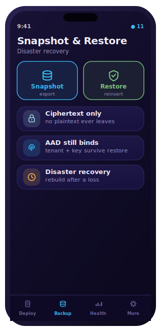</a><br><sub><b>11</b> · Snapshot & Restore</sub></td>
    <td align="center" width="33%"><a href="docs/screens/12-deployment.svg">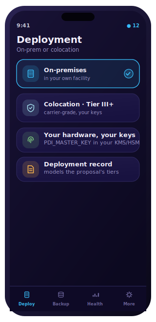</a><br><sub><b>12</b> · Deployment</sub></td>
    <td align="center" width="33%"><a href="docs/screens/13-key-management.svg">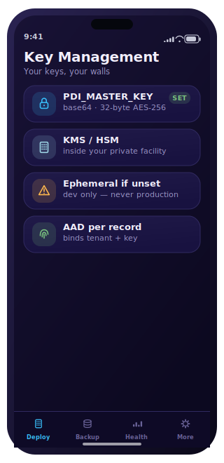</a><br><sub><b>13</b> · Key Management</sub></td>
  </tr>
  <tr>
    <td align="center" width="33%"><a href="docs/screens/17-system-health.svg">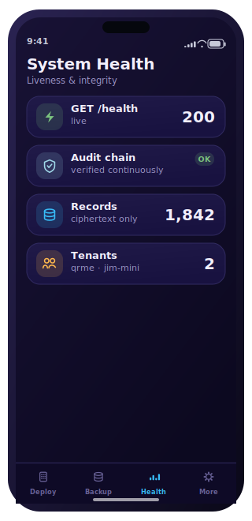</a><br><sub><b>17</b> · System Health</sub></td>
  </tr>
</table>

**Isolation, the promise & the tandem**

<table>
  <tr>
    <td align="center" width="33%"><a href="docs/screens/14-tenant-isolation.svg">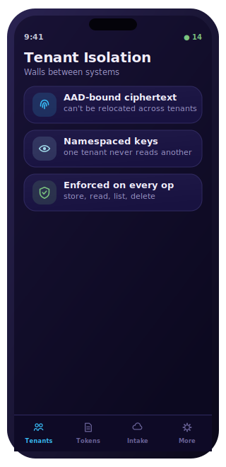</a><br><sub><b>14</b> · Tenant Isolation</sub></td>
    <td align="center" width="33%"><a href="docs/screens/15-data-promise.svg">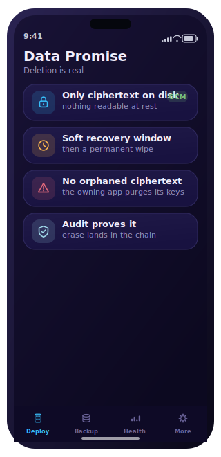</a><br><sub><b>15</b> · Data Promise</sub></td>
    <td align="center" width="33%"><a href="docs/screens/16-your-data.svg">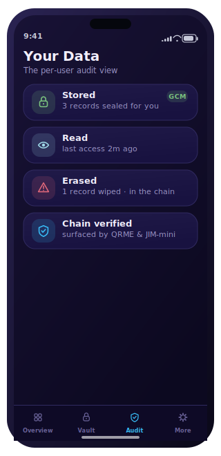</a><br><sub><b>16</b> · Your Data</sub></td>
  </tr>
  <tr>
    <td align="center" width="33%"><a href="docs/screens/18-tandem.svg">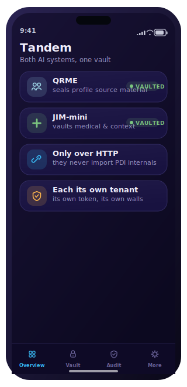</a><br><sub><b>18</b> · Tandem</sub></td>
    <td align="center" width="33%"><a href="docs/screens/19-design-system.svg">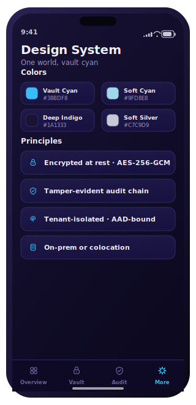</a><br><sub><b>19</b> · Design System</sub></td>
  </tr>
</table>

**First-run setup**

The first-run journey runs **23 Welcome → 22 Log In → 24 Key Setup → 25 Grant Access → 26 Connect Systems → 27 All Set**, then opens the console.

<table>
  <tr>
    <td align="center" width="33%"><a href="docs/screens/23-welcome.svg">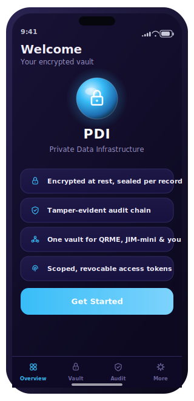</a><br><sub><b>23</b> · Welcome</sub></td>
    <td align="center" width="33%"><a href="docs/screens/24-key-setup.svg">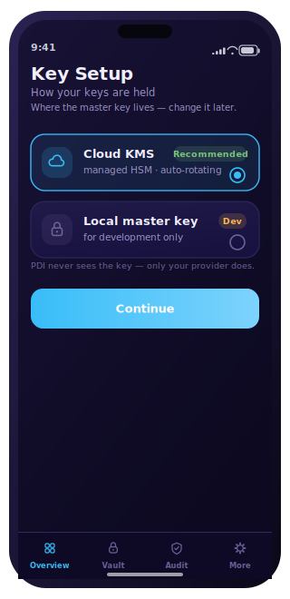</a><br><sub><b>24</b> · Key Setup</sub></td>
    <td align="center" width="33%"><a href="docs/screens/25-grant-access.svg">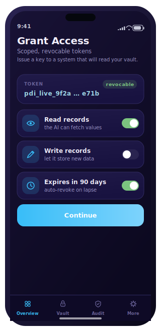</a><br><sub><b>25</b> · Grant Access</sub></td>
  </tr>
  <tr>
    <td align="center" width="33%"><a href="docs/screens/26-connect-systems.svg">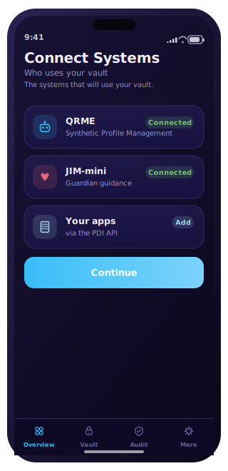</a><br><sub><b>26</b> · Connect Systems</sub></td>
    <td align="center" width="33%"><a href="docs/screens/27-all-set.svg">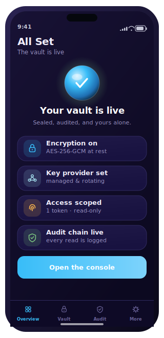</a><br><sub><b>27</b> · All Set</sub></td>
  </tr>
</table>

**Operator session lifecycle**

<table>
  <tr>
    <td align="center" width="33%"><a href="docs/screens/20-sign-in.svg">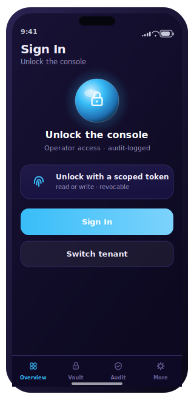</a><br><sub><b>20</b> · Sign In</sub></td>
    <td align="center" width="33%"><a href="docs/screens/21-sign-out.svg">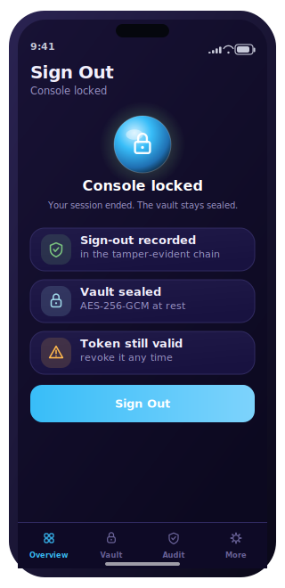</a><br><sub><b>21</b> · Sign Out</sub></td>
    <td align="center" width="33%"><a href="docs/screens/22-log-in.svg">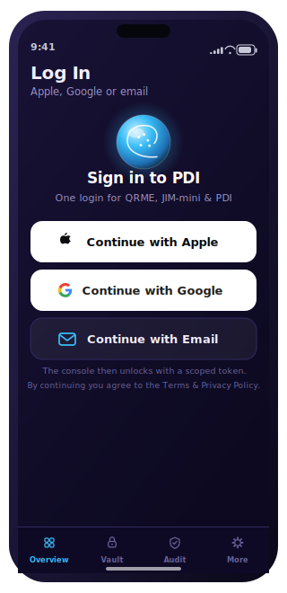</a><br><sub><b>22</b> · Log In</sub></td>
  </tr>
</table>

**Connectors — social platforms & AI-integrated apps**

<table>
  <tr>
    <td align="center" width="33%"><a href="docs/screens/28-connectors.svg">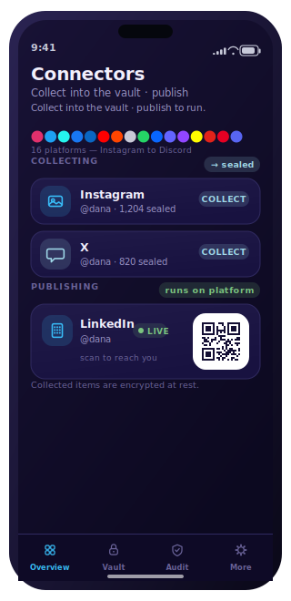</a><br><sub><b>28</b> · Connectors</sub></td>
    <td align="center" width="33%"><a href="docs/screens/29-connected-apps.svg">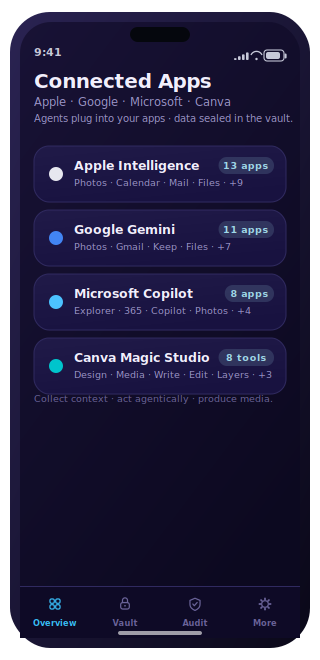</a><br><sub><b>29</b> · Connected Apps</sub></td>
    <td align="center" width="33%"></td>
  </tr>
</table>


## API

| Endpoint | Auth | Purpose |
|---|---|---|
| `GET /health` | — | Liveness |
| `POST /deployments` | admin | Record a deployment (on-premises / colocation) |
| `POST /tenants` | admin | Create a tenant (optional `retention`); returns its bearer token once |
| `PUT /tenants/{id}/retention` | admin | Set record retention (`7d`…`1y`\|`forever`\|days) |
| `PUT /records` | tenant (write) | Store `{key, value}` — value sealed at rest |
| `GET /records/{key}` | tenant | Retrieve and decrypt a value (keys may be path-namespaced) |
| `DELETE /records/{key}` | tenant (write) | Delete a record |
| `GET /records` | tenant | List this tenant's keys |
| `POST /contributions` | tenant (write) | Seal an anonymized cloud-model contribution (optional `ref`) |
| `GET /contributions` | tenant | List contribution keys |
| `DELETE /contributions/{ref}` | tenant (write) | Revoke a contribution by its anonymous ref |
| `POST /positions` | tenant (write) | Seal a role-mapping intake and return the assistant blueprint |
| `GET /positions` | tenant | List saved position ids |
| `GET /positions/{id}` | tenant | Fetch a saved position's blueprint |
| `GET /snapshot` | tenant | DR export (ciphertext only) |
| `POST /keys/rotate` | admin | Rotate the key version (re-seals records; `?reseal=false` to defer) |
| `GET /keys` | admin | Key versions + provider |
| `POST /keys/reseal` · `POST /keys/retire` | admin | Re-seal records / retire old versions |
| `GET /retention` | admin | Retention policy (recovery window + per-tenant) |
| `POST /retention/sweep` | admin | Enforce retention now (expire/purge past-window; `forever` = no-op) |
| `GET /audit` | tenant | This tenant's audit entries (each with a `category`) |
| `GET /audit/verify` | tenant | Verify the hash-chain is intact |
| `GET /audit/schema` | — | Audit event schema: fields + action catalogue |

Tenant endpoints require `Authorization: Bearer pdi_...`.

## Tandem client

`pdi/client.py` (`PDIClient`) is the small library an AI system uses to store
secrets in PDI over HTTP — e.g. JIM-mini keeping a user's emergency contact in
the encrypted vault instead of its own database. The AI systems never import
PDI internals.

## Configuration

| Variable | Default | Purpose |
|---|---|---|
| `PDI_DB` | `pdi.db` | SQLite database path (ciphertext only) |
| `PDI_MASTER_KEY` | — | Key-encryption key (KEK): base64 of 32 bytes. Wraps the per-version DEKs; ephemeral if unset (dev only) |
| `PDI_KEY_PROVIDER` | `env` | `env` reads `PDI_MASTER_KEY`; `kms` routes the KEK to a KMS/HSM (see `KmsKeyProvider`) |
| `PDI_KMS_KEY_ID` | — | KMS/HSM key id used by the `kms` provider |
| `PDI_RECOVERY_WINDOW` | `forever` | Soft-deleted tenants purge after this window on sweep (`7d`…`1y`\|`forever`\|days) |
| `PDI_ADMIN_TOKEN` | — | Guards admin endpoints; unset = open (dev only) |

## Test

```bash
pytest pdi/tests
```

Covers encryption round-trip, encryption-at-rest (plaintext never on disk),
tenant isolation, the hash-chained audit log (including tamper detection), and
a tandem run where a simulated AI system uses `PDIClient`.

## Out of scope for v1

Real facility provisioning, HSM/KMS integration, replication/redundancy across
sites, and billing — represented structurally (deployment record, snapshot
export), not as live infrastructure.

## Architecture

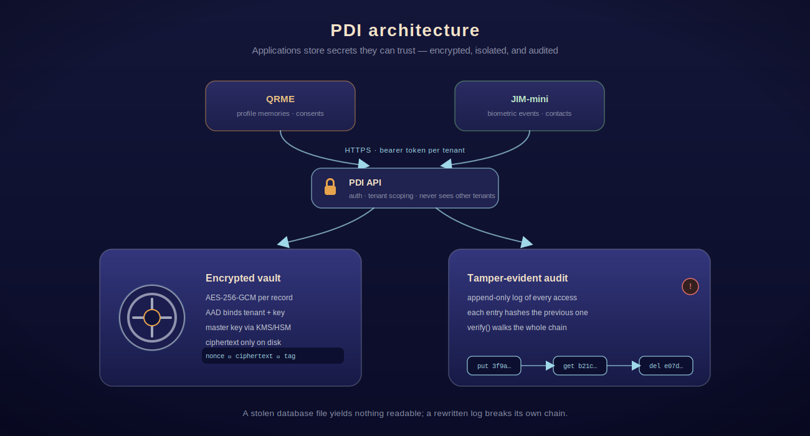

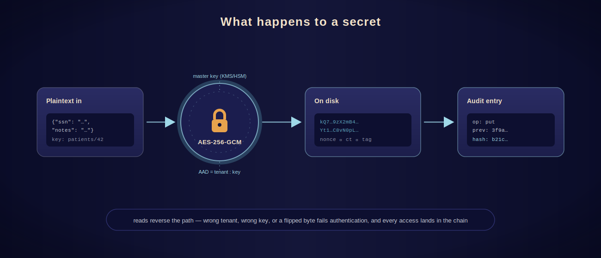

## Related projects

Three separate products, each standalone, interoperating only over HTTP —
see [docs/tandem.md](docs/tandem.md) for the full architecture:

- [**qrme**](https://github.com/davidsbianchi1984/qrme) — AI synthetic
  profiles: relationship-aware, remembered, moderated.
- [**jim-mini**](https://github.com/davidsbianchi1984/jim-mini) — Guardian
  personal guidance: monitor, predict, guide, escalate; can delegate
  specialist guidance to QRME.
- [**pdi**](https://github.com/davidsbianchi1984/pdi) — Private Data
  Infrastructure: the encrypted vault both AI systems can run on top of.

## License

MIT © 2026 David Bianchi — see [LICENSE](LICENSE).
