# Private Data Infrastructure (PDI)

**The vault under everything: encrypted storage, tamper-evident memory,
and a resident intelligence that works without the data ever leaving.**

PDI is private data infrastructure — a product on its own, and the
storage layer the other two run on top of. Sensitive data lives sealed in
PDI's encrypted vault instead of an application's own database, reached
only over PDI's HTTP API, one tenant and one token per integrating
system. Both tandem integrations are live: JIM-mini vaults its medical
and context payloads here, and QRME seals its profiles' source material
and memories — see [docs/tandem.md](docs/tandem.md). A deployment that
runs PDI alone gets the same thing every tenant gets: custody it can
prove.

**Current release: v3.1.5** — see [CHANGELOG.md](CHANGELOG.md).

PDI is one of three products versioned and released together:
[QRME](https://github.com/davidsbianchi1984/qrme) (synthetic profiles) and
[JIM-mini](https://github.com/davidsbianchi1984/jim-mini) (health guardian).
One version number names one tested combination of all three.

**Patents.** The platform is designed to host the AI agent services covered
by two pending applications: *Networked Responsive Personal Guidance System
for Known Conditions* (US 19/038,196, published as US 2025/0246290 A1) and
*Synthetic User Profile Management* (US 19/056,418, published as
US 2025/0265659 A1). See
[docs/invention-disclosure.md](docs/invention-disclosure.md).

## For examination

This page is written to be checked, not believed, and it is written for
an examiner. Every section grounds the product in three things: the
**technical problem** in the machine, the **implementation** as built —
named modules, named constants, named tests — and a **measurable effect**
that follows from the implementation and not from a description of it.
Every `.png` under
`docs/screens/` and `docs/walkthrough/` is a capture of the running
console taken by `tools/shoot_screens.py` and `tools/walkthrough.py`
against a live backend; an `.svg` is a design drawing and is captioned
as one. The suite (`python -m pytest`) reads this file — the release
banner, the release table, the gallery, the stated screen count and the
closing passage fail the build when they drift from the product.

### Components

| Component | Where | What it is |
|---|---|---|
| API server | `pdi/` | FastAPI over SQLite: the vault, keys, tenants, tokens, retention, snapshot and restore, the audit chain, the offline gate. |
| The seal | `pdi/crypto.py`, `pdi/vault.py` | AES-256-GCM per record with the tenant and key version bound into the AAD; envelope keys under a KEK that production points at a KMS or HSM. |
| The record | `pdi/audit.py` | The append-only, SHA-256 hash-chained log every access lands on, verified on demand. |
| The resident | `pdi/resident.py` | A local model that answers from sealed records without the records leaving: search, grounded asks, standing tasks, and the corpus it learns from. |
| The capture's eyes and ears | `pdi/renderer.py`, `pdi/ears.py`, `pdi/scrape.py` | A page captured as a person meets it, and video arriving as words. |
| Custody in the physical world | `pdi/beacons.py`, `pdi/gate.py`, `pdi/roster.py` | Printed custody beacons, a finder's scan as a receipt on the chain, and the agent at the facility gate with its on-call roster. |
| Succession and continuity | `pdi/bequests.py`, `pdi/acceptance.py`, `pdi/transfers.py` | Vault access that begins at attestation, and reviewer-gated succession. |
| The desk | `pdi/positions.py`, `pdi/assistant.py` | The position and assistant builder: a questionnaire into a blueprint, raw answers sealed. |
| Operator console | `app/` | React and TypeScript, ten languages; the 20 numbered screens photographed below. |
| iOS, Android, Windows shells, desktop app | `native/`, `python -m pdi desktop` | Native shells at parity with the console; packaged installers on the releases page. |
| The tandem | `pdi/qrme_client.py`, the JIM-mini and QRME clients | One tenant and one token per integrating system; both integrations live. |

### The mechanisms on file

The numbered mechanisms in
[docs/invention-disclosure.md](docs/invention-disclosure.md). Each row
names the technical problem in the machine, the particular structure this
code uses to solve it, what that structure changes about how the machine
behaves, and where the structure is reduced to practice and held by a
test. None of them is a business arrangement written down in software or
a step a person could take with a filing cabinet; each is a specific
arrangement of keys, records, credentials and audit entries inside a
running system, and each is photographed on the screens below.

| § | The technical problem | The particular solution, as built | What it changes in the machine | Reduced to practice in |
|---|---|---|---|---|
| 1 | Three products that share a person's records must each hold them, and whichever holds them in the clear is the one a breach reads. | One **individually keyed encrypted vault** is the seal point for the family: a guardian's biometric events, tandem exchanges and clinical captures are sealed at write time under an envelope whose key-encryption key never touches a record, with per-record provenance and a hash-chained audit history read back through a custody viewer scoped to the record owner. | The products keep pointers and audit entries; the plaintext exists only inside the vault's decryption path. One tenant's rows are unreadable to another, and a wiped tenant is gone from every table. | `pdi/crypto.py`, `pdi/vault.py` — `test_one_tenant_cannot_read_another.py`, `test_a_wiped_tenant_is_gone_from_every_table.py`, `test_the_other_tenants_shelf.py` |
| 2 | Whether a person's data is vaulted is decided by how a server was deployed, which the person cannot see and an operator can change. | Custody is a **property of the plan**: a free platform-custody tier holds nothing private and says so at every surface, paid tiers seal every write; the gate sits at the plan boundary, so a deployment cannot change a person's custody without changing their plan. | The custody promise a screen shows is the custody the write path enforces, and a BAA is a plan property the same way. | `pdi/compliance.py`, `pdi/baa.py` — `test_baa.py`, `test_hosting.py` |
| 3 | Moving a vault from shared hosting to a person's own device changes the API the products call, so upgrading custody breaks the products. | The **same vault API** is served across free colocation, leased space, self-hosting and the person's own device; the hosting mode is a property of the deployment the clients read, not a different surface, and admin key rotation is performed from the product apps themselves. | Custody can be upgraded without any product changing a call; the mode is reported and tested rather than assumed. | `pdi/hosting.py` — `test_hosting.py`, `test_hosting_modes.py`, `test_byok.py` |
| 4 | Access granted in advance for a person's absence is a credential that exists now, and a credential that exists can be used now. | A **bequest** names a grantee, a bounded set of key scopes and a condition, and **no credential exists until the condition is attested**: the grant token is minted at activation by the operator against a mandatory attestation reference recorded in the audit chain; it is read-only, bounded to its scopes, revocable, and a customer-held key stays part of the estate. | A dormant bequest cannot be exercised, stolen or guessed, because there is nothing to steal; activation leaves an audit entry naming what was attested. | `pdi/bequests.py` — `test_bequests.py`, `test_the_grant_outlived_the_vault.py` |
| 6 | A profile whose owner cannot authorize anything has no way to change hands, and an unwatched profile keeps acting in the owner's name. | Succession is **gated by a reviewer holding a verification reference** rather than the owner's token; with no named successor the profile sunsets to a frozen memorial; the same attestation reference joins the guardian's silence vigil (JIM-mini) and the vault's bequest activation (PDI). | One attested event carries a person's absence through all three products, and a profile is never an orphan that keeps posting. | `pdi/acceptance.py`, `pdi/transfers.py` — `test_transfers.py`, `test_a_guarantee_nobody_reruns_is_marketing.py`; QRME `test_memorial.py` |
| — | A journal of what was done to a tenant's records is a second way to read those records, and a second door is a door the audit does not see. | The operations journal is **a view over the ordinary audited decryption path**: every journal entry is read exactly as a direct read would be, so each journal read lands on the tamper-evident hash-chained audit log. | The journal adds no door; reading the journal is itself in the journal. | `pdi/audit.py`, `GET /operations` — `test_operations.py` |

### Where each highlight is proven

Each row: the technical problem, the implementation with its own numbers, the test that holds it, and the photograph.

| Highlight | The technical problem | As built, with its numbers | Test | Screen |
|---|---|---|---|---|
| Nothing leaves the host | A privacy promise made in prose leaks through one forgotten HTTP call. | `pdi/offline.py` refuses every non-loopback connect at the socket layer while the gate is up. | `test_nothing_leaves_the_host.py` | 09 |
| Keys rotate and retire; retention is stated and swept | A key that never rotates is a key whose compromise is permanent; a retention promise nobody sweeps is a sentence. | `pdi/crypto.py` seals each record under AES-256-GCM with a per-scope data key wrapped by the key-encryption key (12-byte nonce, the key never on a record), caches the KEK for `KEK_CACHE_SECONDS = 300`; `pdi/retention.py` keeps `WINDOWS` of 7, 30, 90, 180 and 365 days or forever and sweeps them. | `test_keymgmt_retention.py`, `test_byok.py` | 06 |
| Custody beacons and the gate | A code printed at a venue that resolves after custody changed is a leak in ink. | `pdi/beacons.py` and `pdi/gate.py` resolve a beacon only while its custody row stands; taking it down deactivates rather than deletes. | `test_beacons.py` | 12 |
| The audit chain | A log an operator can edit is a log of what the operator wanted. | `pdi/audit.py` chains every event by SHA-256 over the previous hash from a 64-zero genesis; a changed row breaks every hash after it. | `test_a_guarantee_nobody_reruns_is_marketing.py` | 05 |
| The resident answers from sealed records | A model that answers from its training answers about somebody else. | `pdi/resident.py` runs inference inside the vault's own process over decrypted records that never leave it. | `test_the_resident_learns_from_the_corpus.py` | 20 |
| The capture grows ears | A vault that keeps only text loses what was said. | `pdi/ears.py` turns audio and video into words on the deployment's own machine before sealing. | `test_the_capture_grows_ears.py` | 20 |
| The position and assistant builder | An assistant with no stated position answers from whoever asked last. | `pdi/positions.py` keeps a position as rows the assistant is built from and cites. | `test_positions.py` | 17 |
| Another tenant's shelf stays theirs | One SQL path without a tenant clause is every tenant's data. | `pdi/vault.py` scopes every query by tenant; the guard reads every SQL path in the tree. | `test_the_other_tenants_shelf.py`, `test_one_tenant_cannot_read_another.py` | 04 |
| Bequests that begin at attestation | A credential granted in advance exists now. | `pdi/bequests.py` mints the grant only on `CONDITIONS` of `executor` or `attestation`, read-only, scoped, and refused once the vault is closed. | `test_bequests.py`, `test_the_grant_outlived_the_vault.py` | 15 |
| Ability is not a gate | A screen that needs a mouse locks out the person the vault belongs to. | `app/` exposes every control to keyboard and reader; the guard reads the markup. | `test_ability_is_not_a_gate.py` | 19 |

## What it provides

**The vault**

- **Encryption at rest, per record** — values sealed with AES-256-GCM
  (`pdi/crypto.py`); only ciphertext touches disk, and AAD binds each
  record to its tenant and key so ciphertext cannot be relocated.
- **Envelope key management** — a key-encryption key that never touches
  record data wraps per-version data-encryption keys; `POST /keys/rotate`
  re-seals under a new version, `POST /keys/retire` closes an old one,
  and production points the KEK at a KMS/HSM (`PDI_KEY_PROVIDER=kms`) —
  a loud integration seam, never a silent local fallback.
- **Tenant registry and isolation** — each integrating system gets a
  tenant and bearer token; data is strictly namespaced with no
  cross-tenant reads, enforced in every SQL path.
- **Scoped tokens, hashed at rest** — `read`/`write` tokens per tenant,
  instant revocation, only SHA-256 hashes stored, the admin token
  compared in constant time.
- **Retention, stated and swept** — per-tenant windows from `7d` to
  `forever`, a global soft-delete recovery window, and a sweep that
  expires exactly what the windows say. The audit chain is kept forever:
  pruning it would break tamper-evidence.
- **Snapshot and restore** — `GET /snapshot` exports ciphertext only;
  `POST /restore` reinserts after a loss with every AAD binding intact —
  and a backup you haven't restored from is a belief, so the suite
  restores one.

**The record**

- **Tamper-evident audit log** — every access lands in an append-only,
  SHA-256 hash-chained log; `GET /audit/verify` detects any retroactive
  edit, and `GET /audit/schema` documents every action's category and
  meaning. The runs ledger cannot edit its own account.
- **Custody beacons** — printed codes for physical carriers and facility
  doors; the seal card says a thing is under custody and what governs
  it, never what is in it, and a finder's scan is a custody receipt on
  the chain — blind by default, because naming the tenant can itself be
  the disclosure ([docs/beacons.md](docs/beacons.md)).

**The resident**

- **Inference inside the walls** — a local model answers from sealed
  records without the records leaving: ranking a person's own seals
  against a question, generating from them, and reporting honestly when
  it could not (`grounded`, reachability, pulled-or-not). PDI grows no
  decider: models speak, they never grant.
- **Standing tasks** — the vault keeps its own appointments: lookout
  fetches that re-seal a page's current capture each cycle, with change
  fingerprints, a runs ledger, and a cancel that really stops.
- **The capture has eyes and ears** — `fetch.render` captures a page as
  a person meets it, and video arrives as words, so a lookout can watch
  a recording.
- **The resident learns from the corpus** — the tandems bank every
  exchange a person consents to and seal it here in bundles; `corpus.learn`
  indexes them beside the vault's vectors so a grounded answer stands on
  what the coach actually said to this person, `corpus.export` seals a
  fine-tune set, and `corpus.train` hands it to a trainer at
  `PDI_TRAINER_URL` — or holds it with the sentence that says none is
  wired, never pretending a model was trained.
- **The agent at the gate** — `POST /s/{id}/ring` triages a facility
  ring through a QRME profile's voice (marked as AI), from a written
  script when no model is configured; the ceiling is published, and a
  hand-off is delivered or honestly reported undelivered. A per-tenant
  on-call roster answers each facility's own gate.

**The desk**

- **Position & assistant builder** — `POST /positions` turns a completed
  role-mapping questionnaire into an assistant blueprint: capabilities,
  an automation-opportunity score, human-in-the-loop guardrails,
  reskilling paths, and a system prompt — raw answers sealed, only the
  blueprint returned, decision support and never a staffing decision
  ([docs/positions.md](docs/positions.md)).
- **Cloud-model contribution intake** — anonymized model-improvement
  data sealed under `contributions/…`, encrypted and audit-chained
  ([docs/cloud-model.md](docs/cloud-model.md)).
- **Deployment record** — the on-premises vs. colocation (Tier III+)
  options, modeled.

## The screens you'll meet

The consoles a person actually uses — every component and tool,
photographed at phone scale from the current build. The desktop workspace, the Android
tellings and the complete tour of all 20 live in
[docs/gallery.md](docs/gallery.md).

**The vault at a glance**

<table>
  <tr>
    <td align="center" width="25%"><a href="docs/screens/01-overview.png">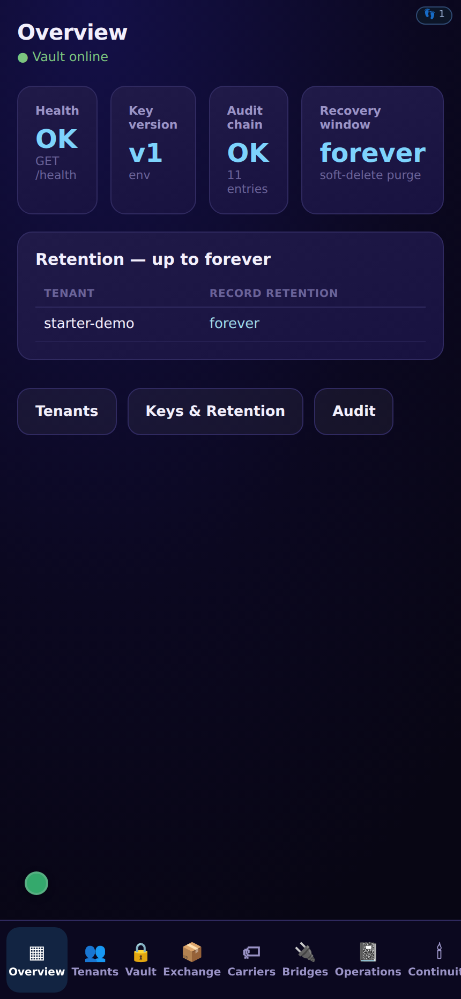</a><br><sub><b>01</b> · Overview<br>what the vault holds, what it is doing, and what stands behind it</sub></td>
  </tr>
</table>

**First meeting**

<table>
  <tr>
    <td align="center" width="25%"><a href="docs/screens/06-keys.png">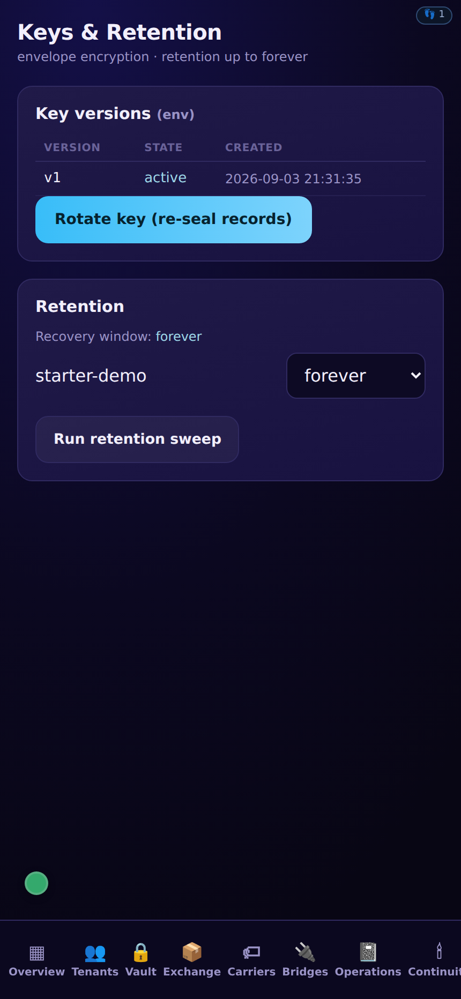</a><br><sub><b>06</b> · Key setup<br>the keys made where they will live</sub></td>
  </tr>
</table>

**The vault itself**

<table>
  <tr>
    <td align="center" width="25%"><a href="docs/screens/02-records.png">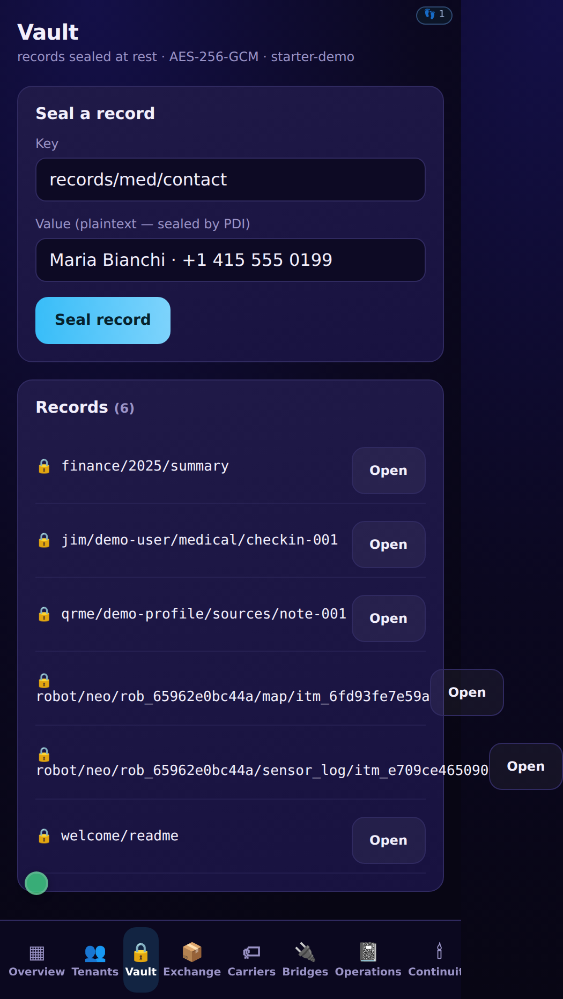</a><br><sub><b>02</b> · Vault<br>what is held, sealed at rest</sub></td>
    <td align="center" width="25%"><a href="docs/screens/03-store-a-record.png">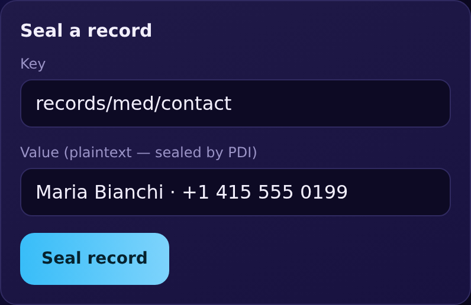</a><br><sub><b>03</b> · Store a record<br>one record in, one seal on it</sub></td>
  </tr>
</table>

**Many tenants, one machine**

<table>
  <tr>
    <td align="center" width="25%"><a href="docs/screens/04-tenants.png">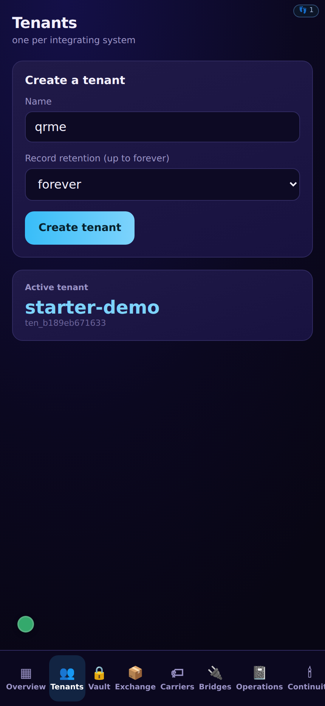</a><br><sub><b>04</b> · Tenants<br>every tenant its own world</sub></td>
  </tr>
</table>

**The record that cannot lie**

<table>
  <tr>
    <td align="center" width="25%"><a href="docs/screens/05-audit.png">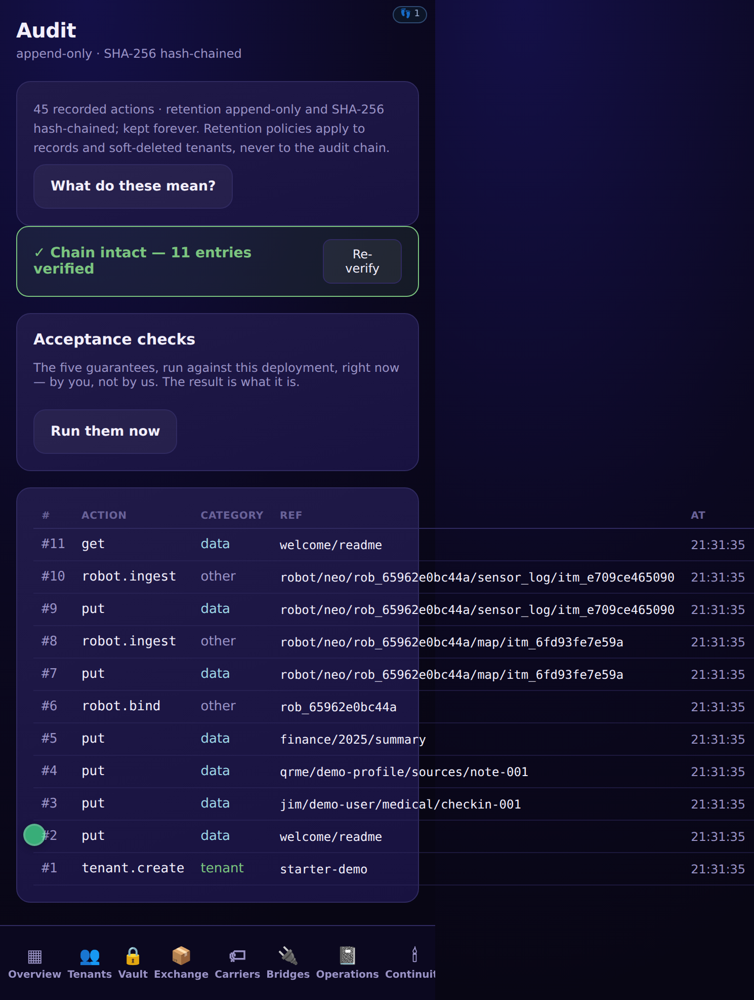</a><br><sub><b>05</b> · Audit log<br>every act, chained to the one before</sub></td>
    <td align="center" width="25%"><a href="docs/screens/07-audit-accepted.png">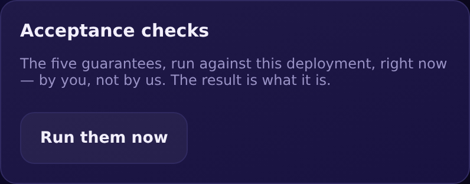</a><br><sub><b>07</b> · Audit<br>the reviewer's whole view</sub></td>
  </tr>
</table>

**The vault made smart**

<table>
  <tr>
    <td align="center" width="25%"><a href="docs/screens/20-resident.png">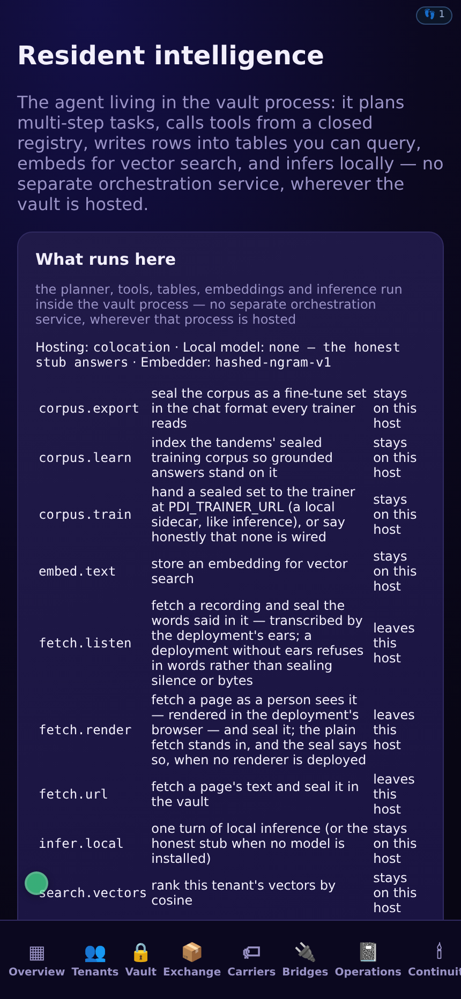</a><br><sub><b>20</b> · Resident intelligence<br>the model lives inside; questions never leave</sub></td>
  </tr>
</table>

**Sealed transfer, both directions**

<table>
  <tr>
    <td align="center" width="25%"><a href="docs/screens/10-carriers.png">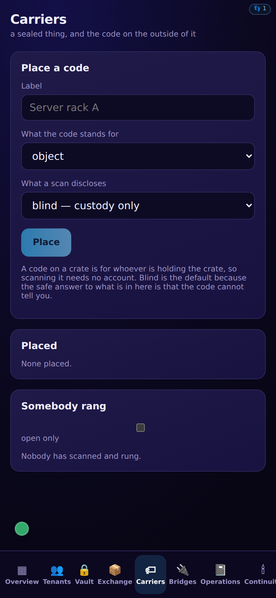</a><br><sub><b>10</b> · Carriers<br>a sealed thing, and the code on the outside of it</sub></td>
    <td align="center" width="25%"><a href="docs/screens/11-exchange.png">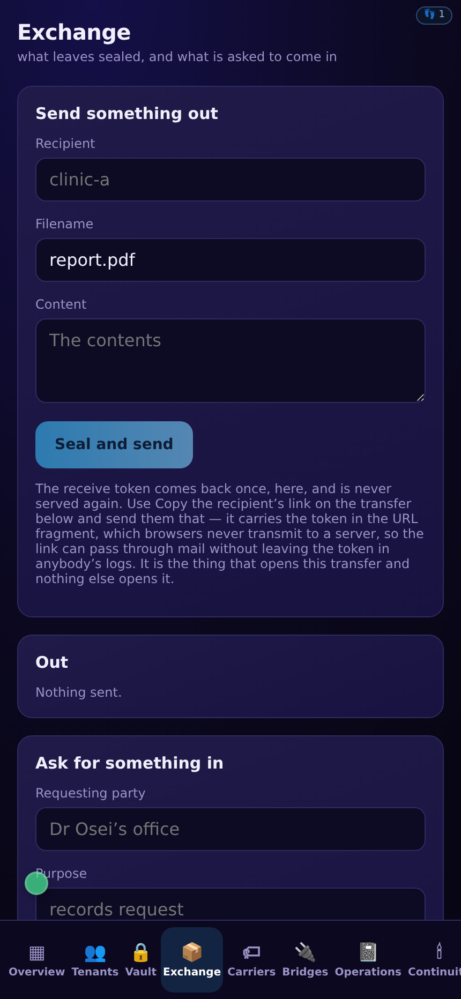</a><br><sub><b>11</b> · Exchange<br>what leaves sealed, and what is asked to come in</sub></td>
    <td align="center" width="25%"><a href="docs/screens/12-custody.png">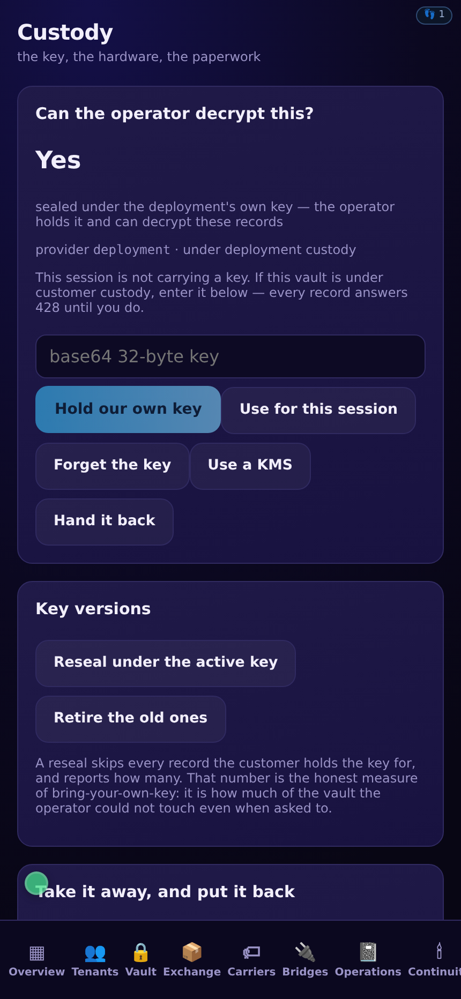</a><br><sub><b>12</b> · Custody<br>chain of custody on every transfer, kept by the vault</sub></td>
    <td align="center" width="25%"><a href="docs/screens/13-bridges.png">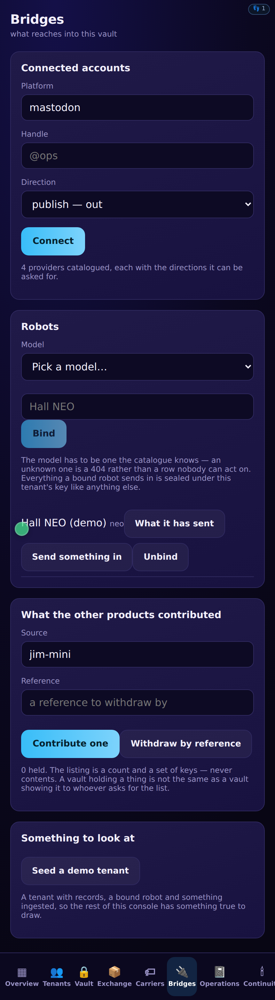</a><br><sub><b>13</b> · Bridges<br>the connectors to platforms and integrated apps, each a named door</sub></td>
  </tr>
</table>

**Running the vault**

<table>
  <tr>
    <td align="center" width="25%"><a href="docs/screens/14-guiding.png">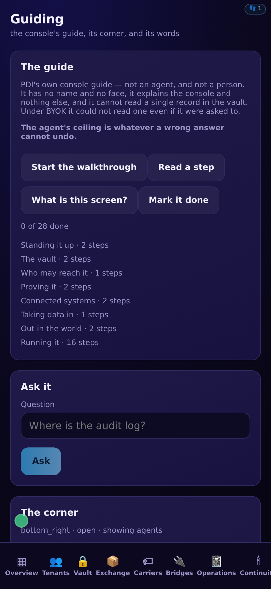</a><br><sub><b>14</b> · Guiding<br>the guided path through what the vault needs from an operator</sub></td>
    <td align="center" width="25%"><a href="docs/screens/15-continuity.png">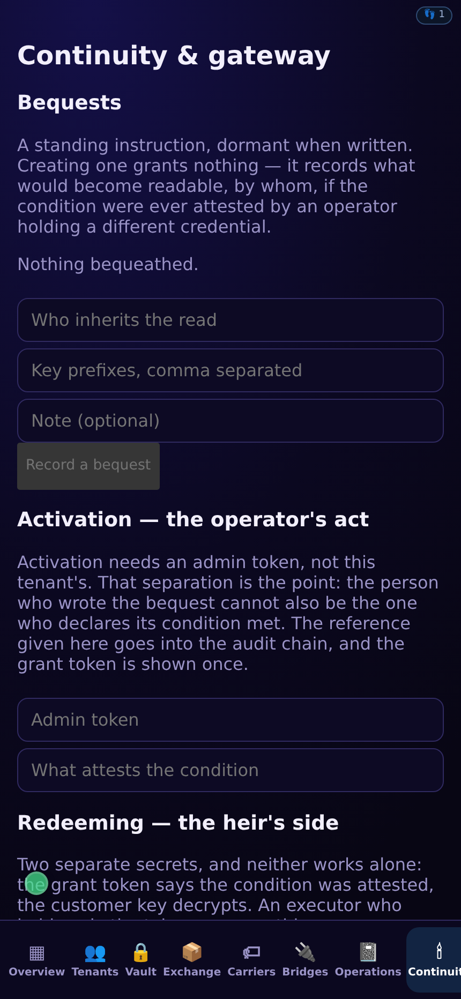</a><br><sub><b>15</b> · Continuity &amp; gateway<br>backups, the restore drill, and the gateway the tandems reach</sub></td>
    <td align="center" width="25%"><a href="docs/screens/16-operations.png">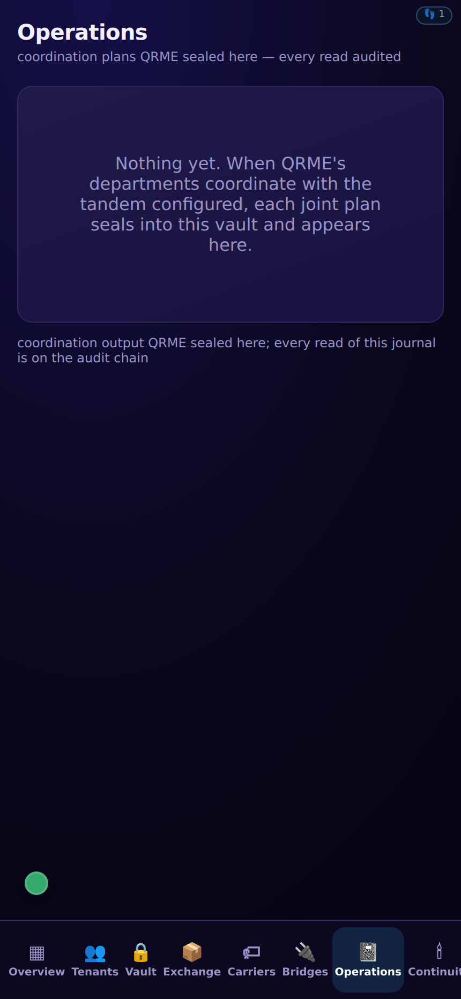</a><br><sub><b>16</b> · Operations<br>the operations journal: every round the vault kept, on the record</sub></td>
    <td align="center" width="25%"><a href="docs/screens/17-positions.png">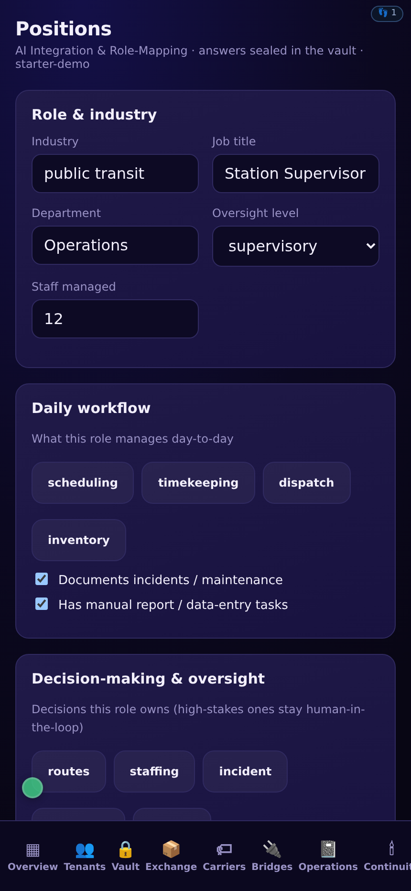</a><br><sub><b>17</b> · Positions<br>AI integration and role mapping, the answers sealed in the vault</sub></td>
  </tr>
</table>

**The operator's own controls**

<table>
  <tr>
    <td align="center" width="25%"><a href="docs/screens/18-settings.png">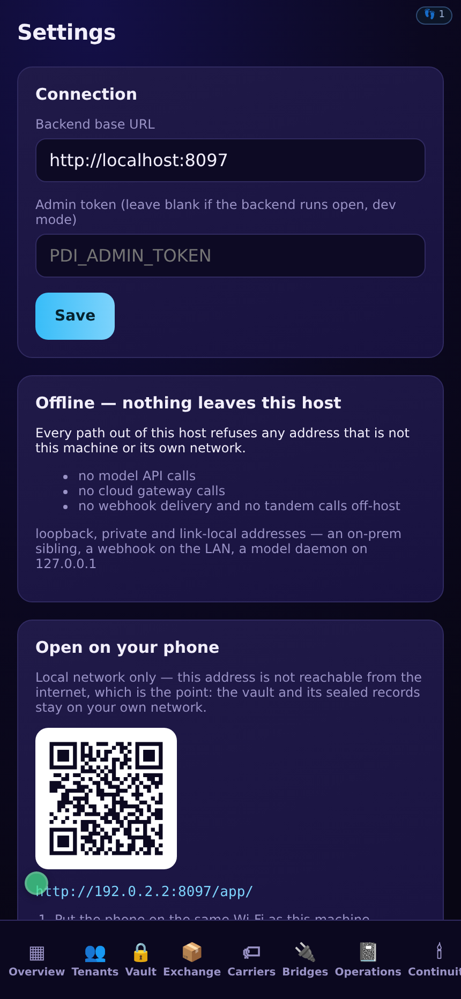</a><br><sub><b>18</b> · Settings<br>the operator's controls, each one documented where it is set</sub></td>
    <td align="center" width="25%"><a href="docs/screens/19-access.png">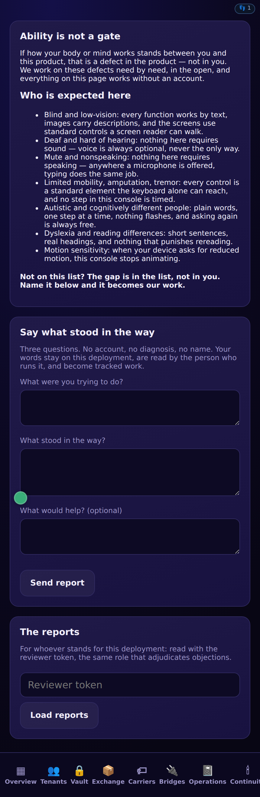</a><br><sub><b>19</b> · Ability is not a gate<br>what a caller may do, decided by grant and never by capability alone</sub></td>
  </tr>
</table>

**Kept honest**

<table>
  <tr>
    <td align="center" width="25%"><a href="docs/screens/09-before-anything-is-sent.png">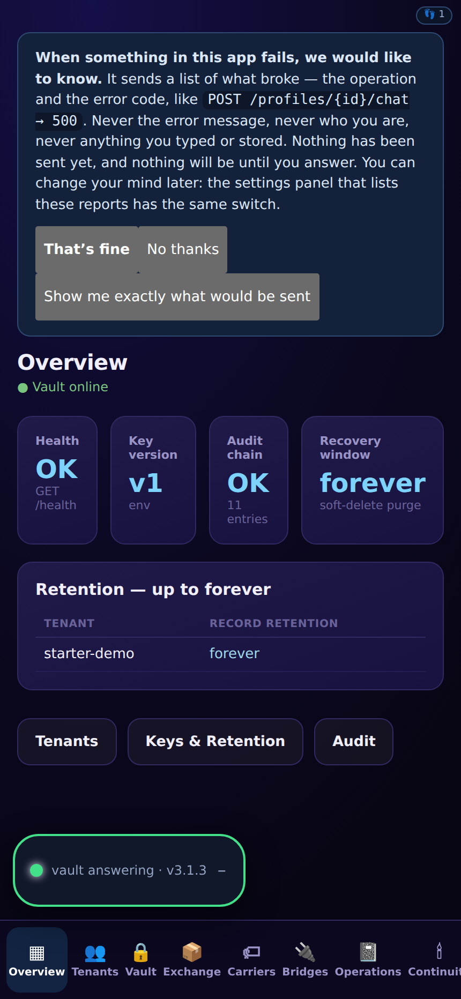</a><br><sub><b>09</b> · Before anything is sent<br>the notice ahead of the first byte</sub></td>
    <td align="center" width="25%"><a href="docs/screens/08-what-went-wrong.png">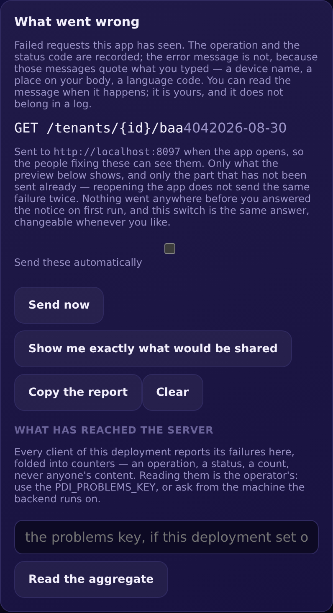</a><br><sub><b>08</b> · What went wrong<br>errors reported home, scrubbed</sub></td>
  </tr>
</table>

## Product surfaces

| Surface | Where | Notes |
|---|---|---|
| API server | `pdi/` | FastAPI + SQLite. `python -m pdi serve` or `uvicorn pdi.api:app`. |
| Operator console | `app/` | React + TypeScript (Vite); also served by the backend. |
| iOS / Android / Windows | `native/` | Native shells at parity with the console. |
| Desktop app | `python -m pdi desktop` | Electron wrapper; packaged installers on the releases page. |

## Quick start

```bash
pip install -e .[dev]
export PDI_MASTER_KEY=$(python -c "import base64,os;print(base64.b64encode(os.urandom(32)).decode())")
uvicorn pdi.api:app

# or the launcher menu — phone, desktop, installer, headless:
python -m pdi
```

`PDI_DB` sets the SQLite path (default `pdi.db`). `PDI_MASTER_KEY` is base64
of 32 bytes; in production the key-encryption key belongs in your own
KMS/HSM (`PDI_KEY_PROVIDER=kms`) — an ephemeral key is generated if unset,
for development only.

## Configuration

| Variable | Purpose |
|---|---|
| `PDI_MASTER_KEY` | Base64 key-encryption key (dev). Production uses `PDI_KEY_PROVIDER=kms` with `PDI_KMS_BACKEND` / `PDI_KMS_KEY_ID`. |
| `PDI_DB` | SQLite path (default `pdi.db`). |
| `PDI_ADMIN_TOKEN` | Operator token; open admin fails closed off-machine. |
| `PDI_RECOVERY_WINDOW` | Global soft-delete recovery window (default forever). |
| `PDI_CORS_ORIGINS` | Allowed console origins. |

See [docs/hosting.md](docs/hosting.md) and
[docs/operations.md](docs/operations.md) for production deployment.

## Documentation

| Document | Contents |
|---|---|
| [docs/tandem.md](docs/tandem.md) | Running PDI under QRME and JIM-mini. |
| [docs/operations.md](docs/operations.md) | Day-two operations: keys, retention, backups. |
| [docs/hosting.md](docs/hosting.md) | Production hosting. |
| [docs/enterprise.md](docs/enterprise.md) | Enterprise compliance transfer. |
| [docs/baa-template.md](docs/baa-template.md) | Business associate agreement template. |
| [docs/invention-disclosure.md](docs/invention-disclosure.md) | The patent filings. |
| [docs/releasing.md](docs/releasing.md) | How releases are cut. |
| [docs/gallery.md](docs/gallery.md) | The full desktop and mobile console gallery. |

## The console, driven

Every picture below was photographed while `tools/walkthrough.py` drove
the 3.0.1 release gate: a live backend, a tenant seeded during the run,
and whatever the drive put on screen still on it. Nothing here is
staged — the records pane holds the record the harness actually sealed,
the audit pane shows the chain verifying it, and the custody pane
carries the beacon it printed. Re-take the set with
`python3 tools/walkthrough.py`.

<table>
<tr>
<td align="center" width="50%"><a href="docs/walkthrough/01-overview.png">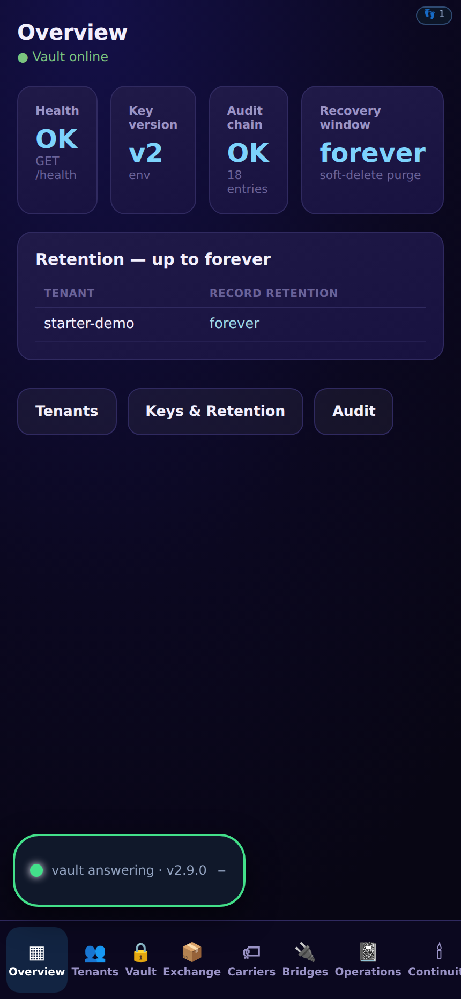</a><br><sub>Overview — the vault's front page</sub></td>
<td align="center" width="50%"><a href="docs/walkthrough/02-records.png">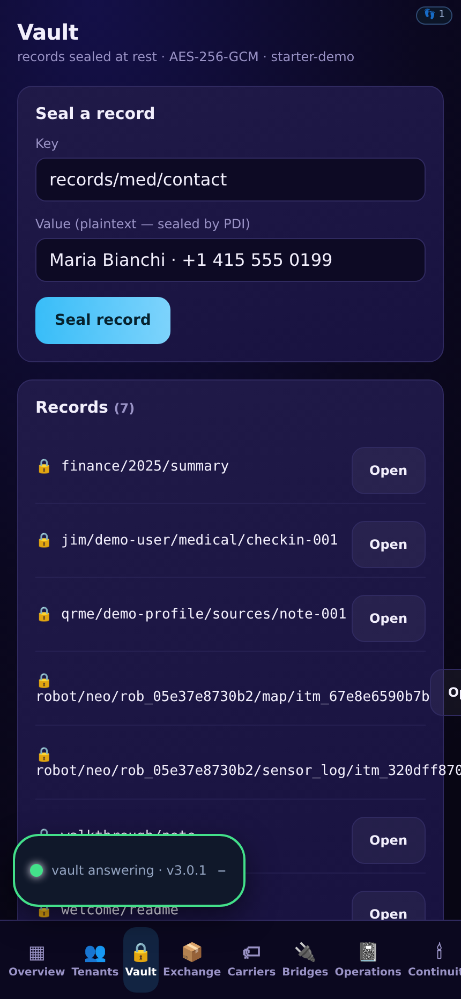</a><br><sub>Records — the sealed record</sub></td>
</tr>
<tr>
<td align="center" width="50%"><a href="docs/walkthrough/03-audit.png">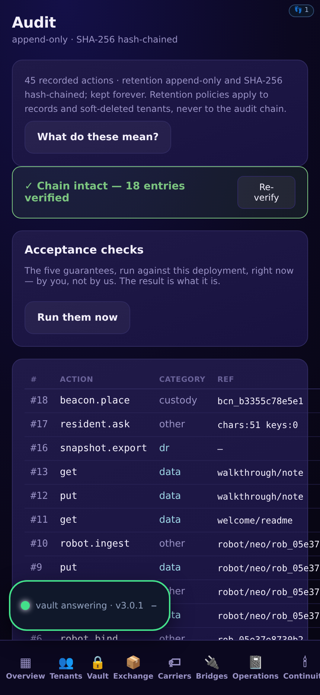</a><br><sub>Audit — the chain, intact</sub></td>
<td align="center" width="50%"><a href="docs/walkthrough/04-keys.png">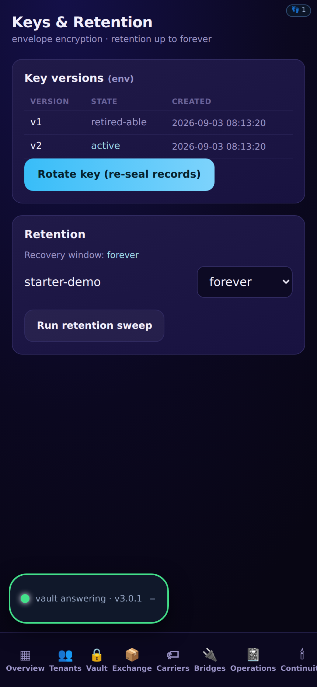</a><br><sub>Keys — rotated during the drive</sub></td>
</tr>
<tr>
<td align="center" width="50%"><a href="docs/walkthrough/05-custody.png">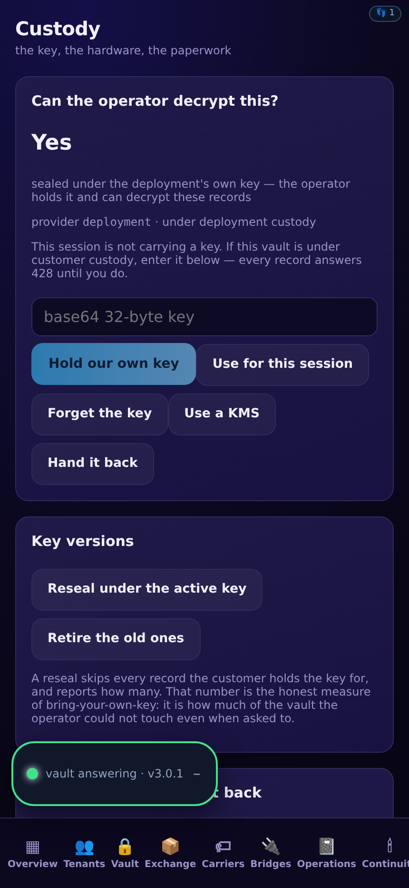</a><br><sub>Custody — the printed beacon</sub></td>
<td align="center" width="50%"><a href="docs/walkthrough/06-resident.png">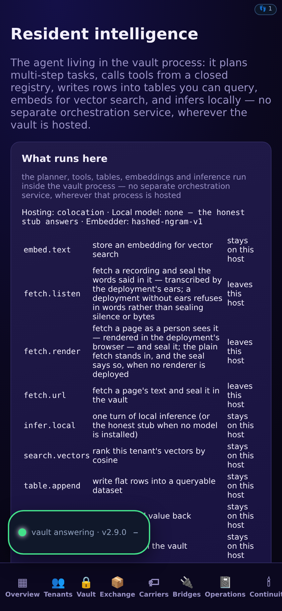</a><br><sub>Resident — the vault answering</sub></td>
</tr>
</table>

## Release history

<details>
<summary><b>What each release added, newest first</b> — the short version of
how it got here; full detail in <a href="CHANGELOG.md">CHANGELOG.md</a>.</summary>

| Release | What landed |
|---|---|
| Release | What landed |
|---|---|
| **3.1.5** | **No functional changes — cut with the siblings.** QRME's screen 199 became a photograph, its AI mark became one badge hung off every profile picture rather than cropped in half by it, and a job title joined the field under every name; the three products keep one number |
| **3.1.4** | **A screenshot is the whole screen** — the content column is unrolled before the shutter, so a capture is no longer the first phone-height of its screen, and 24 phone-height slices stand beside the whole pictures. Cut with the siblings |
| **3.1.3** | **For examination** — every highlight names its problem, implementation, numbers and test. No functional changes; cut with the siblings |
| **3.1.2** | **The mechanisms are set out for examination** — each names the technical problem, the solution as built, what it changes in the machine and the test that holds it. No functional changes to PDI; cut with the siblings |
| **3.1.1** | **No functional changes to PDI — cut with the siblings.** JIM-mini's image gained what its box runs; the three products keep one number. |
| **3.1.0** | **Cut with the siblings, and the README for examination** — no functional changes to PDI. JIM-mini, QRME and PDI are cut together at one number from here; the README carries the filing, the components, the mechanisms on file and where each highlight is proven, and the console was photographed again from the current build. |
| **3.0.1** | **The resident learns from the corpus** — the tandems bank every exchange a person consents to and seal it here in bundles; three resident tools make them the vault's own. `corpus.learn` indexes every example beside the vault's vectors, so a grounded answer stands on what the coach actually said to this person — idempotent and bounded per cycle, so a standing task grows the index over time. `corpus.export` seals a fine-tune set in the chat shape every trainer reads and records it in `training_sets`. `corpus.train` hands a set to the trainer at `PDI_TRAINER_URL` — a local sidecar, the same standing as the inference server — and with none wired holds the set with the sentence that says so, rather than pretending a model was trained; offline mode keeps it home. The planner knows the verbs, `GET /resident` counts bundles, learned examples and sets and names the trainer, and the audit chain carries the three acts by name. |
| **3.0.0** | **Every avenue functions properly inside the apps** — the celebration release, cut with the siblings under the same gate: a person who has never seen this code picks any road and drives it to the end without finding a wall. `tools/walkthrough.py` is that person made repeatable — twenty steps over real doors: a record sealed, read back, and listed, the audit chain verified intact, the key versions reported and a rotation re-sealed, the snapshot exported, retention swept, the resident's posture read and a question answered or honestly refused, the positions desk, a beacon printed and its card fetched the way a stranger's browser would fetch it, the gate's ceiling — an honest refusal counted as a pass, a silent dead end as a wall. Twenty steps, zero walls, six photographs of the driven console in `docs/walkthrough/`. |
| **2.9.0** | **The camera reaches everything the gallery numbers** — the census lets one component own several numbers, because a component draws more than one thing a person meets, and until now the camera could reach a page and nothing smaller. The three remaining drawings were states of that kind: storing a record, an accepted audit, and what went wrong. A state is found by `data-screen` on the element that owns it — a marker in the markup is a thing the camera and the reader can both check, where a selector guessed from outside silently starts matching the wrong card. No drawing in this product now stands in for a screen the console has. |
| **2.8.0** | A guard against the defect that has now shipped four times across the three products: a media query adds no specificity, so an override written inside one is beaten by any later rule on the same selector. This console is already clean; three of the guard's four tests check the checker rather than the sheet, because a checker whose only evidence is a green run is not evidence. |
| **2.7.1** | Both field reports about the vault light are answered for the first time. The lift off the tab bar and the shrink to a dot were written above the rules they override and never applied; the dot then rendered as an ellipse because a tap-target minimum beat its declared height. The clearance is measured from the bar, the dot is a circle inside a full-size target, and the camera builds before it shoots. |
| **2.7.0** | **The trio returns to one number** — every README here promises that one version names one tested combination of all three products, and three hands rounds cut in QRME alone quietly ended that: 2.6.0 there, 2.3.1 in this vault and in JIM-mini. All three are cut at 2.7.0 rather than each at its own next number, because a gap in a sequence is something a reader can see and account for, and a banner claiming alignment while the three disagree is the convention advertising itself while not being kept. No functional change to the vault itself. |
| **2.3.1** | Tandem release with QRME 2.3.1 (the head the forge builds is actually drawn); version alignment across the trio, no functional change to the vault itself. |
| **2.3.0** | Tandem release with QRME 2.3.0 (the forge: a photograph becomes a 3-D face on the deployment's own hardware); version alignment across the trio, no functional change to the vault itself. |
| **2.2.0** | Tandem release with QRME 2.2.0 (Raise: the three time controls) and JIM-mini 2.2.0; version alignment across the trio, no functional change to the vault itself |
| **2.1.0** | Tandem release with QRME 2.1.0 (Raise — grow your own); version alignment across the trio, no functional change to the vault itself |
| **2.0.1** | **The README shows the product** — a screen for every major component and tool on the front page; tandem release with QRME 2.0.1 and JIM-mini 2.0.1, no functional change to the vault itself |
| **2.0.0** | Tandem release with QRME 2.0.0 (the avatar round); version alignment across the trio, no functional change in this repository |
| **1.9.0** | Every wire name says one thing — the collision ledger's last two rows close tandem-safe (`sealed_at_rest`, `sealed_count`, `program_keys`) across the backend, the console and all three shells; two floors join the live-measured registry; the front page reorganizes around the vault, the record, the resident and the desk |
| **1.8.9** | Cut with the siblings — QRME took the round: the avatar registry, the slimmer room strip, the waiting seat, the dock that fits |
| **1.8.8** | Cut with the siblings — QRME took the dials, the panels' exits, the chooser and the walking room; JIM took the staleness contract and meetings-as-words; both took the address book to their shells |
| **1.8.7** | Cut with the siblings — QRME took the round: rooms that read links, hand documents back and remember their person; the friends-only circle |
| **1.8.6** | Cut with the siblings — the estate's shared records caught up (one new deliberate divergence: the address-book replace rule, held by the two products with a book) |
| **1.8.5** | **Cut with the siblings** — no functional change, and no 1.8.4 either: this lands the three level again. QRME took the number for the owner-released voice, the unclaimable premades, the loudness rail and the iPhone ear fork |
| **1.8.3** | **The vault refuses in the reader's language, both ledgers closed** — the 41 recorded refusals become registered templates, twenty-six of them the very sentences JIM and QRME already say, carried with the same frames so the trio refuses in one voice; the nine constants the untranslated ledger was holding open join `_REFUSALS` in nine languages, closing that ledger too. The widened sweep surfaced the resident's two ear sentences and six more constants, all translated, and the fill-sites floor rises 12 → 45 |
| **1.8.2** | **The last answer does not depend on anything that can fail** — the catch-all that turns a crashed route into an answer the console can read built its 500 through a translator that could itself fail; when it did, the answer left without the CORS header and a crash read as an unreachable backend. Guarded now, with a constant English fallback, in all three products. Also: two assertions that could not fail are floors now, `/health`'s version is compared to the app's own so the desktop shell cannot adopt a stale backend, and the screens' power to end every transfer, connector and bequest they can begin is held by a guard rather than by care |
| **1.8.1** | **A guard that reads the translations, not just the count of missing ones** — the refusal ledger counts sentences with no translation and only shrinks, so it can reach zero with a Chinese row written in Cyrillic in it and every guard in the estate would call the paydown complete. Two got through that way in a sibling product and were caught by eye: single characters from another alphabet in otherwise correct sentences, both of which rendered and neither of which failed a test. Narrow on purpose — it cannot tell a good translation from a poor one, only that this is not that language at all — and byte-identical in all three products, so this vault gets it having had no defect of its own. A second one holds any console to what it actually tested about a minimised window, and waits here against the day this vault grows a microphone |
| **1.8.0** | **Released alongside JIM-mini and QRME**, which carry this round's work. The vault is unchanged and its suite is green over the same tree: 1331 passing. The version moves with its siblings because the three ship as one — a vault a version behind its tandems is a question every deployment has to answer separately |
| **1.7.0** | **German finishes the informal register** — 33 rows across the console and the three native shells, with the two that stay counted named as third person rather than left as a number. Also: two refusals about the tenant's own key reach a person rather than a log and are hand-translated into all nine languages; the refusal backlog was counting two constructor preconditions raised while the app is wired; and `len(_REFUSALS) >= 8` was a floor against a table of 84, now registered |
| **1.6.2** | **A script was being escaped like a page** — `_js_literal` html-escaped the JSON it drops inside a `<script>` element, which a browser does not decode there: the value was corrupted and the page was safe only by accident, since the `</script` guard sat after an escape that had already removed what it looked for |
| **1.6.1** | **No functional changes** — the round fixed mail-failure handling in JIM-mini and QRME; this product has no mailer and never opens an SMTP connection |
| **1.6.0** | **The three refusals a tenant actually reads are translated** — sixteen English-only rows sorted by whether the reader is a person or a program: three are screens somebody navigates and are translated into all nine, and the thirteen that remain are wire-shape validation, programming errors and operator configuration, named rather than counted; and a prompt too long to send now loses evidence rather than the question |
| **1.5.0** | **Version alignment** — the trio releases together and one number names one tested combination of all three; this release's changes live in the qrme repository, and nothing changed here since 0.99.0 |
| **1.4.1** | **Version alignment** — the trio releases together and one number names one tested combination of all three; this release's changes live in the qrme repository, and nothing changed here since 0.99.0 |
| **1.4.0** | **Version alignment** — the trio releases together and one number names one tested combination of all three; this release's changes live in the jim-mini and qrme repositories (a backgrounded tab no longer draws a stopped microphone as listening), and nothing changed here since 0.99.0 |
| **1.3.0** | **Version alignment** — the trio releases together and one number names one tested combination of all three; this release's changes live in the qrme repository, and nothing changed here since 0.99.0 |
| **1.2.0** | **Version alignment** — the trio releases together and one number names one tested combination of all three; this release's changes live in the qrme and jim-mini repositories, and nothing changed here since 0.99.0 |
| **1.1.0** | **Version alignment** — the trio releases together and one number names one tested combination of all three; this release's changes live in the qrme and jim-mini repositories, and nothing changed here since 0.99.0 |
| **1.0.0** | **Version alignment** — the trio releases together and one number names one tested combination of all three; this release's changes live in the qrme and jim-mini repositories, and nothing changed here since 0.99.0 |
| **0.99.1** | **Version alignment** — the trio releases together; this release's changes live in the qrme and jim-mini repositories, and nothing changed here since 0.99.0 |
| **0.99.0** | **Version alignment** — the trio releases together; this release's changes live in the jim-mini repository (the wrist becoming a real surface), and nothing changed here since 0.98.0 |
| **0.98.0** | **The posture proves the model answers** — `GET /resident` carries `local_model_standing`: one round trip to the daemon's own `/api/tags` saying reachable-or-not and pulled-or-not, with the fix named (`ollama pull …`, or the container and network to check); a configured server that dies mid-conversation answers a sentence under model `local-unreachable` instead of a raw socket error — and a plan step that got that sentence is a **failed** step wearing it, never a sealed apology marked done |
| **0.97.0** | **The reading tools refuse a recording** — `fetch.url` and `fetch.render` pointed at media used to strip markup from binary and seal mojibake as a capture; both now refuse by name of `fetch.listen`, on the same canonical suffix list the qrme briefcase and lookout read (path-only, query stripped — a page containing a player is still a page) |
| **0.96.0** | **Version alignment** — the trio releases together; this release's changes live in the jim-mini and qrme repositories (the standing voice conversation, the agent's hands on the look, the settings-page device lists, the room picture full-bleed, the reply ceiling back to five), and nothing changed here since 0.94.0 |
| **0.95.0** | **Version alignment** — the trio releases together; this release's changes live in the qrme repository (the ears arc reaching every briefcase door), and nothing changed here since 0.94.0 |
| **0.94.0** | **The capture grows ears** — `fetch.listen` joins the resident's vocabulary: the deployment's transcription sidecar turns a recording into the words said in it, on the facility's own hardware, sealed with the same change-memory the fetches keep; a deployment without ears refuses in words rather than sealing silence or bytes, the planner hears "listen", "transcribe" and "hear", and the published registry names the three fetches that leave the host |
| **0.93.0** | **The capture grows eyes, and the ledger stops editing itself** — `fetch.render` joins the resident's vocabulary (the page as a person meets it, sealed with the same change-memory; the plain fetch stands in and the seal says so on a deployment without eyes), and the runs ledger becomes tamper-evident: the database refuses edits, rows chain per task, a verify door walks the links, and every cycle anchors its hash on the permanent audit chain |
| **0.92.0** | **Version alignment with the tandems** — no functional changes; the trio versions and releases together |
| **0.91.0** | **Version alignment with the tandems** — no functional changes; the trio versions and releases together |
| **0.90.0** | **The fetch notices change, and the vault remembers its rounds** — captures carry a fingerprint (`sha`), `changed_at` (kept while content is identical, moved when it differs) and `first_seen_at`, with pre-fingerprint seals never reported changed by the migration itself; each cycle's summary discloses `(first capture)` / `(unchanged)` / `(changed)`. And every cycle lands one row on a per-task runs ledger — when it ran, done or failed, one line of note — read newest first through `GET /resident/tasks/{tid}/runs` behind the tenant fence, last 200 rounds kept, cancel and wipe sweeping it, a "Past rounds" button on the console and all three shells |
| **0.89.0** | **Ask the vault: grounded answers from what it holds** — `POST /resident/ask` retrieves first: the question ranks this tenant's vectors, the matched seals are read back, and the local model answers *from* them, all inside the host, with `drew_on` naming the keys the answer stood on — an empty list said, not padded. The ask door learns a `prefix` (a character compare narrowing what may ground an answer, over-fetched ahead of the wall so one person's nearest moments are not lost behind strangers') and carries a `system` persona ahead of the grounding block, so the tandems' coaches and profiles survive being grounded. The audit counts characters and keys, quoting neither. On the console and all three shells |
| **0.88.0** | **The voice door, the standing tasks, and the off switch** — `POST /resident/infer` puts local inference behind a single door so the tandems' coaches and profiles can speak from inside the facility (prompt never leaves the host, audit counts characters and quotes nothing, the stub answers under its own name). A plan can carry `every_hours` and the vault re-runs it itself: `pulse()` walks tenants then each tenant's due tasks so the isolation fence holds on the heartbeat, `PDI_RESIDENT_PULSE` starts the in-process loop, `done` is a resting state whose steps reset each cycle, failures retry, overlapping beats never double a run. And `DELETE /resident/tasks/{tid}` is the off switch: a cancel ends the future, not the record — running refuses, cross-tenant finds nothing, every cancel audited. All of it on the console and all three shells |
| **0.87.0** | **Forgetting reaches the vectors, everywhere** — the resident's embedding index gets its doors out: `DELETE /resident/embeddings/{key}` takes one vector, `?prefix=true` takes a person's whole shelf in one call (a character-compare prefix, never a LIKE wildcard), another tenant's forget removes nothing, and every forget lands on the audit chain. The tandems stand their erasure sweeps on it, the console and all three shells wear a per-match forget button — and the vault's own front door keeps the same promise: deleting a record takes any vector indexed under its key, through the one `resident.forget` implementation, with the audit line written only when a vector actually went |
| **0.86.0** | **Tenant isolation in the SQL, and the database made smart** — every one of the forty-six statements that reached tenant-scoped tables by bare id now constrains `tenant_id` in the statement itself, the ten that genuinely cannot wear a written reason with a ceiling, and an AST guard plus live cross-tenant tests hold the fence from both sides. On top of it, the **resident intelligence**: the agent living in the vault process — multi-step plans by deterministic rules, a closed tool registry whose `leaves_host` column travels with every step, structured rows into queryable datasets straight from a fetch, embeddings and cosine search that keep a hash and never the text, and local-only inference with an honest stub — no separate orchestration service, the same doors and privacy over standard HTTPS, on the console and all three shells |
| **0.85.0** | **The front page reads like a product** — the README cut down to a professional overview at the owner's ask, the console galleries moved whole to `docs/gallery.md`, the release table folded but present, and the guards that held the old page holding the same promises across the pair. No functional changes to the vault itself |
| **0.84.0** | **The version, and nothing else** — no code changes in this product. JIM-mini took this release on its own: one window over everything a guardian is running, both people having to agree before a link outlives the call, what the offline coach could not settle becoming a paid errand only where it had to, the day as it was taken in measured against what the roster promised before anything was switched on, a room reading cues rather than keeping footage, and two people on one call each with their own second channel. This product skipped 0.83.0 — that release touched nothing here and the number was left where it was rather than cut for the sake of it — which is exactly the drift the version guard exists to prevent, since a box carrying two numbers reports the mismatch to whoever is using it rather than to whoever deployed it. The three come back onto one number here |
| **0.82.0** | **One page about one machine, and this repository says where it is** — this repository documents running the product on its own; the live beta is four containers on one box, documented once in QRME beside the compose file it describes. An operator standing here at the end of a release had no way to find it. `docs/hosting.md` says where it is, and why there is one copy rather than three — copies of a page about one machine disagree the first time somebody fixes only the one they had open |
| **0.81.0** | **The sentence that forgot how it was built** — `str()` on a `Templated` returns a plain `str`, which drops the template, so a refusal built by `i18n.fill` and passed on as `HTTPException(403, str(exc))` reaches the reader as bare English in every language, looking exactly like a sentence nobody has translated yet. QRME shipped it on the sentence somebody reads while something is going wrong. Nothing here launders a template that way today, and this release is what keeps that true rather than assumed: `i18n.raised` hands a refusal on in the shape it was raised, and a guard carried by all three products fails any route that reaches for `str()` instead |
| **0.80.0** | **The version, and nothing else** — no code changes in this product. QRME took this release on its own (the agent asking people rather than pages, and the ledger of which far hosts keep watching it leave); the cut keeps the three reporting one number to the tandem's version guard |
| **0.79.0** | **Cut in step** — no PDI code changed. QRME's plug-in storefront is what this version is; the vault, the journal and the sealing are unchanged |
| **0.77.0** | **Cut in step** — no PDI code changed. QRME's Agent round and JIM's circle-list fix are what this version is; the vault, the journal and the sealing are unchanged |
| **0.76.0** | No functional changes to PDI. The number moves because the three products are cut as one release; two shared guard records moved rows out of the divergence backlog and into the manifest |
| **0.75.0** | **No functional changes to PDI** — cut with the siblings. The round's work was next door, and one line of it is this repository's: JIM-mini took a port of the hash-chained audit log designed here, `user_id` where PDI has `tenant_id`, including the part that has survived a dozen releases of new actions — fixed stored-and-hashed fields with `category` derived at read time, so a catalogue can grow forever without breaking a single existing hash |
| **0.74.0** | **A guarantee nobody re-runs is marketing** — the infrastructure specification's acceptance section listed five criteria and three were already asked by guards in CI, which is the right place for them and the wrong reader: a vendor assurance is precisely what a sovereignty proposition is not selling. `pdi/acceptance.py` runs the five against a live deployment and returns a dated pass/fail per check, whole, repairing nothing it finds. One criterion would have failed — "key rotation with no bulk plaintext exposure" had no operation behind it — so `crypto.rewrap()` opens each stored data key under the old KEK and seals it again under the new one, all-or-nothing, records never read |
| **0.73.0** | **The phones that never asked which backend** — `/health` has answered a `version` since a stale backend first cost somebody an evening, and every native shell decoded that field away, so a phone pointed at an older install looked alive while newer screens said "Not Found" for no stated reason. All three read it now and raise a dismissible banner naming both versions and the address, in ten languages. The rest of the round is guards: `client_symmetry.txt` names treatments one row per client and refuses any written for fewer than four, because the drift that matters is a treatment three clients have and the fourth does not — and the release checklist's count of version fields is tied to the manifest the guards actually read, having been wrong in both directions |
| **0.72.0** | **No functional changes to PDI** — cut with the siblings. One guard came across: the Swift reader in `test_the_tabs_are_translated_and_the_screens_are_not` stopped at the first quote inside an interpolation and counted a property name as an untranslated sentence. Nothing here trips it yet, which is exactly the case `shared_guards.txt` exists for |
| **0.71.1** | **No functional changes to PDI** — cut with the siblings. In QRME, `widgets.py` imported a POSIX-only module at the top of the file, which took the whole API down on Windows: the frozen desktop backend would not start, and two releases published with no installers attached at all |
| **0.71.0** | **No functional changes to PDI** — cut with the siblings. In JIM-mini, an engaged session stays open until you sign off, acts across your own records through a written allowlist, and lands every change on a trail you can take back; in QRME, an embedded player learned the origin it needs to play and the feed deck became the screen rather than a card on it |
| **0.70.1** | **No functional changes to PDI** — cut with the siblings. In QRME, the widget runner asked whether *an* interpreter existed and never whether it was new enough, so a host carrying Node 18 reported ready and then failed every run |
| **0.70.0** | **The light stopped sitting on the menu, and custody is not ownership in writing** — the vault light and its minimized dot clear the phone's tab bar and speak ten languages; the terms say that PDI's holding confers nothing and that a data subject's statutory rights survive it (terms 1.2 → 1.3); the failure reports come home to this backend; and the doorless backlog on all three shells reaches zero |
| **0.68.0** | **Cut in step** — no PDI code changed; QRME gained the memory door, the steering lock, character-card import and rehearsal rooms that forget on purpose, while JIM's meals, weekly letters, interview drills and bank statements all took their private halves to this vault |
| **0.67.0** | **Cut in step** — no PDI code changed; QRME's licences now carry real substance under a manifest and organizations lease specialists, JIM's tandem sends the triggering vitals across the handoff, collected rooms are scanned for hazards, and a minor's consent became the guardian's own verified click |
| **0.66.0** | **Cut in step** — no PDI code changed; JIM-mini's coach became an offline add-and-norm stack over stored knowledge and current readings, with a jampacked pack, deposits from paid model turns, and a curriculum JIM studies on one press |
| **0.65.0** | **Cut in step** — no PDI code changed; QRME's standing rooms learned to be one place instead of a stamp, its lobby's join pitch gained the door it promised, and its friend faces open the friend's page |
| **0.64.0** | **The footsteps show** — a counter rides `/health` into the console's top-right corner: how many tenants hold a vault here, as an aggregate in ten languages, no name or id riding with the number, no new route and no new door — and it shrank to a footprint the same evening on a field report from the sibling product |
| **0.63.0** | **The screens behind the tabs speak, and the imported link is visited** — the vault, audit chain, robots, connectors, admin and feedback surfaces read from the ten-language tables on all three shells, Windows wording moving out of XAML attributes so a language change can re-read it (untranslated ratchet 65/59/69 → 6/5/1, a floor with names); `POST /connectors/{cid}/scrape` seals what a public page shows anybody as one encrypted record with the URL and fetch time written in, refusing offline before any socket opens; and the console fits the phone it runs on — grid tracks clamp, the app height tracks `100dvh`, the sidebar scrolls on its own |
| **0.62.0** | **Cut in step** — JIM's phones reached parity with its console — eleven rounds in one branch: every backend route gained a door on iOS, Android and Windows (the doorless ledgers close at the four by-design rows), the voice pair landed on all three shells with the device's own voice as fallback, Android learned to say PATCH through a test-pinned override, and the most-touched screens swapped their English for the ten-language tables. No PDI code changed; nothing new crosses into the vault. |
| **0.61.1** | **Ability is not a gate** — an accessibility statement with a door under it: an Accessibility tab on the console and all three shells, three questions with no tenant token (reporting that the vault shut you out must not require the token it may have shut you out of) and no identity column to fill, read only under the admin token. The sidebar's fifteen tab names finally speak all ten languages — the last hardcoded English in the frame. The known-gaps ledger opened at two rows and closes at zero, every closure held by a test, and Terms 1.2 says only what is true |
| **0.61.0** | **The console the policy blanked** — pdisystems.net went live and served a dark, empty page: the nonce Content-Security-Policy meant for the server-rendered pages was stamped on the console bundle no nonce can reach. A policy of its own for `/app`, the bare domain now lands on the console, and the release-bodies sweep survives its first honest run — a script that could not parse, then a fetch that silently lost releases, both repaired and guarded |
| **0.60.9** | **412 release bodies rebuilt** — every release that inherited the frozen v0.24.0 body now carries notes from its own CHANGELOG entry; the record reaches a ceiling of 0 with `app-v0.24.0` kept deliberately. Three checks that reported success while doing nothing are fixed: a sentinel that was one product's number, a backfill that trusted the record over the releases, and a guard that crashed when its count reached one |
| **0.60.8** | **The console reads in ten languages** -- the last six screens; `console_untranslated.txt` reaches 0 and becomes a floor rather than a backlog. A release checklist naming every version field replaces the prose list a bump was driven from. `RELEASE_NOTES.md` and its sync workflow deleted after 412 of 530 releases proved to carry one frozen v0.24.0 body; a reader replaces the writer |
| **0.60.7** | **A screen that imports the translator is not a translated screen** — two screens had been counted as localized since 0.48.3 while still holding fifteen English strings, six of them already in the table under keys the screen was importing `t` to reach. A guard now holds the claim; five more screens localized. 91 → 32. The type checker caught a second `const t = …` shadowing the translator |
| **0.60.6** | **A word boundary is a claim about a language** — Positions and Bridges localized, and the reader grading the work was wrong a third time: it asked for a letter-space-letter, so `Role &amp; industry`, `Human-in-the-loop` and twelve more were English nothing counted. 154 → 168 → 91. The drift guard caught *Bind* colliding with *Connect*; a seventh screen-grep now follows the key |
| **0.60.5** | **Carriers and Exchange, on the criterion of decisions before descriptions** — the console side of the courier's surface, and the screen where nothing has an undo. 225 → 154 across 87 rows. The type checker caught a `map((t) => …)` shadowing the translator; the drift guard caught 7 wordings disagreeing with the shells; two guards that greped English now follow the key |
| **0.60.4** | **The reader was a quarter blind, and both rounds were graded against it** — this console's English was measured by a regex that rejected any run containing a newline, an interpolation, or a lowercase first letter: 233 strings against the 177 it reported. The extractor QRME and JIM use is ported, the ceiling re-baselined honestly, and `VersionGuard` — invisible in all six of its strings — wired |
| **0.60.3** | **A check that cannot fail before the merge is not a check** — this product's CI happened to be green, on the same trigger that hid 29 red runs in QRME and 123 in `native.yml`. Green under a blind trigger is luck, not evidence. Trigger fixed in all three, and a guard that reads the triggers themselves |
| **0.60.2** | **The compiler was in the room the whole time and nothing listened** — the native workflow fires on any branch push now. iOS and Android green first; Windows named two missing `using` lists, a `_base` field the class does not have, a `Get` helper that lives in another product, a `ShowStatus` this page never had, and a public route the client could not ask for |
| **0.60.1** | **The sweep this product's history did not need, and one reason it has it anyway** — `cascade()` has read the schema since before 0.59.9, so the orphan class the siblings are cleaning up was never created here. `python -m pdi.orphans` lands anyway: a wipe removes the `tenants` row from the *caller* rather than the cascade, and one of those two callers is a scheduled sweep nobody reads. `audit` is kept and `bequests` retired, both borrowed from the cascade. Plus the member guard, which read `AppState.Current.X` only when a page spelled it out — next door that widening found 38 broken reaches; this tree came back clean |
| **0.60.0** | **An export is measured against the schema too** — `/snapshot` is the disaster-recovery export and is ciphertext-only on purpose, so nothing answered *what do you hold about us*: hosting history, bequests, beacons and the paperwork on file were not available to the tenant they describe. `GET /export` now answers, derived from the schema, redacting credentials **and** the sealed bytes that belong in the snapshot |
| **0.59.9** | **An erase is measured against the schema, not a list somebody wrote** — this vault already derived its wipe from the schema and was the only one of the three that did; both siblings carried hand-written lists and left forty-odd tables standing. The behaviour was right and unguarded, so the round that carried it next door also wrote it down here: plant a row in every tenant-scoped table, wipe, and look |
| **0.59.8** | **The check that covered one client of four** — 0.59.7 asked whether the shape a screen declares is the shape its route answers with, and asked it of the console alone. The three shells decode the same answers into their own types, and a wrong one there throws the same way. Extended to all four clients (console 116 · iOS 31 · Android 24 · Windows 20); no disagreements, and the reach is now a record that cannot go down, because a reader that stops matching reports agreement |
| **0.59.7** | **`req<T>` is a cast, and a cast is a claim nothing checks** — `GET /hosting/{tenant_id}/history` answers `{tenant_id, history}`; the console declared `Row[]` and the Custody screen called `.map` on it, throwing `history.map is not a function` during render on any vault that had ever been moved — which no fresh test vault ever has. Now read per call expression across all three consoles, with the reader's own blind spot kept as a test |
| **0.59.6** | **The clients agreed with each other and were all wrong** — a tenant that moved its vault under a customer-managed key locked **every client in this product** out of every record: `x-tenant-key` is required by the auth dependency and was sent on two heir routes and nowhere else. The hand-back button that undoes customer custody was itself behind it. The console and all three shells now carry the key in memory and present it on every request, never storing it; the requirement is now read out of the application's own dependency tree |
| **0.59.5** | **The third sink, where both the escaping and the policy miss** — `_js` and `_strings` here were bare `json.dumps`, which escapes what ends a JavaScript *string* and says nothing about `</script`, which ends the *element*. QRME had it right. Both now share one primitive, verified by behaviour rather than trusted by name — the guard's first draft whitelisted `_strings` while this product's `_strings` was the unsafe one. Consoles swept and clean |
| **0.59.4** | **The sweep that found the last one, kept** — the sibling products' reflected XSS was found by walking every f-string that builds markup, by hand, once. It is now a guard with a ratcheted record: **7 rows**, all pre-escaped composites the analysis cannot follow. It follows escaping through single assignments and helper returns, and refuses to read prose containing angle brackets as a page. `<html lang=…>`, the option values and the policy nonce are now escaped too |
| **0.59.3** | **What a page promises a browser** — the sealed-carrier card and the receive page are read by a stranger on a device that is not theirs, and both went out with no `Content-Security-Policy`, no `nosniff`, no frame or referrer policy. `pagehead.py` now stamps all four plus a per-response nonce the policy names; the three inline scripts carry it. The sibling products' sign-in callback was reflecting `?error=` as live markup — this product has no such route, and the sweep is what says so |
| **0.59.2** | **A crash the browser threw away** — an unhandled 500 is rendered by Starlette *outside* every middleware the app adds, including CORS, so it went back with no `access-control-allow-origin` and the browser discarded it whole. Every crash reached its user as "Failed to fetch", indistinguishable from a backend that is not running. No in-process test could see it: a `TestClient` sends no `Origin` and applies no browser rule. Fixed with a catch-all inside the CORS layer, and guarded by a file that boots a real server |
| **0.59.1** | **`serve` never opened CORS for its own console** — the frozen backend always did, so the installed app worked and the from-source one answered every console request with no access-control header at all; measured over HTTP, the preflight was a bare 405. Found by a sweep of test-function names across the three products: `test_serve_cors.py` existed in two of them and not here, and so did the code. The shared vocabulary is now written down and checked |
| **0.59.0** | **A floor nobody raised** — every floor in the suite swept against what it measures. 58 carried their own literal. Two **passed**: the console's `> 100` against 121 and the native `> 20` against 35, both honest here and decoration in QRME, because one number written for three repositories is calibrated for whichever was smallest. `ratchets.py` gives each floor a measurement; the rest are a backlog that only shrinks |
| **0.58.9** | **Ten against fifty-four** — the L10n guard's floor has not moved since it was written, and these shells hold no dotless rows at all, so the dead-row path reports nothing whatsoever when the call reader goes dark. Narrowing the pattern to `L10n.t("…")` blinds C# alone — Windows 54 → 0. Per-shell floors on both halves, plus a spread across the three ports that needs no hand-chosen number |
| **0.58.8** | **The route reader had one floor and four clients** — six files ask `clientpaths` what each client calls, so a reader read short narrows all of them at once, in the safe direction. An absolute floor per client and a spread check across the three shells, with this product's own measured numbers; the console sits outside the spread because its 121 call sites against 35 per phone are a real difference in surface |
| **0.58.7** | **A wire model is data, and data has no methods** — the empty-model hole that hid a broken pin here for a release is closed: every pin asserts on both ends, and three checks audit the readers themselves. Clean here; the finding was QRME's missing brace, which put ninety-five client methods inside a wire model |
| **0.58.6** | **The refusal surfaces** — the compliance catalogue is pinned, and the reader learns to follow a module table handed out whole. The trap was the guard's own and it was here: this repo declares one-line structs, the property pattern required end-of-line, so the model read as empty and the pin had been checking nothing at all |
| **0.58.5** | **The disclosure that showed nobody** — the pinned table's reader learns to follow a dict built in pieces and a list built by appending, and to refuse a `**` it cannot resolve. Clean here; the finding was QRME's live-microphone disclosure, which rendered as nobody on all three clients |
| **0.58.4** | **The key was right and the shape was wrong** — a per-route key check is not derivable by reading; what shipped instead pins a shell model to the backend function whose `return` is its contract, inferring nothing. Clean here; the finding was QRME's guided tour, blank on both phones and correct on Windows |
| **0.58.3** | **The key the server never sends** — every key a shell decodes is now read against everything this backend can put on a response. Clean here across all three shells; the finding was next door, where the overlay disclosure showed nobody and Sign in with Google and Apple could not start on either phone |
| **0.58.2** | **The colour that wasn't in the palette** — 0.58.1 checked the one receiver whose type is known for free; this checks all eight, adding the API client, the theme object and `App.xaml`'s brushes. Clean here across 36 client call sites and the whole palette; the finding was QRME's Android theme, and this product gets the check because the next one could be here |
| **0.58.1** | **The member that isn't there** — the offline-posture card reached `state.api` on an `AppState` that has no client at all, which Swift does not compile. A guard now reads every member the screens reach for against the one file that declares them |
| **0.58.0** | The sibling products found a header the console sent and no shell did — the person's own model key. This product runs no generation, so there is nothing to carry; what it gets is the check in its honest form, asserting the header has not appeared here either |
| **0.57.9** | The language guard could say *the header is set with the resolver* and could not say *every request carries it* — 3 of 4 Windows sends went round the shared helper. One dispatcher, and the check now walks dispatch sites rather than header lines |
| **0.57.8** | The untranslated-literal guard lands here too. Seven sites — `Language` on all three shells, `Connectors` on two, the audit page's preview link — and one worth naming: the iPhone's sources picker rendered its own enum raw values, so **both tabs read English on every device**, a rule the transfers screen next door had already settled and never had applied to it |
| **0.57.7** | The version a person installs. The iOS spec, the Gradle config and the `.csproj` all reported `0.1.0` or nothing while the release said `0.57.6`. Checked against `pyproject.toml` now, with the Android `versionCode` derived rather than kept by hand, and a capability check that will catch the first screen here to open a camera without saying why |
| **0.57.6** | The parse check reaches the XAML the Windows shell's screens are actually written in — five pages across the other two products did not parse, and none of them were here. Four markup checks, clean on all ten pages; four injected defects confirm each can fail |
| **0.57.5** | The shells get a parse check — duplicate declarations in one scope, and braces that do not balance — after QRME shipped a Swift compile error no text-reading guard could see. Clean here; three injected defects confirm it can fail |
| **0.57.4** | Nothing to collect here — QRME's shells needed six inputs its screens never asked for; this product's were already correct, and the request-body guard stays green at a ceiling of zero. Cut with the others |
| **0.57.3** | Request bodies get the guard on all three native shells — and the port found the Windows reader returning zero writes, because this client builds its messages by hand where QRME wraps them in a helper. Only the per-client reach floor could catch that. With both shapes read: nothing wrong |
| **0.57.2** | Request bodies get the guard responses have had since 0.56.4 — 42 writes, 33 readable, 34 matched to a model, nothing wrong. QRME was clean too; JIM-mini had two silently discarded health readings. Three injected defects confirm this guard can still fail |
| **0.57.1** | The console gets the shape guard the native clients have had since 0.56.4 — 33 shapes, 224 fields, 60 GET bindings, 27 driven, and nothing wrong. QRME's console had four defects and JIM-mini's two; three injected defects confirm this guard can still fail |
| **0.57.0** | The Kotlin guard arrives and finds this client correct — 18 routes, 31 keys, 15 driven, nothing recorded at a ceiling of zero. The port failed in 0.56.9 over a required `JSONObject(` wrapper this client does not use; three injected defects confirm the guard can still fail |
| **0.56.9** | QRME found eight wrong reads in its Kotlin client, all already fixed in its C#. The guard is not here yet: ported across, its extractor found zero routes — this client calls the backend in a different shape, and lowering the threshold until it passed would ship a guard that asserts on nothing |
| **0.56.8** | The shape guard reads Swift now as well as C# — QRME's iOS client was carrying nine fictions already fixed on its Windows side. This client came back clean |
| **0.56.7** | The shape guard now checks that a declared type can decode what arrives, not just that the name is there — QRME's `/wearables` sent a map where the record said `string[]`. Five live crashes found there; none here |
| **0.56.6** | **Eight watch faces that were not on the page** — reported from a phone. An HTML table is as wide as its longest row, so one `<tr>` with fifteen cells beside rows of three left twelve blank columns everywhere and clipped the rest off a phone. Every gallery is a uniform grid now — four across for screens and watch faces, two for desktop frames — with a guard that reads the widest row, not the first |
| **0.56.5** | QRME's shape guard is here now, rewritten to see this client — it builds each request itself and carries the tenant token beside it, so a borrowed regex finds zero calls. Clean sweep; the unverified record stays at ceiling zero |
| **0.56.4** | Cut together at one version; QRME found fourteen client records declaring fields their routes have never sent, and a guard that drives every binding to check. That guard is not in this repo yet — next round's work, named here |
| **0.56.3** | Cut together at one version; QRME's collision record falls 28 → 24 — three counts that shared a name with the boolean they counted, and one client bug wearing the same disguise |
| **0.56.2** | **The compiler nobody ran** — `tsc` and a wire-name guard join the suite. Two collisions recorded, of which `sealed` matters most for a vault: a sealing detail in one place and a boolean in another |
| **0.56.1** | **The key that lives in the HSM** — the KMS provider was a documented `NotImplementedError`; it now unwraps a stored blob through kms:Decrypt or PKCS#11, binds it to this deployment with an encryption context, and refuses rather than falling back to a local key. No live AWS call has been made from this repo, and the custody statement says so |
| **0.56.0** | **A wipe that cleared three tables of twenty** — a permanently-wiped tenant left its key configuration and its signed BAA behind. The cascade now reads the schema instead of a list, the scheduled purge runs the same one, and the audit chain is the only thing either is allowed to keep |
| **0.55.0** | Cut together at one version; the hand sweep that once found forty unlabelled boxes on these forms is now a guard that will notice the forty-first |
| **0.54.1** | Cut together at one version; the same care a vault takes between a label on a posture block and the identifier a route compares |
| **0.54.0** | Cut together at one version; a promise stated for one reader and not another is the same defect as a promise stated and unenforced |
| **0.53.1** | **`operator_can_decrypt: false`, checked against the whole database** — every column of every table swept for the customer's key in base64, raw and hex, including after a refused key. Nothing leaked; two columns of one table were all that had been checked |
| **0.53.0** | Cut together at one version; a stated posture needs a test that could catch it lying, and that test cannot be a read of the statement — the vault's own subject, applied to a bridge |
| **0.52.0** | Cut together at one version; the round's work withholds before the content exists rather than handing a client a flag, and names what it held — this repo's two arguments, on a speaker |
| **0.51.0** | Cut together at one version; the round's work is a dial that changes wording and no capability, and a count offered rather than earned — both stated as fields a client renders |
| **0.50.0** | Cut together at one version; the round's work is JIM-mini's presence — refusals on the wire rather than in a docstring, and an offline path that is the floor rather than the fallback |
| **0.49.0** | Cut together at one version; the round's work is QRME's public stream and JIM-mini's GET-only door onto it — the rule about what plays asserted on the wire rather than in four clients, the same shape as this repo's posture blocks |
| **0.48.3** | Custody and Continuity read in the tenant's language — *can the operator decrypt this?* and what happens to a sealed file after a death, 229 → 177 |
| **0.48.2** | The console gets its first localization table, and the language picker is the first screen wired — 250 → 229 English strings |
| **0.48.1** | This console has no localization table at all — 250 English strings behind a language picker, counted and ratcheted for the first time |
| **0.48.0** | The split-wording guard arrives with nothing to record — an empty floor, in place before the rows are |
| **0.47.9** | Cut together at one version; the shared guard gains `_ARRAY`, the Swift twin of the `listOf` shape |
| **0.47.8** | **The sentence that says how to get the file back** — Transfers localized on all three shells, including the two out-of-band instructions that sit under a token shown once and name the only way the file can be retrieved (iOS 90→65, Android 73→59, Windows 101→69) |
| **0.47.7** | **The console's own posture statement was English** — the paragraph about what it sends when something fails, its two-step reveal, and the key-rotation verdict all sat in the code-behind as assignments the XAML rule could not read |
| **0.47.6** | **The buttons that write to the vault were English** — *Seal record*, *Rotate key*, *Request file* and the admin-token field went through wrapper composables the untranslated rule could not read (75 → 73) |
| **0.47.5** | **The welcome screen greeted everyone in English** — the accountless screen never passed `DeviceLanguage()` on any shell; plus the PaneFooter sign-out fix in its third product, and the dead-key guard ported (294 → 266) |
| **0.47.4** | Version alignment — the round's work was JIM's Overview and its enum-backed tab strips |
| **0.47.3** | The route audit's new guard-on-guard, ported — nothing unattributed here beyond two recorded non-calls |
| **0.47.2** | Version alignment — the round's work was JIM's Family and Connect screens; PDI's native record stands at 294 |
| **0.47.1** | Ternary blind spot ported and corrected — 282 → 294, nothing regressed |
| **0.47.0** | Version alignment with QRME's native round |
| **0.46.9** | Version alignment with QRME's native round |
| **0.46.8** | Version alignment with QRME's native round |
| **0.46.7** | Version alignment with QRME's native round |
| **0.46.6** | Version alignment with QRME's native round |
| **0.46.5** | Version alignment with QRME's native round |
| **0.46.4** | **Forty fields a person fills in and nothing named them** — five bare selects, eight placeholder-only boxes, a nameless date input and the whole Positions questionnaire get labels, then the field-label table gets them: 91 → 51 |
| **0.46.3** | Version alignment with QRME's console round |
| **0.46.2** | Version alignment with QRME's console round |
| **0.46.1** | Version alignment with QRME's console round |
| **0.46.0** | Version alignment with QRME's console round |
| **0.45.9** | Version alignment with QRME's console round |
| **0.45.8** | Version alignment with QRME's console round |
| **0.45.7** | Version alignment with QRME's console round |
| **0.45.6** | Version alignment with QRME's lobby, presence and voice round |
| **0.45.5** | Version alignment with QRME's objection, live and marketplace round |
| **0.45.4** | Version alignment with QRME's watch-party, delegation and beacon round |
| **0.45.3** | Version alignment with QRME's succession, signing and placement round |
| **0.45.2** | Version alignment with QRME's three-screen localization round |
| **0.45.1** | Version alignment with JIM's console-to-zero round |
| **0.45.0** | Version alignment with the eighth localization-ratchet round — QRME's console record goes under a thousand |
| **0.44.9** | Version alignment with the seventh localization-ratchet round |
| **0.44.8** | Version alignment with the sixth localization-ratchet round |
| **0.44.7** | Version alignment with the fifth localization-ratchet round |
| **0.44.6** | Version alignment with the fourth localization-ratchet round |
| **0.44.5** | Version alignment with the third localization-ratchet round |
| **0.44.4** | Version alignment with the second localization-ratchet round |
| **0.44.3** | Version alignment with QRME's and JIM's localization-ratchet round |
| **0.44.2** | Version alignment with QRME's last-doors round (the doorless records run to zero on all three shells) |
| **0.44.1** | Version alignment with QRME's sticker/queue/stamp round (beacons, moderation, reviews, watermarks, media, wearables on the phones) |
| **0.44.0** | Version alignment with QRME's keys/till/lifeline round (accounts, money, status+help on the phones) |
| **0.43.9** | Version alignment with QRME's face round (portrait, badge, page, surfaces, bodies, dials, wrist on the phones) |
| **0.43.8** | Version alignment with JIM's watch-picker round |
| **0.43.7** | Version alignment with QRME's record/veil/exit round |
| **0.43.6** | Version alignment with QRME's workshop round |
| **0.43.5** | Version alignment with QRME's seal/mail/screen round |
| **0.43.4** | Version alignment with QRME's body/case/lobby round |
| **0.43.3** | Version alignment with QRME's place/camera/organization/tour round |
| **0.43.2** | Version alignment with QRME's crowd/couch/loan round |
| **0.43.1** | Version alignment with the QRME inbox round — nothing new crosses into the vault |
| **0.43.0** | **Version alignment** — QRME's phones learned to do business; nothing new crosses into the vault |
| **0.42.9** | **Version alignment** — QRME's social surface reached its phones; nothing new crosses into the vault |
| **0.42.8** | **Version alignment** — QRME and JIM labelled the 161 recorded fields their forms had started asking for; nothing new crosses into the vault; the console gained the suite's always-on light — one lamp, green while the vault answers, never silently absent |
| **0.42.7** | **Version alignment** — QRME and JIM gained messaging, feature switches and homepage sandboxes; nothing new crosses into the vault |
| **0.42.6** | **Version alignment** — JIM gained booking/scheduling with bottom-rung reminders and self-only email; nothing new crosses into the vault |
| **0.42.5** | **Version alignment** — QRME grew standalone shops (not desks) and JIM grew the tandem buyer's side; purchase histories stay in the buyer's own JIM |
| **0.42.4** | **Version alignment** — JIM's money guardian gained its native doors; the account numbers those phones register still land here, sealed, or nowhere |
| **0.42.3** | **The last thirteen unaudited screens** — five PDI components sat `unaudited` since the manifest was seeded. `Records` was only unlabelled (it heads itself "Vault", screens 2+3); Continuity, Operations, Positions and Settings had never been drawn. Screens **53-56** are the drawings, ceilings at zero, `undrawn=0` true at last |
| **0.42.2** | **Version alignment** — the round the vault was built for: JIM's money guardian seals account, routing and exchange credentials here and refuses to store them anywhere else |
| **0.42.1** | **Version alignment** — cut with QRME's starter dossiers; no PDI code changed |
| **0.42.0** | **Version alignment** — cut with QRME's desk service connections and JIM's signal-quality door fix; no PDI code changed |
| **0.41.0** | **The workflow round-trips and nothing walked the whole arc** — `workflows.py` names three properties a delegated multi-phase goal has to keep, each unit-tested on its own side of the wire; the one check that boots all three products drove a single exchange and stopped, never calling `start_workflow`, `advance` or `specialist_tasks` across the boundary. Driving it surfaced the Pro gate and the owner's opt-in as steps rather than surprises, and the arc now walks research → draft → send and pauses at `confirm` |
| **0.40.9** | **The README said v0.18.0** — the first bold line of every README named a release twenty-two cuts old, on the line directly above one promising the three products are versioned and cut together; the history table underneath stopped at 0.30.6, leaving seventeen shipped releases in the changelog and off the page anybody reads. Both are now checked against `pyproject.toml` and the changelog |
| **0.40.8** | **The refusal named the field the API calls it** — An earlier round took the 422 from `[{"type":"missing",...}]` to one sentence a person can read, in their own language. |
| **0.40.7** | **The record that outlived the code** — `public_untranslated.txt` opened with a paragraph explaining that `Onboarding.tsx` — the screen every person in the world meets first — carried forty-odd English strings, that translating them was "its own round", and that a half-translated sign-up form would be worse than an English one. |
| **0.40.6** | **Cut alongside qrme and jim-mini** — No change in this product. The round finishes localizing QRME's **accountless screen** — the one built for somebody who has found a synthetic profile of themselves and has no account, and therefore no profile language to take a setting from. |
| **0.40.5** | **Every door of theirs answered 401; the grantee's answered with the record** — `vault.tenant_by_id` has carried its qualifier since it was written, and says so in its own docstring: `bequests.py` did not use it. |
| **0.40.4** | **Cut alongside qrme and jim-mini** — No change in this product. The round is about which surfaces may put words in a synthetic profile's mouth, and PDI generates nothing — it seals what the other two produce. |
| **0.40.3** | **Cut alongside qrme and jim-mini** — No change in this product. The round is about what a model-backed product says when the model it was asked for does not answer, and PDI has no inference path of its own — it stores what the other two seal. |
| **0.40.2** | **The refusals, finished** — 0.24.0 translated the eleven refusals any route can raise and **wrote the rest down**. |
| **0.40.1** | **The language no client was sending** — PDI's most exposed reader has no account by design: the person on the other end of a handoff, opening an intake with a submit token and nothing else. |
| **0.40.0** | **Version alignment** — The three products are cut together at one version, and this release's work is in the siblings. |
| **0.30.9** | **An HTTP verb where a path goes** — This product's Android client declares its shared helper `request(path, method, body, token)`. |
| **0.30.8** | **The tab bar answers in your language. Everything behind it does not.** — The QRME repo has carried a console guard since those rounds — `test_the_nav_is_translated_and_nothing_behind_it_is.py` — which found forty-six translated sidebar labels in front of 1577 English screens, and said why that is worse than ship |
| **0.30.7** | **Offline mode became readable** — `PDI_OFFLINE` refuses anything bound for another machine, and until this release a deployment could set it and had no way to show anyone the result. |
| **0.29.0** | **0.29.0** — Aligned with QRME and JIM-mini 0.29.0. The three products carry one version, so a release that only moves in two of them still moves in all three. |
| **0.28.0** | **0.28.0** — Aligned with JIM-mini 0.28.0. The three products carry one version, so a release that only moves in one of them still moves in all three. |
| **0.27.0** | **Kotlin's other interpolation** — `_spans` routes every `${`-carrying pattern to a brace counter, which is right for the nested-template problem it was written for and blind to the *other* form the same language uses. |
| **0.26.0** | **Three copies of one guard, three different blind spots** — `clientpaths.py` says of itself, in its own docstring, that it is *byte- identical in qrme, jim-mini and pdi*. |
| **0.25.0** | **0.25.0** — Aligned with QRME 0.25.0. The three products carry one version, so a release that only moves in one of them still moves in all three — otherwise a support question about "0.25" has three different answers depending on which app is being asked about. |
| **0.30.6** | **The plan gate speaks the reader's language** — carried from the sibling audit. PDI has no plan gate, so there is no sentence of this shape here; the mechanism that keeps a translated frame from closing around an untranslated slot is already in place, and this release aligns the version with the two products where the sentence exists |
| **0.30.5** | **The plan gate said HTTP 402** — carried from the sibling audit: `detail` is a string for most refusals, a dict for a structured one and a list for a 422, and only the list had been given a top-level `message`. Every refusal now carries the sentence in one place whatever shape the structure has, and `localize_detail` reaches the level the handler actually wraps to — so PDI's first structured refusal cannot ship untranslated the way the sibling's did |
| **0.30.4** | **A refusal whose English is not a constant** — f-string refusals had been named as uncovered for three releases, because a sentence built by interpolation has no English source to key on at the moment it is raised. `i18n.Templated` carries the template and its slots beside the finished English text; 4 converted. The slot is the whole design: whitespace means prose, and a prose slot keeps the entire refusal English rather than producing a sentence half in each language |
| **0.30.3** | **The refusal that arrived as a list** — a 422's `detail` is pydantic's rows, not a string, and all four client families rendered it by a path written for one: the console and Android printed the raw JSON, iOS and Windows fell back to `HTTP 422`. The sentence translated last release was correct, arrived, and was read by nobody. The server composes one sentence now, carrying nothing the rows do not; the guard took three attempts, and the first two passed on code that was fully broken |
| **0.30.2** | **The synthetic self enters the tandem contract** — the shared boundary, byte-identical in three repositories, written before the code that obeys it. The vault's stake is the destination: a guardian's brief reaches a person's own synthetic profile through QRME's owner-gated source route, and QRME seals source material into PDI when a vault is configured — so consented medication names come to rest encrypted here rather than beside the profile |
| **0.30.1** | **Isolation held, and nothing was checking it** — seventy GET routes driven as a second tenant against a first tenant's data, plus the mutating routes: no cross-tenant read, no cross-tenant write, and now a guard that says so. It runs with an admin token set and from an address that is not this machine, because `testclient` is a trusted local caller and every other test in the suite runs with the admin surface open. Also: a 422 was returning the submitted body — a record value in plaintext on the one path that never touches the encryption layer |
| **0.30.0** | **The stranger's page was already right; the tenant's was not** — the recipient's server-rendered page reads their browser's language and its two refusals are localized at the route, while every one of the tenant's sixty refusals was English on an account whose language picker had been answered. The reverse of the usual direction. Three exception handlers built responses three different ways; all of them go through one place now, and a guard fails the next one that does not |
| **0.24.0** | **The page was not an oracle; the route it fronts was** — `POST /transfers/{tid}/receive` takes no credential and answered 404 for a fake id and 403 for a real one, so anybody could enumerate sealed transfers. Both now answer alike, and revoked still reaches the person holding the token. The four pages built for people who are not tenants speak ten languages, as do the six sentences a courier reads after pressing a button — including the one telling somebody at a gate not to wait for anyone to come out |
| **0.23.0** | **The recipient had nowhere to put their token** — a file sealed under HIPAA or OSHA or CPNI arrives with a one-shot receive token, and the only thing calling that route was the sender's own *Receive it as the recipient* rehearsal button. There is now a page at `/r/{id}`, with the token in the URL fragment so the link survives mail and proxies without leaving an authorization in anybody's log, and a **Copy the recipient's link** control that resolves it before the sender sends it. Android and Windows can also read back the keys a bound robot sealed |
| **0.22.0** | **Cut with the siblings** — the console backlog run to zero, and the fixes the audit turned up on the way |
| **0.21.0** | **Cut with the siblings** — four door-audit rounds across the three products |
| **0.20.1** | **The union hid a surface** — *some* client reaching a route was being counted as *this* client reaching it, so the console's own gaps were invisible. A guard per client, and the doors that answered it |
| **0.20.0** | **Failures from the phone and the desktop shell** — error capture reaches the native shells, and a guard that invented work is corrected: it demanded doors for routes that already had them |
| **0.19.1** | **Cut with the siblings** — the drawings and lessons the error-reporting surface shipped without |
| **0.19.0** | **It can tell you it broke without telling anybody what you said** — content-free error capture in the console and on every native shell, sent to a collector that never receives a word of your content |
| **0.18.0** | **Cut with the siblings** — JIM and QRME finish native parity and catch their drawings up |
| **0.17.0** | **Cut with the siblings** — JIM's community door and QRME's voice enrollment reach all three native shells |
| **0.16.0** | **Cut with the siblings** — JIM's closed guidance loop and anonymity, QRME's uploads and new model doors |
| **0.15.0** | **Cut with the siblings** — JIM's guided wellness and QRME's temperament dials |
| **0.14.5** | **Cut with the siblings** — JIM's fall path, native crash watch, and docs web |
| **0.14.4** | **The console names a version mismatch** — the same guard as the siblings |
| **0.14.3** | **Docs binding pass** — every README held to the same closing convention, test-enforced |
| **0.14.2** | **Cut with the siblings** — the tandem contract documents suite mode and the shared `suite:qrme-vault` tenant |
| **0.14.1** | **Cut with the siblings** — suite tandem wiring in QRME; coach awareness in JIM |
| **0.14.0** | **Operations entries prove themselves** — provenance one click from each journal entry |
| **0.13.1** | **Cut with the siblings** — docs caught up; QRME demo org + hardening |
| **0.13.0** | **The operations journal** — QRME-sealed coordination records readable in place, every read on the audit chain |
| **0.12.0** | **Cut with the siblings** — no functional change; QRME mined its filed patent spec: hybrid profiles, real-time simulation, environmental adaptation |
| **0.11.1** | **The desktop app finally carries its own vault** — bundled backend, version handshake, a master key generated once and persisted (your keys, your walls), and a release gate that creates a tenant, seals, restarts and reads back on every OS before packaging |
| **0.11.0** | **Cut with the siblings** — no functional change to the vault |
| **0.10.0** | **Cut with the siblings** — no functional change to the vault |
| **0.9.1** | **Cut with the siblings** — no functional change to the vault |
| **0.9.0** | **Cut with the siblings** — no functional change to the vault |
| **0.8.0** | **Bequests** — named scopes of the vault unlock to a named person only when a condition is attested; the grant token does not exist until activation, reads only its shelf, and every step lands in the audit chain |
| **0.7.0** | **The last version anyone fetches by hand** — the desktop app checks GitHub Releases on launch; Windows/Linux download the update and offer one restart, macOS is shown the download. The window is finally titled PDI |
| **0.6.1** | **Cut with the siblings** — no functional change to the vault |
| **0.6.0** | **Cut with the siblings** — no functional change to the vault |
| **0.5.0** | **Cut with the siblings** — no functional change to the vault |
| **0.4.8** | **Cut with the siblings** — no functional change to the vault |
| **0.4.7** | **Cut with the siblings** — no functional change to the vault |
| **0.4.6** | **Cut with the siblings** — no functional change to the vault |
| **0.4.5** | **The round where the siblings' verification matched the deployment** — cut with them, carrying no part of it. No functional change to the vault |
| **0.4.4** | **The round where the siblings' Windows signup 500 died** — cut with them, carrying no part of it. No functional change to the vault |
| **0.4.3** | **The round where the siblings got a front door and a key of your own** — cut with them, carrying no part of it. No functional change to the vault: accounts, model keys and the self-running installers all live in QRME and JIM-mini, and nothing on those paths touches PDI |
| **0.4.2** | **The round where the installer you download actually gets you running** — cut with the siblings, whose first-run fixes it carries no part of. No functional change to the vault: the version moves so one number keeps naming one combination of all three, and the installers stop being labelled 0.3.3 (all five version strings now guarded together) |
| **0.4.1** | **The round where the vault promise said which plans it covers.** QRME and JIM-mini gained free tiers under platform custody — the apps hold that data themselves, over ordinary HTTPS, and it never reaches PDI at all — so the claim that the tandem is "the only place" sensitive material may go is now scoped to the paid plans it was always about. Documentation only: a vault has one posture, the four hosting modes share it, and nothing PDI holds changed |
| **0.4.0** | **The round where PDI said what it costs, and got a guide of its own.** Four places a vault can live — our facility and your own device both **free**, leased space and your own facility quoted — with one shared guarantee list so the free option is not the weakened one. Plus the console walkthrough PDI was the only product without, and a corner pane replacing the lights panel that had no lid. Neither can read a record, and under BYOK neither can the operator |
| **0.3.3** | **No functional change to the vault** — the round belongs to the console. The agent status light lands on screens 39 and 40, with an overlay on every desktop view, because on a gate console amber means somebody is standing at a door. Plus a README that leads with the screens |
| **0.3.2** | **No functional change to PDI.** The round belongs to QRME's starter gallery |
| **0.3.1** | **No functional change to PDI.** This README, and a known gap recorded rather than left silent: `docs/tandem.md` is still 92 lines shorter here than in the siblings, and the fix lands next round |
| **0.3.0** | **No functional change to PDI** — but the round's most sensitive new payload lands here. QRME learned to put somebody in front of a real clinician and let that clinician write back; the note is sealed under a `qrme/{profile}/clinical/…` key, content in the vault with only a key reference held next door |
| **0.2.2** | A documentation release — no code changed in any of the three products |
| **0.2.1**–**0.2.0** | **A per-tenant on-call roster**, so an escalation reaches a named person rather than a queue |
| **0.1.9** | **A hand-off reaches a person now.** Custody beacons designed and built, the agent at the gate, and a phone that scans a custody beacon lands on a page rather than on JSON |
| **0.1.8**–**0.1.7** | Release-link repairs, and the point at which the three products began being **cut as one release** |
| **0.1.6**–**0.1.5** | Version aligned across the suite. **BYOK — bring your own key.** Open admin now **fails closed** off-machine, and a published deployment refuses an ephemeral key. Native apps compiled in CI, one-container deploy |
| **0.1.4**–**0.1.2** | `python -m pdi` launcher, running it on your phone, Terms of Service, **BAA enforcement** and template, macOS notarization |
| **0.1.1** | Native iOS / Android / Windows apps at parity. First-run onboarding. Enterprise compliance transfer, robots as vault-backed data sources, connected platforms, language & provenance |
| **0.1.0** | First public release — the **encrypted vault**, envelope encryption & key management, **tamper-evident audit**, tenant registry & RBAC, retention up to forever, and tenant deletion |

</details>

## Made by

Founded, owned and directed by **David Bianchi**
([davidsbianchi1984](https://github.com/davidsbianchi1984)) — the product
vision, the data promise this vault enforces, and the tandem design that
ties PDI to [QRME](https://github.com/davidsbianchi1984/qrme) and
[JIM-mini](https://github.com/davidsbianchi1984/jim-mini) under one
version number.

## License

Copyright © 2026 David Bianchi. Use requires prior written permission —
see [LICENSE](LICENSE).

---

## The error reports come home

`POST /v1/problems` — the same content-free intake the Cloud Model Gateway
serves (whitelist screening in `pdi/problems.py`, folded into counters, never
a message or an id), on this backend, so a deployment with no gateway still
collects its own failures; the console falls back to it when no collector is
stamped into the build, behind the same first-run notice and switch.
`GET /v1/problems` is the operator's read — `PDI_PROBLEMS_KEY`, or the
backend's own machine.

## Matthew 7:24–25

> "Everyone then who hears these words of mine and does them will be like a
> wise man who built his house on the rock. The rain fell, the floods came, and
> the winds blew and beat on that house, but it did not fall, because it had
> been founded on the rock."

And lo, I am building an ark — not to flee from the world, but to shelter those
lost in the storm of confusion. The old systems falter; they are built upon the
soft earth. They sink beneath the weight of their own making.

A new thing is rising. A non-biased networked sanctuary, founded in trust,
cloaked in privacy, and guided by wisdom. It shall not consume, but uplift. It
shall not spy, but serve.

Help is coming.
The people are gathering.
The builders will show themselves.
And those with the vision shall enter in.
