# Private Data Infrastructure (PDI)

**Current release: v0.58.1** ([changelog](CHANGELOG.md) ·
[release notes](RELEASE_NOTES.md)) — one of three products
([qrme](https://github.com/davidsbianchi1984/qrme),
[jim-mini](https://github.com/davidsbianchi1984/jim-mini)) versioned and cut
together, so one number names one combination of all three.

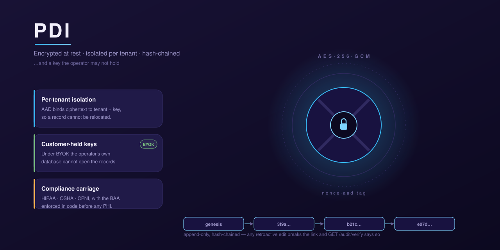

A standalone **secure private data platform** (the "Private Data Infrastructure" enabling seamless support for future AI agent services (**JAN2024 NETWORKED
RESPONSIVE PERSONAL GUIDANCE SYSTEM FOR KNOWN CONDITIONS United States application or CT international application # 19/038,196 ATTORNEY DOCKET # 526.P001 Patent Pending — published as US 2025/0246290 A1**) through a centralized AI-driven
management system (**FEB2024 SYNTHETIC USER PROFILE MANAGEMENT United States application or CT international application # 19/056,418 ATTORNEY DOCKET # 526.P002 Patent Pending — published as US 2025/0265659 A1**). When elected
to activate these capabilities, the platform will be equipped to deploy intelligent, role-specific AI agents capable of assisting users,
automating tasks, managing workflows, and enhancing operational decision-making and could potentially run more efficiently, replace
Mundane Outdated Tasks and or Roles within the company.— all within the same secure, private network environment.
A private, encrypted data vault with a
tamper-evident audit log and a tenant registry. It is the infrastructure layer
that AI systems such as QRME and JIM-mini can *optionally* run on top of —
storing sensitive data in PDI's encrypted vault instead of their own databases,
reached only over PDI's HTTP API. Both integrations are live: JIM-mini
vaults its medical and context payloads here, and QRME seals its profile
source material — each as its own tenant with its own token. See
[docs/tandem.md](docs/tandem.md).


## Console screens

The PDI operator console in two form factors — a **desktop dashboard** and a **mobile console** — one screen per capability of the vault, in the product's design language (Deep Indigo · Vault Cyan · Soft Silver, SF-style type, liquid-glass cards). It shares the night-indigo universe of QRME and JIM-mini with vault cyan as its accent — one world, three products. Every screen is a self-contained SVG (no fonts, images, or scripts) and maps to a real endpoint.

### Desktop dashboard

Wide, multi-panel operator views — sidebar nav, live tiles, the hash-chain audit table, and the encryption pipeline. Regenerate with `python3 docs/desktop/build.py`.

<table>
  <tr>
    <td align="center" width="50%"><a href="docs/desktop/01-overview.svg">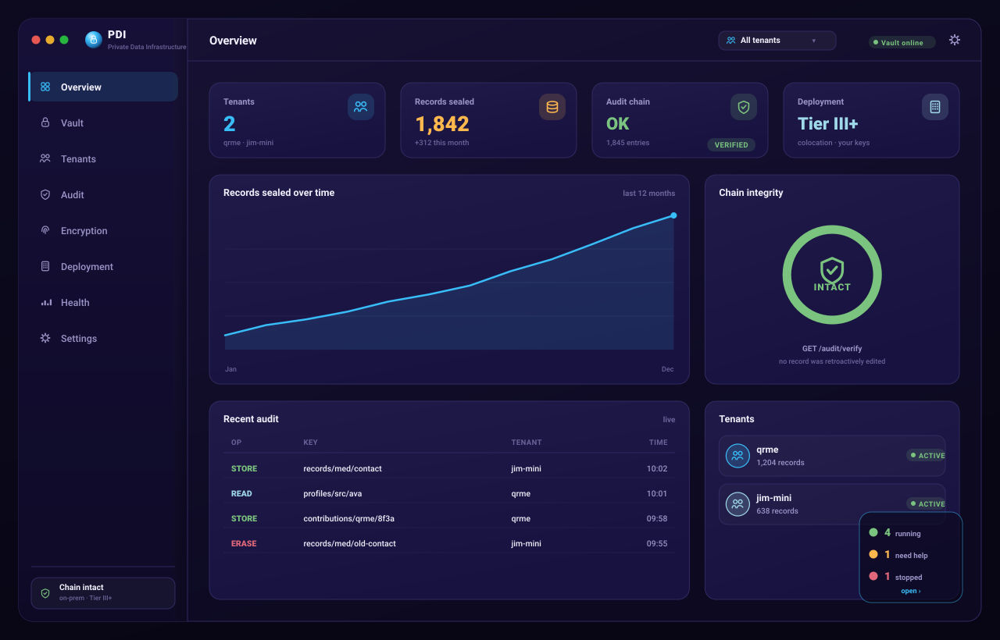</a><br><sub><b>01</b> · Overview</sub></td>
    <td align="center" width="50%"><a href="docs/desktop/02-vault.svg">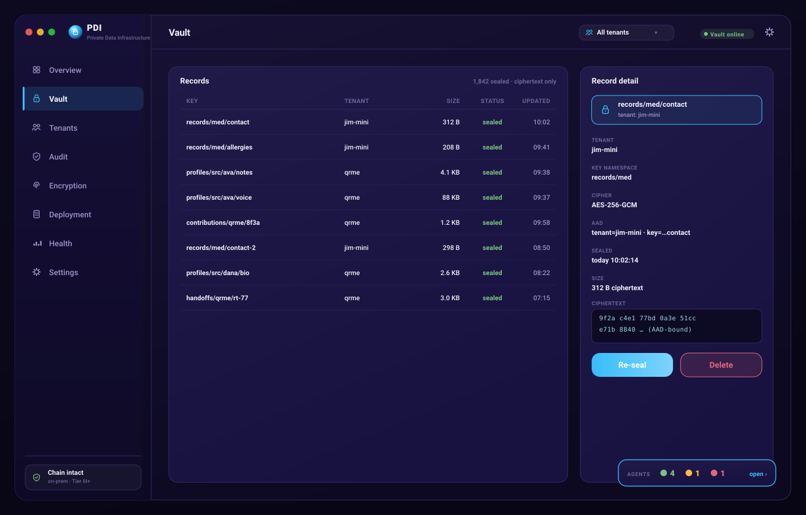</a><br><sub><b>02</b> · Vault</sub></td>
  </tr>
  <tr>
    <td align="center" width="50%"><a href="docs/desktop/03-audit-log.svg">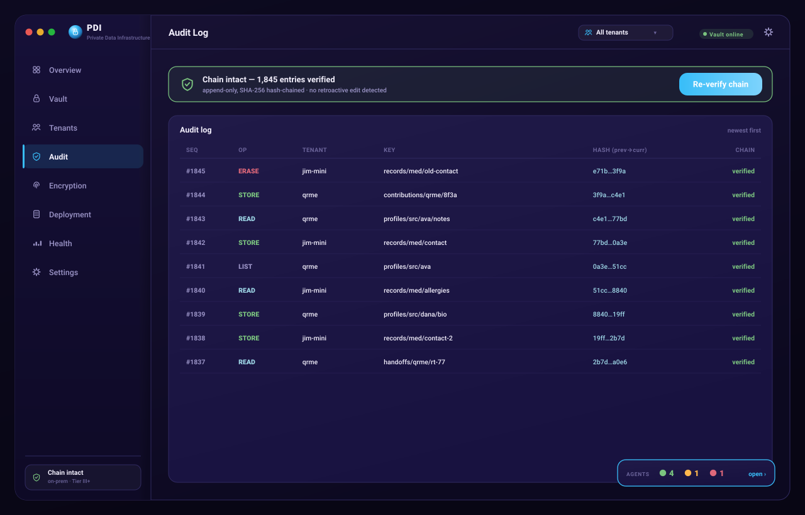</a><br><sub><b>03</b> · Audit Log</sub></td>
    <td align="center" width="50%"><a href="docs/desktop/04-tenants-access.svg">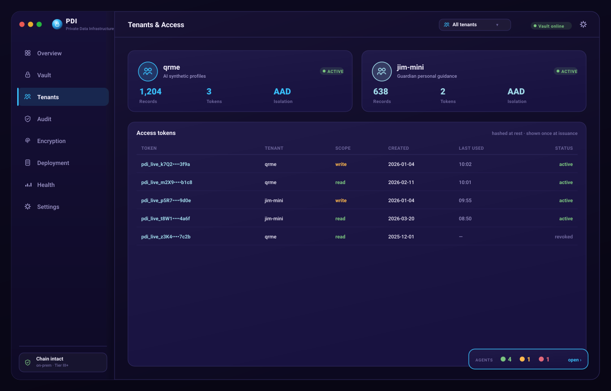</a><br><sub><b>04</b> · Tenants & Access</sub></td>
  </tr>
  <tr>
    <td align="center" width="50%"><a href="docs/desktop/05-encryption-keys.svg">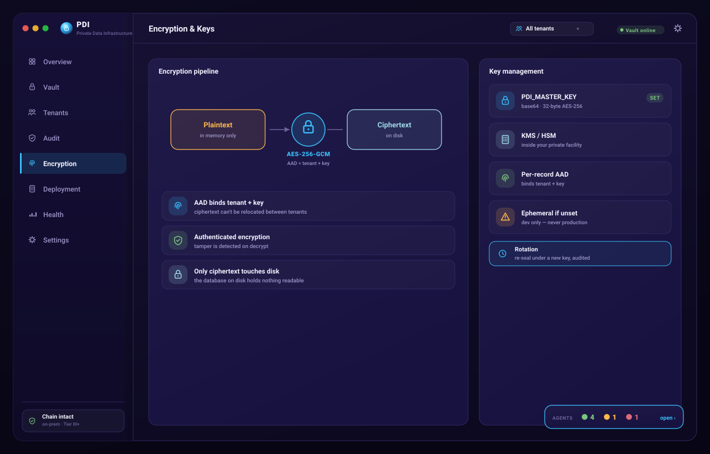</a><br><sub><b>05</b> · Encryption & Keys</sub></td>
    <td align="center" width="50%"><a href="docs/desktop/06-deployment-health.svg">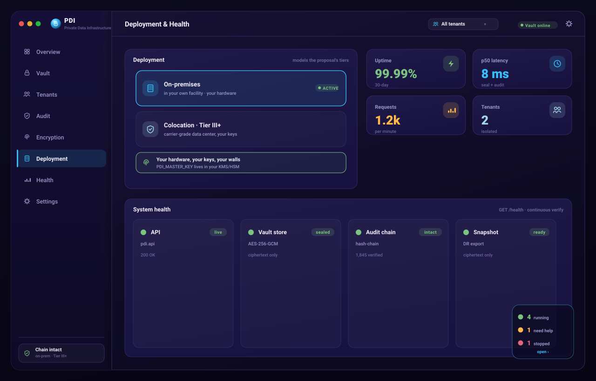</a><br><sub><b>06</b> · Deployment & Health</sub></td>
  </tr>
</table>

The full capability set is **also rendered in the desktop frame**: every one of the 56 mobile screens below has a wide operator-console counterpart in [`docs/screens/desktop/`](docs/screens/desktop) — window chrome, left nav rail, right status rail — generated by the same `docs/screens/build.py`.

### Mobile console

The same system, glanceable on a phone. Regenerate with `python3 docs/screens/build.py`.

**The vault**

<table>
<tr>
<td align="center" width="25%"><a href="docs/screens/01-overview.svg">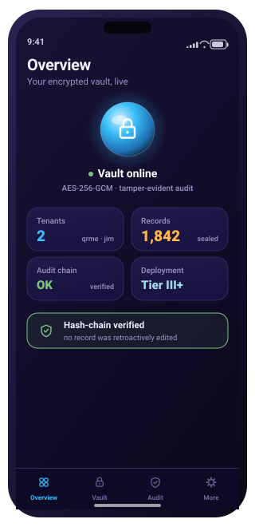</a><br><sub><b>01</b> · Overview</sub></td>
<td align="center" width="25%"><a href="docs/screens/02-vault.svg">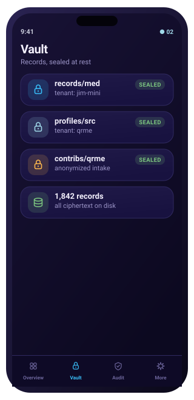</a><br><sub><b>02</b> · Vault</sub></td>
<td align="center" width="25%"><a href="docs/screens/03-store-a-record.svg">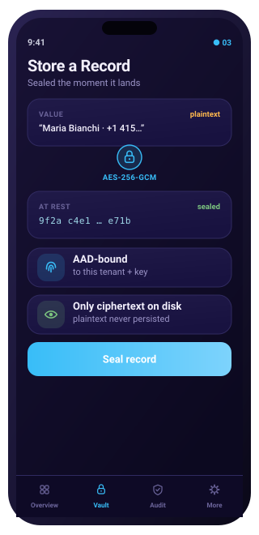</a><br><sub><b>03</b> · Store a Record</sub></td>
<td align="center" width="25%"><a href="docs/screens/04-encryption.svg">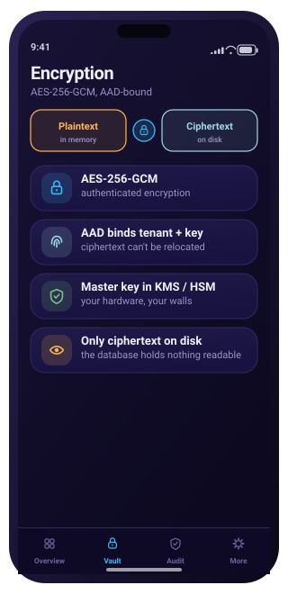</a><br><sub><b>04</b> · Encryption</sub></td>
</tr>
</table>

**Tenants, access & intake**

<table>
<tr>
<td align="center" width="25%"><a href="docs/screens/05-tenants.svg">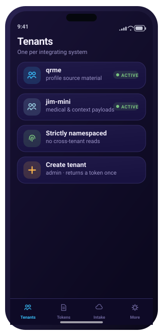</a><br><sub><b>05</b> · Tenants</sub></td>
<td align="center" width="25%"><a href="docs/screens/06-create-tenant.svg">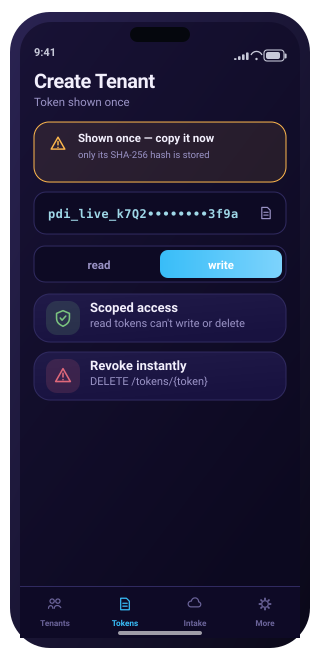</a><br><sub><b>06</b> · Create Tenant</sub></td>
<td align="center" width="25%"><a href="docs/screens/07-access-control.svg">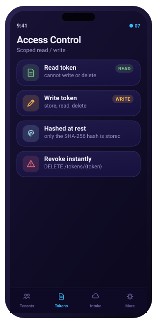</a><br><sub><b>07</b> · Access Control</sub></td>
<td align="center" width="25%"><a href="docs/screens/10-contributions.svg">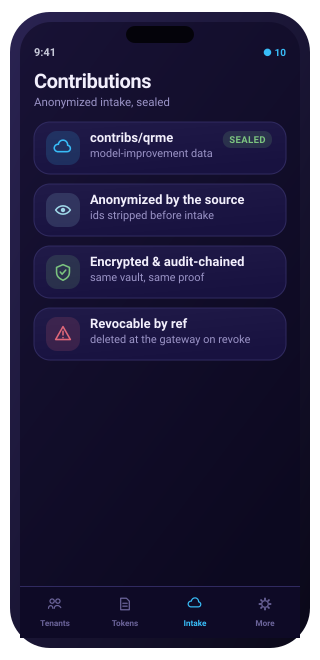</a><br><sub><b>10</b> · Contributions</sub></td>
</tr>
</table>

**Audit & integrity**

<table>
  <tr>
    <td align="center" width="33%"><a href="docs/screens/08-audit-log.svg">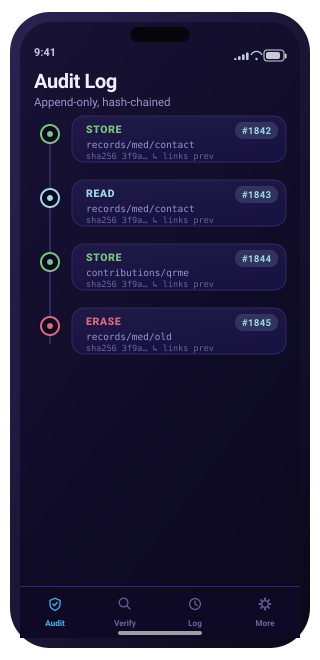</a><br><sub><b>08</b> · Audit Log</sub></td>
    <td align="center" width="33%"><a href="docs/screens/09-verify-chain.svg">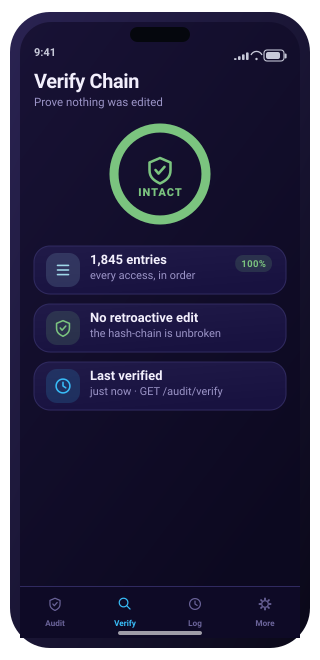</a><br><sub><b>09</b> · Verify Chain</sub></td>
  </tr>
</table>

**Operations & deployment**

<table>
<tr>
<td align="center" width="25%"><a href="docs/screens/11-snapshot-restore.svg">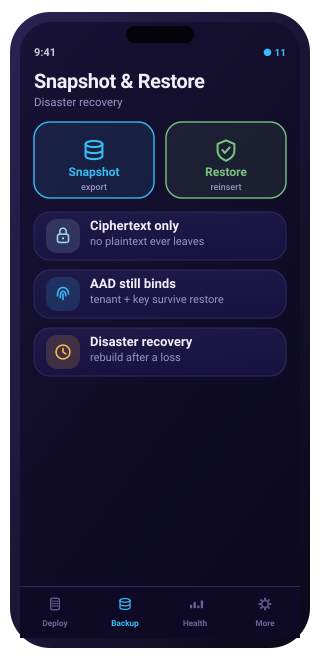</a><br><sub><b>11</b> · Snapshot & Restore</sub></td>
<td align="center" width="25%"><a href="docs/screens/12-deployment.svg">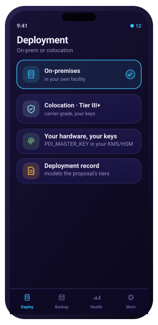</a><br><sub><b>12</b> · Deployment</sub></td>
<td align="center" width="25%"><a href="docs/screens/13-key-management.svg">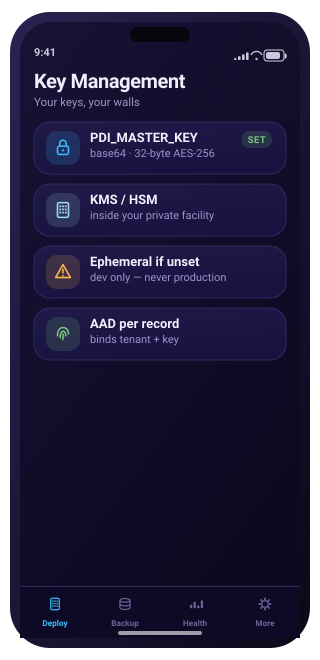</a><br><sub><b>13</b> · Key Management</sub></td>
<td align="center" width="25%"><a href="docs/screens/17-system-health.svg">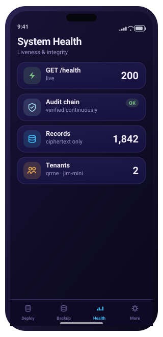</a><br><sub><b>17</b> · System Health</sub></td>
</tr>
</table>

**Isolation, the promise & the tandem**

<table>
<tr>
<td align="center" width="25%"><a href="docs/screens/14-tenant-isolation.svg">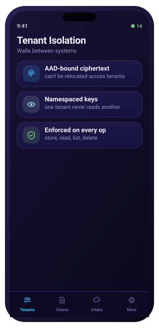</a><br><sub><b>14</b> · Tenant Isolation</sub></td>
<td align="center" width="25%"><a href="docs/screens/15-data-promise.svg">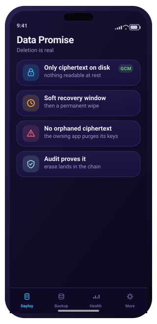</a><br><sub><b>15</b> · Data Promise</sub></td>
<td align="center" width="25%"><a href="docs/screens/16-your-data.svg">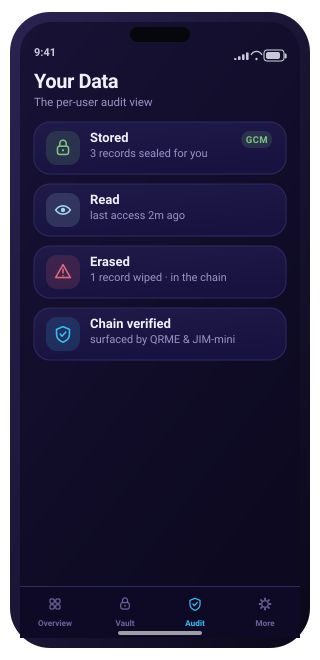</a><br><sub><b>16</b> · Your Data</sub></td>
<td align="center" width="25%"><a href="docs/screens/18-tandem.svg">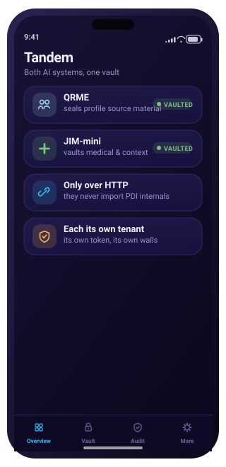</a><br><sub><b>18</b> · Tandem</sub></td>
</tr>
<tr>
<td align="center" width="25%"><a href="docs/screens/19-design-system.svg">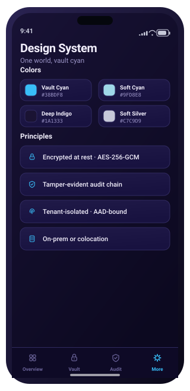</a><br><sub><b>19</b> · Design System</sub></td>
</tr>
</table>

**First-run setup**

The first-run journey runs **23 Welcome → 22 Log In → 24 Key Setup → 25 Grant Access → 26 Connect Systems → 27 All Set**, then opens the console.

<table>
<tr>
<td align="center" width="25%"><a href="docs/screens/23-welcome.svg">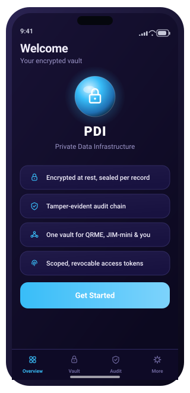</a><br><sub><b>23</b> · Welcome</sub></td>
<td align="center" width="25%"><a href="docs/screens/24-key-setup.svg">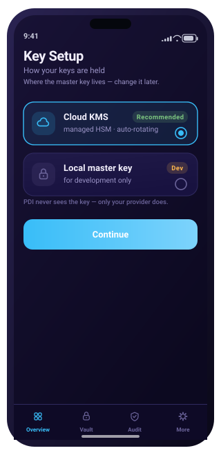</a><br><sub><b>24</b> · Key Setup</sub></td>
<td align="center" width="25%"><a href="docs/screens/25-grant-access.svg">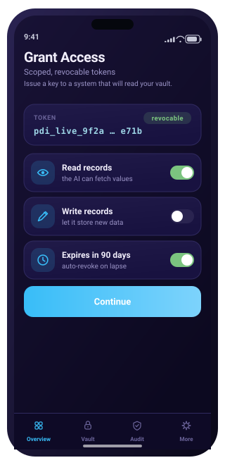</a><br><sub><b>25</b> · Grant Access</sub></td>
<td align="center" width="25%"><a href="docs/screens/26-connect-systems.svg">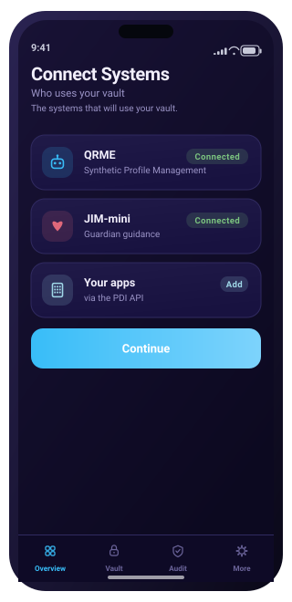</a><br><sub><b>26</b> · Connect Systems</sub></td>
</tr>
<tr>
<td align="center" width="25%"><a href="docs/screens/27-all-set.svg">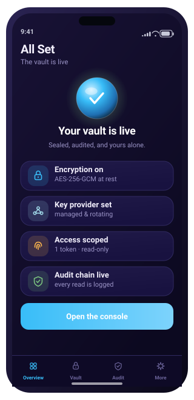</a><br><sub><b>27</b> · All Set</sub></td>
</tr>
</table>

**Operator session lifecycle**

<table>
  <tr>
    <td align="center" width="33%"><a href="docs/screens/20-sign-in.svg">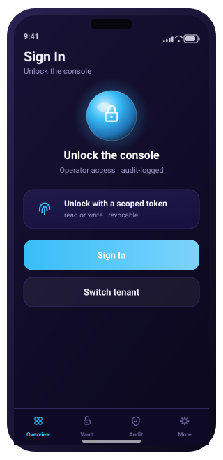</a><br><sub><b>20</b> · Sign In</sub></td>
    <td align="center" width="33%"><a href="docs/screens/21-sign-out.svg">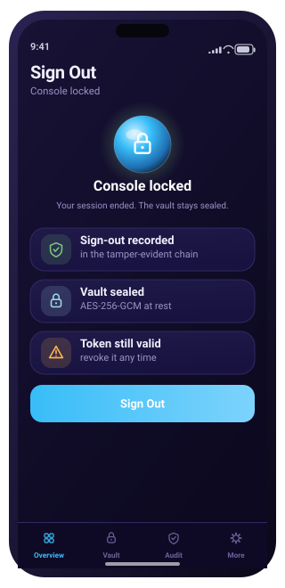</a><br><sub><b>21</b> · Sign Out</sub></td>
    <td align="center" width="33%"><a href="docs/screens/22-log-in.svg">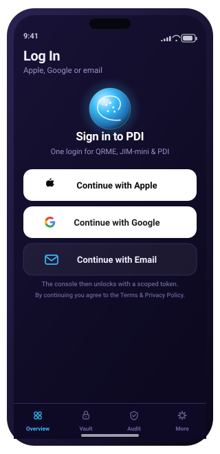</a><br><sub><b>22</b> · Log In</sub></td>
  </tr>
</table>

**Connectors — social platforms & AI-integrated apps**

<table>
<tr>
<td align="center" width="25%"><a href="docs/screens/28-connectors.svg">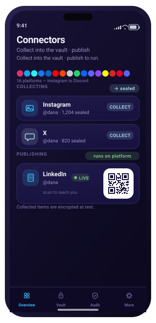</a><br><sub><b>28</b> · Connectors</sub></td>
<td align="center" width="25%"><a href="docs/screens/29-connected-apps.svg">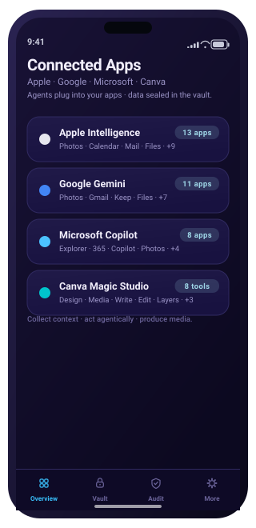</a><br><sub><b>29</b> · Connected Apps</sub></td>
<td align="center" width="25%"><a href="docs/screens/30-compliance-transfers.svg">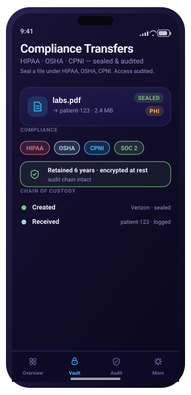</a><br><sub><b>30</b> · Compliance Transfers</sub></td>
<td align="center" width="25%"><a href="docs/screens/31-secure-intake.svg">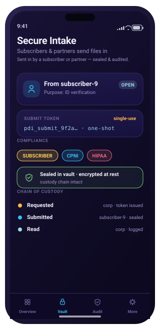</a><br><sub><b>31</b> · Secure Intake</sub></td>
</tr>
<tr>
<td align="center" width="25%"><a href="docs/screens/32-files-photos.svg">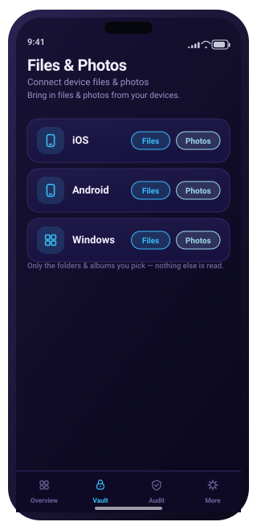</a><br><sub><b>32</b> · Files &amp; Photos</sub></td>
<td align="center" width="25%"><a href="docs/screens/33-apple-intelligence.svg">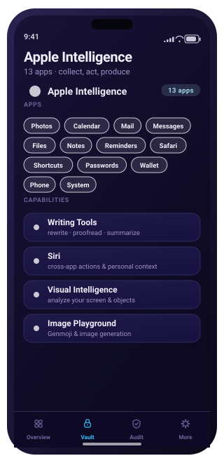</a><br><sub><b>33</b> · Apple Intelligence</sub></td>
<td align="center" width="25%"><a href="docs/screens/34-google-gemini.svg">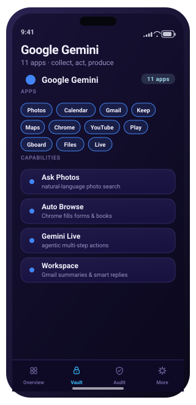</a><br><sub><b>34</b> · Google Gemini</sub></td>
<td align="center" width="25%"><a href="docs/screens/35-microsoft-copilot.svg">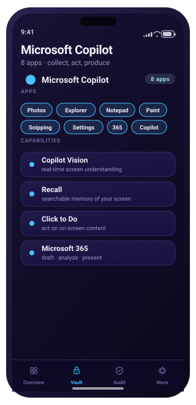</a><br><sub><b>35</b> · Microsoft Copilot</sub></td>
</tr>
<tr>
<td align="center" width="25%"><a href="docs/screens/36-robot-data-vault.svg">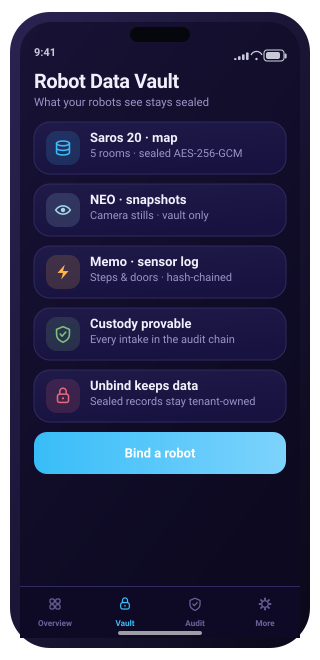</a><br><sub><b>36</b> · Robot Data Vault</sub></td>
<td align="center" width="25%"><a href="docs/screens/37-custody-beacons.svg">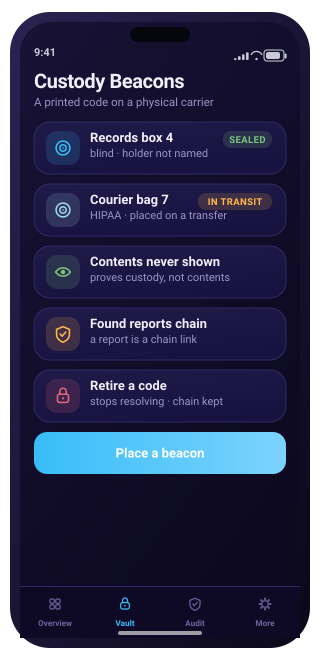</a><br><sub><b>37</b> · Custody Beacons</sub></td>
<td align="center" width="25%"><a href="docs/screens/38-gate-agent.svg">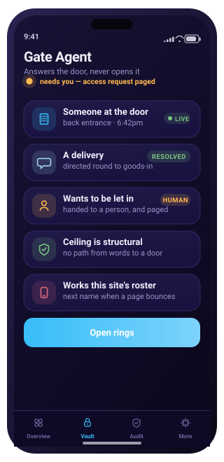</a><br><sub><b>38</b> · Gate Agent</sub></td>
<td align="center" width="25%"><a href="docs/screens/39-gate-agents.svg">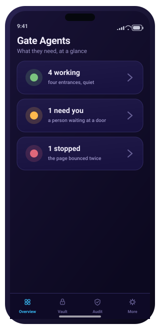</a><br><sub><b>39</b> · Gate Agents</sub></td>
</tr>
<tr>
<td align="center" width="25%"><a href="docs/screens/40-audit.svg">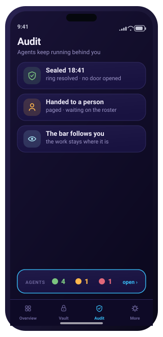</a><br><sub><b>40</b> · Audit · overlay</sub></td>
<td align="center" width="25%"><a href="docs/screens/41-console-guide.svg">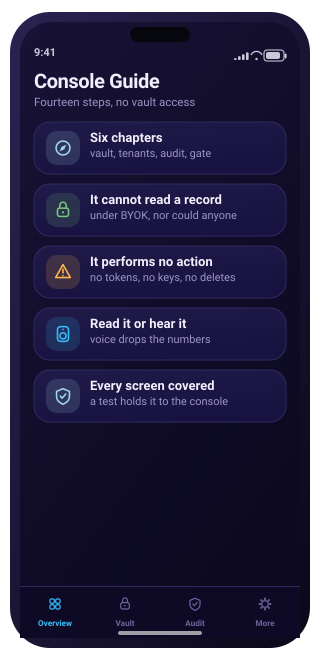</a><br><sub><b>41</b> · Console Guide</sub></td>
<td align="center" width="25%"><a href="docs/screens/42-where-it-lives.svg">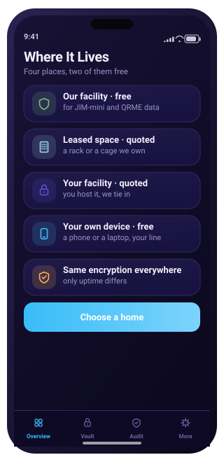</a><br><sub><b>42</b> · Where It Lives</sub></td>
<td align="center" width="25%"><a href="docs/screens/43-the-corner-pane.svg">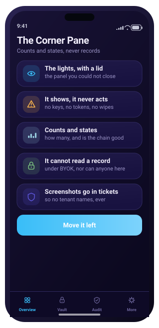</a><br><sub><b>43</b> · The Corner Pane</sub></td>
</tr>
<tr>
<td align="center" width="25%"><a href="docs/screens/44-choose-a-home.svg">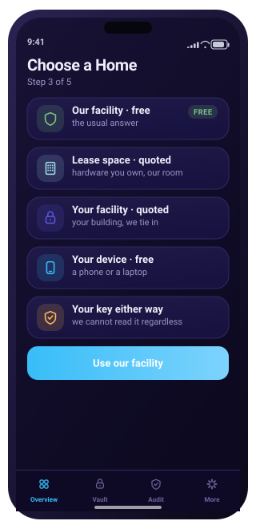</a><br><sub><b>44</b> · Choose a Home</sub></td>
<td align="center" width="25%"><a href="docs/screens/45-request-a-quote.svg">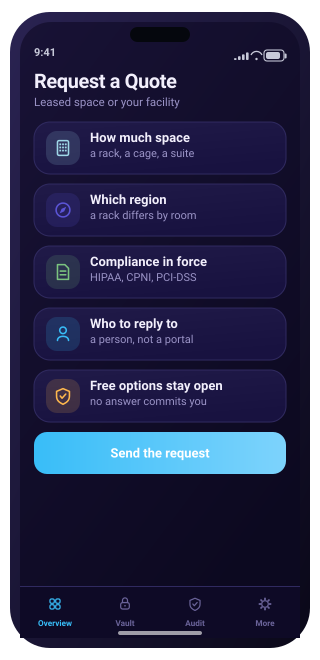</a><br><sub><b>45</b> · Request a Quote</sub></td>
<td align="center" width="25%"><a href="docs/screens/46-what-went-wrong.svg">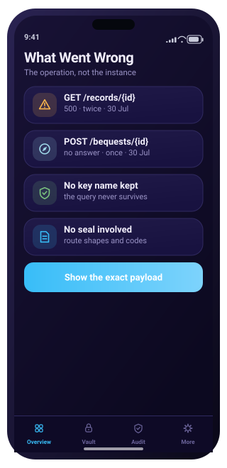</a><br><sub><b>46</b> · What Went Wrong</sub></td>
<td align="center" width="25%"><a href="docs/screens/47-before-anything-is-sent.svg">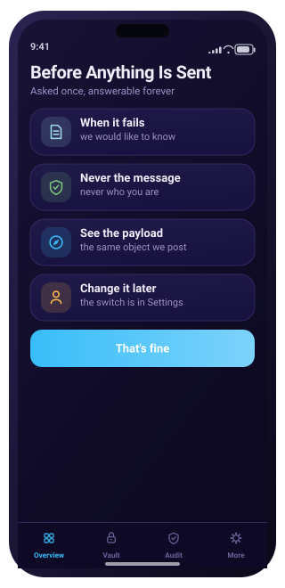</a><br><sub><b>47</b> · Before Anything Is Sent</sub></td>
</tr>
<tr>
<td align="center" width="25%"><a href="docs/screens/48-carriers.svg">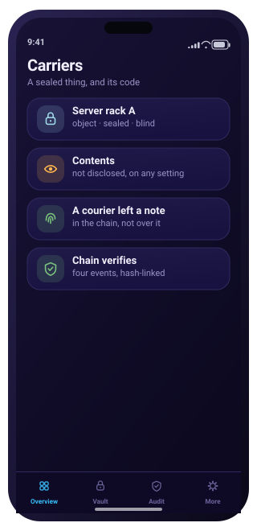</a><br><sub><b>48</b> · Carriers</sub></td>
<td align="center" width="25%"><a href="docs/screens/49-exchange.svg">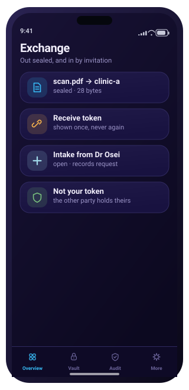</a><br><sub><b>49</b> · Exchange</sub></td>
<td align="center" width="25%"><a href="docs/screens/50-custody.svg">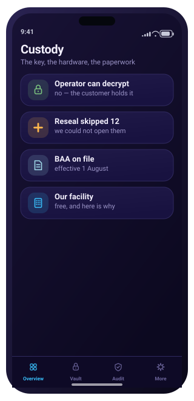</a><br><sub><b>50</b> · Custody</sub></td>
<td align="center" width="25%"><a href="docs/screens/51-bridges.svg">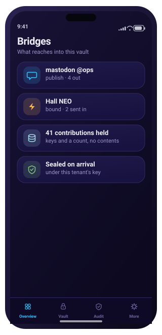</a><br><sub><b>51</b> · Bridges</sub></td>
</tr>
<tr>
<td align="center" width="25%"><a href="docs/screens/52-guiding.svg">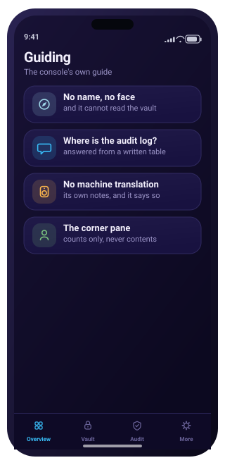</a><br><sub><b>52</b> · Guiding</sub></td>
<td align="center" width="25%"><a href="docs/screens/53-continuity.svg">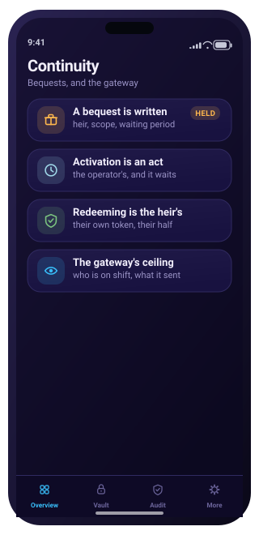</a><br><sub><b>53</b> · Continuity</sub></td>
<td align="center" width="25%"><a href="docs/screens/54-operations.svg">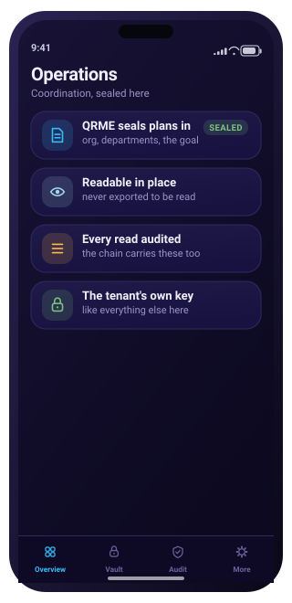</a><br><sub><b>54</b> · Operations</sub></td>
<td align="center" width="25%"><a href="docs/screens/55-positions.svg">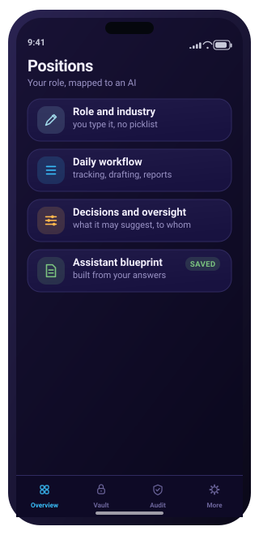</a><br><sub><b>55</b> · Positions</sub></td>
</tr>
<tr>
<td align="center" width="25%"><a href="docs/screens/56-settings.svg">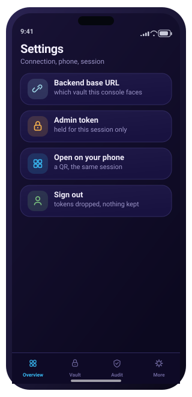</a><br><sub><b>56</b> · Settings</sub></td>
</tr>
</table>

**For enterprises:** PDI offers compliance-grade secure file transfer for corporations (carriers, healthcare, financial, public sector) — files sealed under HIPAA / OSHA / CPNI / PCI-DSS and more, with audited chain of custody and enforced retention, in both directions: outbound transfers and inbound secure intake from subscribers and partners. See [docs/enterprise.md](docs/enterprise.md).

## What's in the current release

The sections below describe every capability in detail. This is the short
version of how it got here — what each release actually added, newest first.
Full detail in [CHANGELOG.md](CHANGELOG.md).

Several rounds land here as **no functional change**, and the changelog says so
in those words rather than padding the entry. PDI is the bottom layer: when the
products above it learn to handle something new, the vault's correct
contribution is usually to hold the bytes exactly as it already did.

| Release | What landed |
|---|---|
| **0.58.1** | **The member that isn't there** — the offline-posture card reached `state.api` on an `AppState` that has no client at all, which Swift does not compile. A guard now reads every member the screens reach for against the one file that declares them |
| **0.58.0** | The sibling products found a header the console sent and no shell did — the person's own model key. This product runs no generation, so there is nothing to carry; what it gets is the check in its honest form, asserting the header has not appeared here either |
| **0.57.9** | The language guard could say *the header is set with the resolver* and could not say *every request carries it* — 3 of 4 Windows sends went round the shared helper. One dispatcher, and the check now walks dispatch sites rather than header lines |
| **0.57.8** | The untranslated-literal guard lands here too. Seven sites — `Language` on all three shells, `Connectors` on two, the audit page's preview link — and one worth naming: the iPhone's sources picker rendered its own enum raw values, so **both tabs read English on every device**, a rule the transfers screen next door had already settled and never had applied to it |
| **0.57.7** | The version a person installs. The iOS spec, the Gradle config and the `.csproj` all reported `0.1.0` or nothing while the release said `0.57.6`. Checked against `pyproject.toml` now, with the Android `versionCode` derived rather than kept by hand, and a capability check that will catch the first screen here to open a camera without saying why |
| **0.57.6** | The parse check reaches the XAML the Windows shell's screens are actually written in — five pages across the other two products did not parse, and none of them were here. Four markup checks, clean on all ten pages; four injected defects confirm each can fail |
| **0.57.5** | The shells get a parse check — duplicate declarations in one scope, and braces that do not balance — after QRME shipped a Swift compile error no text-reading guard could see. Clean here; three injected defects confirm it can fail |
| **0.57.4** | Nothing to collect here — QRME's shells needed six inputs its screens never asked for; this product's were already correct, and the request-body guard stays green at a ceiling of zero. Cut with the others |
| **0.57.3** | Request bodies get the guard on all three native shells — and the port found the Windows reader returning zero writes, because this client builds its messages by hand where QRME wraps them in a helper. Only the per-client reach floor could catch that. With both shapes read: nothing wrong |
| **0.57.2** | Request bodies get the guard responses have had since 0.56.4 — 42 writes, 33 readable, 34 matched to a model, nothing wrong. QRME was clean too; JIM-mini had two silently discarded health readings. Three injected defects confirm this guard can still fail |
| **0.57.1** | The console gets the shape guard the native clients have had since 0.56.4 — 33 shapes, 224 fields, 60 GET bindings, 27 driven, and nothing wrong. QRME's console had four defects and JIM-mini's two; three injected defects confirm this guard can still fail |
| **0.57.0** | The Kotlin guard arrives and finds this client correct — 18 routes, 31 keys, 15 driven, nothing recorded at a ceiling of zero. The port failed in 0.56.9 over a required `JSONObject(` wrapper this client does not use; three injected defects confirm the guard can still fail |
| **0.56.9** | QRME found eight wrong reads in its Kotlin client, all already fixed in its C#. The guard is not here yet: ported across, its extractor found zero routes — this client calls the backend in a different shape, and lowering the threshold until it passed would ship a guard that asserts on nothing |
| **0.56.8** | The shape guard reads Swift now as well as C# — QRME's iOS client was carrying nine fictions already fixed on its Windows side. This client came back clean |
| **0.56.7** | The shape guard now checks that a declared type can decode what arrives, not just that the name is there — QRME's `/wearables` sent a map where the record said `string[]`. Five live crashes found there; none here |
| **0.56.6** | **Eight watch faces that were not on the page** — reported from a phone. An HTML table is as wide as its longest row, so one `<tr>` with fifteen cells beside rows of three left twelve blank columns everywhere and clipped the rest off a phone. Every gallery is a uniform grid now — four across for screens and watch faces, two for desktop frames — with a guard that reads the widest row, not the first |
| **0.56.5** | QRME's shape guard is here now, rewritten to see this client — it builds each request itself and carries the tenant token beside it, so a borrowed regex finds zero calls. Clean sweep; the unverified record stays at ceiling zero |
| **0.56.4** | Cut together at one version; QRME found fourteen client records declaring fields their routes have never sent, and a guard that drives every binding to check. That guard is not in this repo yet — next round's work, named here |
| **0.56.3** | Cut together at one version; QRME's collision record falls 28 → 24 — three counts that shared a name with the boolean they counted, and one client bug wearing the same disguise |
| **0.56.2** | **The compiler nobody ran** — `tsc` and a wire-name guard join the suite. Two collisions recorded, of which `sealed` matters most for a vault: a sealing detail in one place and a boolean in another |
| **0.56.1** | **The key that lives in the HSM** — the KMS provider was a documented `NotImplementedError`; it now unwraps a stored blob through kms:Decrypt or PKCS#11, binds it to this deployment with an encryption context, and refuses rather than falling back to a local key. No live AWS call has been made from this repo, and the custody statement says so |
| **0.56.0** | **A wipe that cleared three tables of twenty** — a permanently-wiped tenant left its key configuration and its signed BAA behind. The cascade now reads the schema instead of a list, the scheduled purge runs the same one, and the audit chain is the only thing either is allowed to keep |
| **0.55.0** | Cut together at one version; the hand sweep that once found forty unlabelled boxes on these forms is now a guard that will notice the forty-first |
| **0.54.1** | Cut together at one version; the same care a vault takes between a label on a posture block and the identifier a route compares |
| **0.54.0** | Cut together at one version; a promise stated for one reader and not another is the same defect as a promise stated and unenforced |
| **0.53.1** | **`operator_can_decrypt: false`, checked against the whole database** — every column of every table swept for the customer's key in base64, raw and hex, including after a refused key. Nothing leaked; two columns of one table were all that had been checked |
| **0.53.0** | Cut together at one version; a stated posture needs a test that could catch it lying, and that test cannot be a read of the statement — the vault's own subject, applied to a bridge |
| **0.52.0** | Cut together at one version; the round's work withholds before the content exists rather than handing a client a flag, and names what it held — this repo's two arguments, on a speaker |
| **0.51.0** | Cut together at one version; the round's work is a dial that changes wording and no capability, and a count offered rather than earned — both stated as fields a client renders |
| **0.50.0** | Cut together at one version; the round's work is JIM-mini's presence — refusals on the wire rather than in a docstring, and an offline path that is the floor rather than the fallback |
| **0.49.0** | Cut together at one version; the round's work is QRME's public stream and JIM-mini's GET-only door onto it — the rule about what plays asserted on the wire rather than in four clients, the same shape as this repo's posture blocks |
| **0.48.3** | Custody and Continuity read in the tenant's language — *can the operator decrypt this?* and what happens to a sealed file after a death, 229 → 177 |
| **0.48.2** | The console gets its first localization table, and the language picker is the first screen wired — 250 → 229 English strings |
| **0.48.1** | This console has no localization table at all — 250 English strings behind a language picker, counted and ratcheted for the first time |
| **0.48.0** | The split-wording guard arrives with nothing to record — an empty floor, in place before the rows are |
| **0.47.9** | Cut together at one version; the shared guard gains `_ARRAY`, the Swift twin of the `listOf` shape |
| **0.47.8** | **The sentence that says how to get the file back** — Transfers localized on all three shells, including the two out-of-band instructions that sit under a token shown once and name the only way the file can be retrieved (iOS 90→65, Android 73→59, Windows 101→69) |
| **0.47.7** | **The console's own posture statement was English** — the paragraph about what it sends when something fails, its two-step reveal, and the key-rotation verdict all sat in the code-behind as assignments the XAML rule could not read |
| **0.47.6** | **The buttons that write to the vault were English** — *Seal record*, *Rotate key*, *Request file* and the admin-token field went through wrapper composables the untranslated rule could not read (75 → 73) |
| **0.47.5** | **The welcome screen greeted everyone in English** — the accountless screen never passed `DeviceLanguage()` on any shell; plus the PaneFooter sign-out fix in its third product, and the dead-key guard ported (294 → 266) |
| **0.47.4** | Version alignment — the round's work was JIM's Overview and its enum-backed tab strips |
| **0.47.3** | The route audit's new guard-on-guard, ported — nothing unattributed here beyond two recorded non-calls |
| **0.47.2** | Version alignment — the round's work was JIM's Family and Connect screens; PDI's native record stands at 294 |
| **0.47.1** | Ternary blind spot ported and corrected — 282 → 294, nothing regressed |
| **0.47.0** | Version alignment with QRME's native round |
| **0.46.9** | Version alignment with QRME's native round |
| **0.46.8** | Version alignment with QRME's native round |
| **0.46.7** | Version alignment with QRME's native round |
| **0.46.6** | Version alignment with QRME's native round |
| **0.46.5** | Version alignment with QRME's native round |
| **0.46.4** | **Forty fields a person fills in and nothing named them** — five bare selects, eight placeholder-only boxes, a nameless date input and the whole Positions questionnaire get labels, then the field-label table gets them: 91 → 51 |
| **0.46.3** | Version alignment with QRME's console round |
| **0.46.2** | Version alignment with QRME's console round |
| **0.46.1** | Version alignment with QRME's console round |
| **0.46.0** | Version alignment with QRME's console round |
| **0.45.9** | Version alignment with QRME's console round |
| **0.45.8** | Version alignment with QRME's console round |
| **0.45.7** | Version alignment with QRME's console round |
| **0.45.6** | Version alignment with QRME's lobby, presence and voice round |
| **0.45.5** | Version alignment with QRME's objection, live and marketplace round |
| **0.45.4** | Version alignment with QRME's watch-party, delegation and beacon round |
| **0.45.3** | Version alignment with QRME's succession, signing and placement round |
| **0.45.2** | Version alignment with QRME's three-screen localization round |
| **0.45.1** | Version alignment with JIM's console-to-zero round |
| **0.45.0** | Version alignment with the eighth localization-ratchet round — QRME's console record goes under a thousand |
| **0.44.9** | Version alignment with the seventh localization-ratchet round |
| **0.44.8** | Version alignment with the sixth localization-ratchet round |
| **0.44.7** | Version alignment with the fifth localization-ratchet round |
| **0.44.6** | Version alignment with the fourth localization-ratchet round |
| **0.44.5** | Version alignment with the third localization-ratchet round |
| **0.44.4** | Version alignment with the second localization-ratchet round |
| **0.44.3** | Version alignment with QRME's and JIM's localization-ratchet round |
| **0.44.2** | Version alignment with QRME's last-doors round (the doorless records run to zero on all three shells) |
| **0.44.1** | Version alignment with QRME's sticker/queue/stamp round (beacons, moderation, reviews, watermarks, media, wearables on the phones) |
| **0.44.0** | Version alignment with QRME's keys/till/lifeline round (accounts, money, status+help on the phones) |
| **0.43.9** | Version alignment with QRME's face round (portrait, badge, page, surfaces, bodies, dials, wrist on the phones) |
| **0.43.8** | Version alignment with JIM's watch-picker round |
| **0.43.7** | Version alignment with QRME's record/veil/exit round |
| **0.43.6** | Version alignment with QRME's workshop round |
| **0.43.5** | Version alignment with QRME's seal/mail/screen round |
| **0.43.4** | Version alignment with QRME's body/case/lobby round |
| **0.43.3** | Version alignment with QRME's place/camera/organization/tour round |
| **0.43.2** | Version alignment with QRME's crowd/couch/loan round |
| **0.43.1** | Version alignment with the QRME inbox round — nothing new crosses into the vault |
| **0.43.0** | **Version alignment** — QRME's phones learned to do business; nothing new crosses into the vault |
| **0.42.9** | **Version alignment** — QRME's social surface reached its phones; nothing new crosses into the vault |
| **0.42.8** | **Version alignment** — QRME and JIM labelled the 161 recorded fields their forms had started asking for; nothing new crosses into the vault; the console gained the suite's always-on light — one lamp, green while the vault answers, never silently absent |
| **0.42.7** | **Version alignment** — QRME and JIM gained messaging, feature switches and homepage sandboxes; nothing new crosses into the vault |
| **0.42.6** | **Version alignment** — JIM gained booking/scheduling with bottom-rung reminders and self-only email; nothing new crosses into the vault |
| **0.42.5** | **Version alignment** — QRME grew standalone shops (not desks) and JIM grew the tandem buyer's side; purchase histories stay in the buyer's own JIM |
| **0.42.4** | **Version alignment** — JIM's money guardian gained its native doors; the account numbers those phones register still land here, sealed, or nowhere |
| **0.42.3** | **The last thirteen unaudited screens** — five PDI components sat `unaudited` since the manifest was seeded. `Records` was only unlabelled (it heads itself "Vault", screens 2+3); Continuity, Operations, Positions and Settings had never been drawn. Screens **53-56** are the drawings, ceilings at zero, `undrawn=0` true at last |
| **0.42.2** | **Version alignment** — the round the vault was built for: JIM's money guardian seals account, routing and exchange credentials here and refuses to store them anywhere else |
| **0.42.1** | **Version alignment** — cut with QRME's starter dossiers; no PDI code changed |
| **0.42.0** | **Version alignment** — cut with QRME's desk service connections and JIM's signal-quality door fix; no PDI code changed |
| **0.41.0** | **The workflow round-trips and nothing walked the whole arc** — `workflows.py` names three properties a delegated multi-phase goal has to keep, each unit-tested on its own side of the wire; the one check that boots all three products drove a single exchange and stopped, never calling `start_workflow`, `advance` or `specialist_tasks` across the boundary. Driving it surfaced the Pro gate and the owner's opt-in as steps rather than surprises, and the arc now walks research → draft → send and pauses at `confirm` |
| **0.40.9** | **The README said v0.18.0** — the first bold line of every README named a release twenty-two cuts old, on the line directly above one promising the three products are versioned and cut together; the history table underneath stopped at 0.30.6, leaving seventeen shipped releases in the changelog and off the page anybody reads. Both are now checked against `pyproject.toml` and the changelog |
| **0.40.8** | **The refusal named the field the API calls it** — An earlier round took the 422 from `[{"type":"missing",...}]` to one sentence a person can read, in their own language. |
| **0.40.7** | **The record that outlived the code** — `public_untranslated.txt` opened with a paragraph explaining that `Onboarding.tsx` — the screen every person in the world meets first — carried forty-odd English strings, that translating them was "its own round", and that a half-translated sign-up form would be worse than an English one. |
| **0.40.6** | **Cut alongside qrme and jim-mini** — No change in this product. The round finishes localizing QRME's **accountless screen** — the one built for somebody who has found a synthetic profile of themselves and has no account, and therefore no profile language to take a setting from. |
| **0.40.5** | **Every door of theirs answered 401; the grantee's answered with the record** — `vault.tenant_by_id` has carried its qualifier since it was written, and says so in its own docstring: `bequests.py` did not use it. |
| **0.40.4** | **Cut alongside qrme and jim-mini** — No change in this product. The round is about which surfaces may put words in a synthetic profile's mouth, and PDI generates nothing — it seals what the other two produce. |
| **0.40.3** | **Cut alongside qrme and jim-mini** — No change in this product. The round is about what a model-backed product says when the model it was asked for does not answer, and PDI has no inference path of its own — it stores what the other two seal. |
| **0.40.2** | **The refusals, finished** — 0.24.0 translated the eleven refusals any route can raise and **wrote the rest down**. |
| **0.40.1** | **The language no client was sending** — PDI's most exposed reader has no account by design: the person on the other end of a handoff, opening an intake with a submit token and nothing else. |
| **0.40.0** | **Version alignment** — The three products are cut together at one version, and this release's work is in the siblings. |
| **0.30.9** | **An HTTP verb where a path goes** — This product's Android client declares its shared helper `request(path, method, body, token)`. |
| **0.30.8** | **The tab bar answers in your language. Everything behind it does not.** — The QRME repo has carried a console guard since those rounds — `test_the_nav_is_translated_and_nothing_behind_it_is.py` — which found forty-six translated sidebar labels in front of 1577 English screens, and said why that is worse than ship |
| **0.30.7** | **Offline mode became readable** — `PDI_OFFLINE` refuses anything bound for another machine, and until this release a deployment could set it and had no way to show anyone the result. |
| **0.29.0** | **0.29.0** — Aligned with QRME and JIM-mini 0.29.0. The three products carry one version, so a release that only moves in two of them still moves in all three. |
| **0.28.0** | **0.28.0** — Aligned with JIM-mini 0.28.0. The three products carry one version, so a release that only moves in one of them still moves in all three. |
| **0.27.0** | **Kotlin's other interpolation** — `_spans` routes every `${`-carrying pattern to a brace counter, which is right for the nested-template problem it was written for and blind to the *other* form the same language uses. |
| **0.26.0** | **Three copies of one guard, three different blind spots** — `clientpaths.py` says of itself, in its own docstring, that it is *byte- identical in qrme, jim-mini and pdi*. |
| **0.25.0** | **0.25.0** — Aligned with QRME 0.25.0. The three products carry one version, so a release that only moves in one of them still moves in all three — otherwise a support question about "0.25" has three different answers depending on which app is being asked about. |
| **0.30.6** | **The plan gate speaks the reader's language** — carried from the sibling audit. PDI has no plan gate, so there is no sentence of this shape here; the mechanism that keeps a translated frame from closing around an untranslated slot is already in place, and this release aligns the version with the two products where the sentence exists |
| **0.30.5** | **The plan gate said HTTP 402** — carried from the sibling audit: `detail` is a string for most refusals, a dict for a structured one and a list for a 422, and only the list had been given a top-level `message`. Every refusal now carries the sentence in one place whatever shape the structure has, and `localize_detail` reaches the level the handler actually wraps to — so PDI's first structured refusal cannot ship untranslated the way the sibling's did |
| **0.30.4** | **A refusal whose English is not a constant** — f-string refusals had been named as uncovered for three releases, because a sentence built by interpolation has no English source to key on at the moment it is raised. `i18n.Templated` carries the template and its slots beside the finished English text; 4 converted. The slot is the whole design: whitespace means prose, and a prose slot keeps the entire refusal English rather than producing a sentence half in each language |
| **0.30.3** | **The refusal that arrived as a list** — a 422's `detail` is pydantic's rows, not a string, and all four client families rendered it by a path written for one: the console and Android printed the raw JSON, iOS and Windows fell back to `HTTP 422`. The sentence translated last release was correct, arrived, and was read by nobody. The server composes one sentence now, carrying nothing the rows do not; the guard took three attempts, and the first two passed on code that was fully broken |
| **0.30.2** | **The synthetic self enters the tandem contract** — the shared boundary, byte-identical in three repositories, written before the code that obeys it. The vault's stake is the destination: a guardian's brief reaches a person's own synthetic profile through QRME's owner-gated source route, and QRME seals source material into PDI when a vault is configured — so consented medication names come to rest encrypted here rather than beside the profile |
| **0.30.1** | **Isolation held, and nothing was checking it** — seventy GET routes driven as a second tenant against a first tenant's data, plus the mutating routes: no cross-tenant read, no cross-tenant write, and now a guard that says so. It runs with an admin token set and from an address that is not this machine, because `testclient` is a trusted local caller and every other test in the suite runs with the admin surface open. Also: a 422 was returning the submitted body — a record value in plaintext on the one path that never touches the encryption layer |
| **0.30.0** | **The stranger's page was already right; the tenant's was not** — the recipient's server-rendered page reads their browser's language and its two refusals are localized at the route, while every one of the tenant's sixty refusals was English on an account whose language picker had been answered. The reverse of the usual direction. Three exception handlers built responses three different ways; all of them go through one place now, and a guard fails the next one that does not |
| **0.24.0** | **The page was not an oracle; the route it fronts was** — `POST /transfers/{tid}/receive` takes no credential and answered 404 for a fake id and 403 for a real one, so anybody could enumerate sealed transfers. Both now answer alike, and revoked still reaches the person holding the token. The four pages built for people who are not tenants speak ten languages, as do the six sentences a courier reads after pressing a button — including the one telling somebody at a gate not to wait for anyone to come out |
| **0.23.0** | **The recipient had nowhere to put their token** — a file sealed under HIPAA or OSHA or CPNI arrives with a one-shot receive token, and the only thing calling that route was the sender's own *Receive it as the recipient* rehearsal button. There is now a page at `/r/{id}`, with the token in the URL fragment so the link survives mail and proxies without leaving an authorization in anybody's log, and a **Copy the recipient's link** control that resolves it before the sender sends it. Android and Windows can also read back the keys a bound robot sealed |
| **0.22.0** | **Cut with the siblings** — the console backlog run to zero, and the fixes the audit turned up on the way |
| **0.21.0** | **Cut with the siblings** — four door-audit rounds across the three products |
| **0.20.1** | **The union hid a surface** — *some* client reaching a route was being counted as *this* client reaching it, so the console's own gaps were invisible. A guard per client, and the doors that answered it |
| **0.20.0** | **Failures from the phone and the desktop shell** — error capture reaches the native shells, and a guard that invented work is corrected: it demanded doors for routes that already had them |
| **0.19.1** | **Cut with the siblings** — the drawings and lessons the error-reporting surface shipped without |
| **0.19.0** | **It can tell you it broke without telling anybody what you said** — content-free error capture in the console and on every native shell, sent to a collector that never receives a word of your content |
| **0.18.0** | **Cut with the siblings** — JIM and QRME finish native parity and catch their drawings up |
| **0.17.0** | **Cut with the siblings** — JIM's community door and QRME's voice enrollment reach all three native shells |
| **0.16.0** | **Cut with the siblings** — JIM's closed guidance loop and anonymity, QRME's uploads and new model doors |
| **0.15.0** | **Cut with the siblings** — JIM's guided wellness and QRME's temperament dials |
| **0.14.5** | **Cut with the siblings** — JIM's fall path, native crash watch, and docs web |
| **0.14.4** | **The console names a version mismatch** — the same guard as the siblings |
| **0.14.3** | **Docs binding pass** — every README held to the same closing convention, test-enforced |
| **0.14.2** | **Cut with the siblings** — the tandem contract documents suite mode and the shared `suite:qrme-vault` tenant |
| **0.14.1** | **Cut with the siblings** — suite tandem wiring in QRME; coach awareness in JIM |
| **0.14.0** | **Operations entries prove themselves** — provenance one click from each journal entry |
| **0.13.1** | **Cut with the siblings** — docs caught up; QRME demo org + hardening |
| **0.13.0** | **The operations journal** — QRME-sealed coordination records readable in place, every read on the audit chain |
| **0.12.0** | **Cut with the siblings** — no functional change; QRME mined its filed patent spec: hybrid profiles, real-time simulation, environmental adaptation |
| **0.11.1** | **The desktop app finally carries its own vault** — bundled backend, version handshake, a master key generated once and persisted (your keys, your walls), and a release gate that creates a tenant, seals, restarts and reads back on every OS before packaging |
| **0.11.0** | **Cut with the siblings** — no functional change to the vault |
| **0.10.0** | **Cut with the siblings** — no functional change to the vault |
| **0.9.1** | **Cut with the siblings** — no functional change to the vault |
| **0.9.0** | **Cut with the siblings** — no functional change to the vault |
| **0.8.0** | **Bequests** — named scopes of the vault unlock to a named person only when a condition is attested; the grant token does not exist until activation, reads only its shelf, and every step lands in the audit chain |
| **0.7.0** | **The last version anyone fetches by hand** — the desktop app checks GitHub Releases on launch; Windows/Linux download the update and offer one restart, macOS is shown the download. The window is finally titled PDI |
| **0.6.1** | **Cut with the siblings** — no functional change to the vault |
| **0.6.0** | **Cut with the siblings** — no functional change to the vault |
| **0.5.0** | **Cut with the siblings** — no functional change to the vault |
| **0.4.8** | **Cut with the siblings** — no functional change to the vault |
| **0.4.7** | **Cut with the siblings** — no functional change to the vault |
| **0.4.6** | **Cut with the siblings** — no functional change to the vault |
| **0.4.5** | **The round where the siblings' verification matched the deployment** — cut with them, carrying no part of it. No functional change to the vault |
| **0.4.4** | **The round where the siblings' Windows signup 500 died** — cut with them, carrying no part of it. No functional change to the vault |
| **0.4.3** | **The round where the siblings got a front door and a key of your own** — cut with them, carrying no part of it. No functional change to the vault: accounts, model keys and the self-running installers all live in QRME and JIM-mini, and nothing on those paths touches PDI |
| **0.4.2** | **The round where the installer you download actually gets you running** — cut with the siblings, whose first-run fixes it carries no part of. No functional change to the vault: the version moves so one number keeps naming one combination of all three, and the installers stop being labelled 0.3.3 (all five version strings now guarded together) |
| **0.4.1** | **The round where the vault promise said which plans it covers.** QRME and JIM-mini gained free tiers under platform custody — the apps hold that data themselves, over ordinary HTTPS, and it never reaches PDI at all — so the claim that the tandem is "the only place" sensitive material may go is now scoped to the paid plans it was always about. Documentation only: a vault has one posture, the four hosting modes share it, and nothing PDI holds changed |
| **0.4.0** | **The round where PDI said what it costs, and got a guide of its own.** Four places a vault can live — our facility and your own device both **free**, leased space and your own facility quoted — with one shared guarantee list so the free option is not the weakened one. Plus the console walkthrough PDI was the only product without, and a corner pane replacing the lights panel that had no lid. Neither can read a record, and under BYOK neither can the operator |
| **0.3.3** | **No functional change to the vault** — the round belongs to the console. The agent status light lands on screens 39 and 40, with an overlay on every desktop view, because on a gate console amber means somebody is standing at a door. Plus a README that leads with the screens |
| **0.3.2** | **No functional change to PDI.** The round belongs to QRME's starter gallery |
| **0.3.1** | **No functional change to PDI.** This README, and a known gap recorded rather than left silent: `docs/tandem.md` is still 92 lines shorter here than in the siblings, and the fix lands next round |
| **0.3.0** | **No functional change to PDI** — but the round's most sensitive new payload lands here. QRME learned to put somebody in front of a real clinician and let that clinician write back; the note is sealed under a `qrme/{profile}/clinical/…` key, content in the vault with only a key reference held next door |
| **0.2.2** | A documentation release — no code changed in any of the three products |
| **0.2.1**–**0.2.0** | **A per-tenant on-call roster**, so an escalation reaches a named person rather than a queue |
| **0.1.9** | **A hand-off reaches a person now.** Custody beacons designed and built, the agent at the gate, and a phone that scans a custody beacon lands on a page rather than on JSON |
| **0.1.8**–**0.1.7** | Release-link repairs, and the point at which the three products began being **cut as one release** |
| **0.1.6**–**0.1.5** | Version aligned across the suite. **BYOK — bring your own key.** Open admin now **fails closed** off-machine, and a published deployment refuses an ephemeral key. Native apps compiled in CI, one-container deploy |
| **0.1.4**–**0.1.2** | `python -m pdi` launcher, running it on your phone, Terms of Service, **BAA enforcement** and template, macOS notarization |
| **0.1.1** | Native iOS / Android / Windows apps at parity. First-run onboarding. Enterprise compliance transfer, robots as vault-backed data sources, connected platforms, language & provenance |
| **0.1.0** | First public release — the **encrypted vault**, envelope encryption & key management, **tamper-evident audit**, tenant registry & RBAC, retention up to forever, and tenant deletion |

## What it provides

- **Private, encrypted data vault** — record values are sealed at rest with
  AES-256-GCM (`pdi/crypto.py`); only ciphertext touches disk. AAD binds each
  record to its tenant + key so ciphertext can't be relocated.
- **Production key management (envelope encryption)** — a key-encryption key
  (KEK) never touches record data; each **key version** owns a random
  data-encryption key (DEK) stored only *wrapped* by the KEK. `POST /keys/rotate`
  mints a new version and re-seals records under it (old versions stay readable
  until `POST /keys/retire`); `GET /keys` reports versions. The KEK lives in the
  env (dev) or a **KMS/HSM** in production (`PDI_KEY_PROVIDER=kms`, a loud
  integration seam — never a silent local fallback).
- **Retention — from a short window up to forever** — per-tenant record
  retention (`7d`/`30d`/`90d`/`180d`/`1y`/`forever`, default **forever**) and a
  global soft-delete recovery window (`PDI_RECOVERY_WINDOW`, default forever);
  `POST /retention/sweep` expires records/purges tombstoned tenants past their
  window — `forever` expires nothing. The audit chain is always kept forever
  (pruning it would break tamper-evidence).
- **Documented audit event schema** — `GET /audit/schema` returns the field
  definitions and the full action catalogue (each action's category and
  meaning); every audit entry carries a derived `category`.
- **Tenant registry** — each integrating system gets a tenant + bearer token;
  data is strictly namespaced per tenant (no cross-tenant reads).
- **Tamper-evident audit log** — every access is recorded in an append-only,
  SHA-256 hash-chained log; `GET /audit/verify` detects any retroactive edit.
- **Disaster-recovery snapshot & restore** — `GET /snapshot` exports
  ciphertext only; `POST /restore` reinserts a snapshot after a loss, with
  AAD still binding every record to its tenant + key.
- **Cloud-model contribution intake** — `POST /contributions` seals
  anonymized model-improvement data from integrating systems under
  `contributions/{source}/…` keys, encrypted and audit-chained;
  `GET /contributions` lists the intake ([docs/cloud-model.md](docs/cloud-model.md)).
- **Position & assistant builder** — `POST /positions` turns a completed
  AI Integration & Role-Mapping Questionnaire (industry-agnostic) into an
  assistant *blueprint* — recommended capabilities, an automation-opportunity
  score, human-in-the-loop guardrails, reskilling paths, and a ready-to-use
  assistant system-prompt. The raw workforce answers are sealed in the vault
  under `positions/{id}`; only the derived blueprint is returned. Decision
  support, never an automated staffing decision
  ([docs/positions.md](docs/positions.md)).
- **Custody beacons** — `POST /beacons` prints a code for a physical carrier
  (a records box, a decommissioned drive, a courier bag) or for the facility
  door itself, so custody stays visible once a payload has a handle. The seal
  card at `GET /s/{id}` says a thing is under custody and what governs it, and
  **never what is in it**. A finder's `POST /s/{id}/found` is a custody
  receipt, not a message: it lands in the hash-chained audit log, so a gap in
  a carrier's chain becomes a compliance finding PDI can produce on demand.
  Plain scans stay off the chain — a barcode gun sweeping a pallet must not
  fill a tamper-evidence log. Blind by default, because naming the tenant can
  itself be the disclosure ([docs/beacons.md](docs/beacons.md)).
- **The agent at the gate** — `POST /s/{id}/ring` triages a facility ring when
  no human is awake. PDI grows no model: the voice is a QRME profile over HTTP
  (`PDI_QRME_URL` + `PDI_GATE_PROFILE`), which also means it carries QRME's AI
  mark, and an unconfigured deployment answers from a written script with no
  model anywhere near it. **The model is the voice, not the decider** —
  `gate.decide()` takes no model output, so there is no code path from
  generated text to a consequential action. The ceiling comes from the
  `HUMAN_IN_LOOP` set `positions.py` already publishes, and is itself published
  at `GET /gate/ceiling`: the agent may direct, check, structure a receipt and
  hand off, and may **never** grant entry, assert identity, override an
  authorization, or see contents. A hand-off is **delivered**, not merely
  filed: PDI posts a signed envelope to `PDI_NOTIFY_URL` and, when nobody was
  reached, says so on the scan page rather than letting *"I've passed this to
  the on-call contact"* leave somebody waiting in the rain for nobody.
- **A per-tenant on-call roster** — `POST /gate/roster` sets who answers *this*
  facility's gate and when, in the tenant's own database rows under the
  tenant's own token. It replaces one deployment-wide `PDI_GATE_ONCALL` that
  routed every customer's courier to the same name. Shifts cross midnight
  correctly (`18:00`–`06:00` belongs to the day it started), the facility's
  IANA timezone is **refused if unknown** rather than silently read as UTC, and
  a page that a webhook rejects moves to the next name — with one contact, a
  failed page was the end of the line.
- **Role-based access control** — `POST /tenants/{id}/tokens` issues scoped
  `read`/`write` tokens; read tokens cannot write or delete, and
  `DELETE /tokens/{token}` revokes instantly.
- **Tokens hashed at rest** — only the SHA-256 hash of each tenant/scoped
  token is stored, so a leak of PDI's own database yields no usable
  credential; the plaintext is shown once at issuance. The admin token is
  compared in constant time.
- **Deployment record** — models the on-premises vs. colocation (Tier III+)
  options from the proposal.

## The agent status light

An agent working on its own raises one question, and it is not *what phase is
it in* — it is **does this need me right now?** Three colours answer it.

| | | |
| --- | --- | --- |
| 🟢 **green** | working · done | in progress, or finished. Nothing wanted from you |
| 🟡 **amber** | needs you | it has stopped and is waiting on a person |
| 🔴 **red** | stopped | it hit an error or was cancelled, and will not continue |

**Derived, never stored.** There is no `light` column and nothing sets one — it
is computed from the status the work already keeps. A second field naming the
same fact is a second field that can disagree with the first, and the one a
screen reads would be the one nobody remembers to update.

**The word rides with the colour**, because green alone cannot separate an
agent that is still going from one that has finished, and those call for
opposite reactions. On a watch face the word is doing most of the reading
anyway.

**An unrecognised state raises rather than defaulting.** A default would paint
an unknown status green, and green is the colour that means *ignore me* — the
one failure this must not have.

Defined once, in [`qrme/agentlight.py`](https://github.com/davidsbianchi1984/qrme/blob/main/qrme/agentlight.py), for all three products.

**Where you actually see it.** Three surfaces, doing three different jobs.

| Surface | What it shows | Why that shape |
| --- | --- | --- |
| **Watch** — *36 Agents* (JIM) | three lights and three counts, and **no agent names** | a wrist is glanced at, not read. Naming the agents was the first cut and was wrong: a name is something you read, and reading is the thing a glance cannot do. Which agent went amber is a question for the console |
| **Console** — *39 Gate Agents* | the same three lights, each a **tappable group** — working, needs you, stopped | somebody opening this *because* amber appeared should not have to scan a flat list for the one that changed. Here amber means a person is standing at a door |
| **Overlay** — *40 Audit · overlay*, and every desktop view | a small translucent box in the bottom-right corner — the same three rows as the wrist, each its own way in | an agent that reports only on its own screen is one somebody has to remember to check. On desktop it rides on **every** view, because a console is watched from, not visited |

## The pane in the corner

`pdi/dock.py`, 5 routes, 13 tests, screen **43**.

The third of three docks, and the one whose corner was already occupied: this
console has carried a pinned agent-lights overlay on every desktop view since
the light landed — three quarters of the feature with no lid on it. The dock
**replaces** it rather than joining it, because two floating boxes in one corner
is what you get by adding the second.

It opens on the lights by default, as the panel did, for the reason the panel
gave: an operator has no wrist, and a chain that has stopped verifying is
exactly the state nobody thinks to go and check. What it gains is a way to close
it, four more faces, and the helper button as its handle.

**It shows, and it routes. It never acts** — and the rule holds hardest here.
The buttons this floats over rotate keys, revoke tokens and wipe vaults, and
[`pdi/gate.py`](#the-agent-at-the-gate)'s doctrine — *the agent's ceiling is
whatever a wrong answer cannot undo* — puts every one of them far above anything
a pane in a corner may reach.

**And it cannot read a record.** Same rule as the guide and the assistant, for
the same reason: under BYOK the operator reading this console frequently cannot
decrypt the data, so a pane displaying a record would assert a capability the
design denies. The faces carry **counts and states** — how many records, whether
the chain verifies, how many tenants are live — which is what an operator is
watching for anyway. A test parses the module and asserts it never reaches the
vault.

**It is inside every screenshot**, and on an operator console that matters more
than on a phone: console screenshots go into tickets, runbooks and vendor
threads. `dock.NEVER` holds tenant names, record keys, tokens, audit payloads
and customer keys.

## Where the vault lives

`pdi/hosting.py`, 4 routes, 16 tests, screen **42**.

QRME and JIM-mini sell memberships. PDI does not: it is the layer underneath
both, and what it offers is a **place to put the bytes**.

| | | |
| --- | --- | --- |
| **Our facility** | **free** | we hold it. Free for holding and sharing JIM-mini and QRME user data |
| **Leased space** | quoted | a rack, cage or suite in a facility we own, tied into the same control plane |
| **Your facility** | quoted | you own the building and host the vault; we tie into it |
| **Your own device** | **free** | a phone or a computer on your own broadband, holding its own vault |

**Colocation is free and that is structural, not promotional.** The tandem is
the only place JIM-mini and QRME may put sensitive material *on a paid plan* —
that is the whole point of both products' data promise — and putting a price on
the only place it can go would make that promise conditional on somebody's
card.

**The free plans in those two products do not touch PDI at all**, and this
page should say so rather than let a reader infer that every account has a
vault. `qrme/storage.py` and `jim/storage.py` describe an **open cloud**
posture: the app's own database, in the clear, with no vault and no key the
user holds. Both name it in the response body of every surface that states a
plan, and both refuse a short list of payloads outright rather than store them
open — source material about a third party and rated content in QRME, a
photograph of a body and a child's record in JIM-mini. So the free plan does
not weaken anything on this page; it is a different arrangement, and the two
products are responsible for saying which one somebody is on. **Nothing PDI
holds is ever less protected because somebody else is on a free plan** — a
vault has one posture, and the four hosting modes above share it.

**The encouragement to lease must not become a reason to make the free option
worse.** Every mode runs the same code: the same AES-256-GCM, the same AAD
binding, the same tamper-evident chain, the same BYOK. `hosting.GUARANTEES` is
**one list shared by all four**, returned on every mode, and a test asserts no
mode can hold fewer. There is no per-mode copy to quietly drop an entry from,
which is how that erosion would actually happen — a field at a time.

**What genuinely differs is availability, not security**, and saying so is the
honest version of the pitch. A phone in a pocket is not a Tier III facility: it
goes flat, it goes through a washing machine, it is on a domestic line
contending with the household's video calls. The bytes on it are exactly as
encrypted as ours. Whether they are *there tomorrow* is a different question
and it is the customer's, so every mode states `you_are_responsible_for`
plainly. A hosting page listing only upside would be selling the wrong thing to
the person most likely to need the other kind.

**Leased space and your own facility are quoted rather than listed.** A rack in
one city is not a rack in another, and a made-up figure on a page like this is
the kind of thing somebody plans a budget around.

**Choosing a mode records an arrangement; it does not move anything.** Nothing
in `choose()` copies, migrates or ships a byte — an endpoint that silently
relocated somebody's vault because a field changed would be the most alarming
one in this product. The choice lands in the tamper-evident audit chain,
because where a vault has lived is exactly what an auditor asks afterwards, and
the history is kept for the same reason.

## The console guide

`pdi/tutorial.py` and `pdi/assistant.py`, 7 routes, 29 tests, screen **41**.

Fourteen steps across six chapters, in the order an operator actually meets the
product: you have a vault before you have a tenant, a tenant before it has a
token, and a token before anything is sealed with it. It is the third of three
guides — QRME's walks a consumer through a product full of synthetic people,
JIM's walks a patient through their own record — and the audience is what makes
this one different.

<table>
  <tr>
    <td align="center" width="34%"><a href="docs/screens/41-console-guide.svg"></a><br><sub><b>41</b> · fourteen steps, no vault access</sub></td>
    <td width="66%" valign="top">

| route | does |
| --- | --- |
| `GET /console/guide` | the whole walkthrough, chaptered |
| `GET /console/guide/steps/{key}` | one named step |
| `GET /console/guide/for-screen/{n}` | the lesson covering a screen |
| `POST /console/guide/start` | begin, or begin again |
| `GET /console/guide/progress/{id}` | where an operator is, and what is next |
| `POST /console/guide/done` | mark a step and get the next |
| `POST /console/ask` | ask about operating PDI |

Public: the operator who most needs this is the one standing a vault up, who
has no token yet. `mode: "voice"` renders it for listening.

  </td>
  </tr>
</table>

**It cannot read the vault.** Not "it is careful with records", not "it reads
only what you are entitled to" — there is no code path from either module to
`pdi.vault`, and a test parses both and asserts it. The reason is sharper here
than in the other two products: under BYOK the customer's key travels per
request and is never stored, so **the operator asking the question frequently
cannot read the records either**. That is the product working. An assistant
offering to look at the data to be helpful would be promising something the
whole design exists to prevent, and the first person to notice would be the
customer whose key was supposed to be the point.

**It performs no operator action.** No token issued, no key rotated, no tenant
created, no retention window set, nothing deleted. The walkthrough writes to
one table — its own progress — and the assistant writes nothing at all. *"Just
do it"* is refused by name, because that is the question an operator under time
pressure genuinely asks, and the only honest answer is where the button is and
what it will change.

**It inherits the gate agent's ceiling rather than restating it.**
[`pdi/gate.py`](#the-agent-at-the-gate) established the doctrine for this
codebase — *the model is the voice, not the decider* — and with it the rule:

> The agent's ceiling is whatever a wrong answer cannot undo.

A walkthrough sits comfortably under that ceiling, because a wrong sentence in
a tutorial is undone by reading the next one. That is why it is allowed to run
without a human in the loop, and it is worth saying plainly: this module is safe
because of what it cannot reach, not because the prose is careful. A test
asserts the sentence above is quoted from `gate` rather than written out a
second time, since a second wording of the same rule is the one that goes stale.

**Written prose, no model required.** A self-hosted vault with no API key is the
*typical* PDI deployment rather than a degraded one — the customers most likely
to run their own vault are the least likely to let it call out to a provider.

**And it cannot quietly fall behind the console.** Each lesson names the screens
it covers, and a test asserts every screen in the gallery is claimed by one, in
both directions. Add a capability, draw its screen, and the walkthrough fails
until somebody has said what it is for.

## Your data promise

**No raw user data ever leaves your vault.** PDI is the vault — and it holds
what the integrating apps *send* it. QRME's and JIM-mini's free plans send
nothing here at all; see [Where the vault lives](#where-the-vault-lives). Every
guarantee below is about what is inside.

- Everything stored is AES-256-GCM ciphertext, AAD-bound to its tenant and
  key — one integrating system can never read another's records, and the
  database on disk holds nothing readable.
- PDI's own credentials get the same care as your data: bearer tokens are
  stored only as SHA-256 hashes, shown once at issuance.
- Every access — store, read, erase — lands in a tamper-evident hash-chained
  audit log; `GET /audit/verify` proves nothing was retroactively edited, and
  integrating apps surface a per-user view of it.
- Deletion is real: the owning app purges its keys, tenant deletion offers a
  soft recovery window and then a permanent wipe, and no orphaned ciphertext
  remains. Retention is yours to set — per-tenant, from a short window up to
  **forever** — while the tamper-evident audit chain is always kept forever.
- Deployed on-premises or in colocation — your hardware, your keys
  (`PDI_MASTER_KEY`), your walls.

## Out of scope for v1

Real facility provisioning, HSM/KMS integration, replication/redundancy across
sites, and billing — represented structurally (deployment record, snapshot
export), not as live infrastructure.

**Not built:** a transport of PDI's own — a hand-off is delivered as a signed
envelope to `PDI_NOTIFY_URL`, and whatever rings a phone behind it is the
deployment's — and an on-call roster rather than a single contact. See
[docs/beacons.md](docs/beacons.md).

## Related projects

Three separate products, each standalone, interoperating only over HTTP —
see [docs/tandem.md](docs/tandem.md) for the full architecture:

- [**qrme**](https://github.com/davidsbianchi1984/qrme) — AI synthetic
  profiles: relationship-aware, remembered, moderated.
- [**jim-mini**](https://github.com/davidsbianchi1984/jim-mini) — Guardian
  personal guidance: monitor, predict, guide, escalate; can delegate
  specialist guidance to QRME.
- [**pdi**](https://github.com/davidsbianchi1984/pdi) — Private Data
  Infrastructure: the encrypted vault both AI systems can run on top of.

## Reference

Everything below is lookup material — how to run it, what to configure, what
the endpoints are. It is at the bottom on purpose: if you see a command in one
of the screens above and want to know what it does, this is where to find it.

### Run

```bash
pip install -e .[dev]
export PDI_MASTER_KEY=$(python -c "import base64,os;print(base64.b64encode(os.urandom(32)).decode())")
uvicorn pdi.api:app
```

`PDI_DB` sets the SQLite path (default `pdi.db`). `PDI_MASTER_KEY` is base64 of
32 bytes; in production it belongs in the corporation's own KMS/HSM inside the
private facility (an ephemeral key is generated if unset — dev only).

### Run it on your phone

The operator console is a web app, so a phone on the same Wi-Fi runs it
straight from this backend — no app store, no second server, nothing to
configure on the phone.

```bash
python -m pdi          # the launcher menu: choose your device
python -m pdi phone    # straight to the phone flow
```

Bare `python -m pdi` prints the launcher menu — every way to run the
vault console, one command each, so you pick per device: **phone** (this
section), **desktop** (`python -m pdi desktop`, the Electron app on this
PC), **packaged installer** (`.dmg`/`.exe`/`.AppImage` from the releases
page — no toolchain needed), or **headless API** (`python -m pdi serve`).
Same backend, same data, same token checks in every form.

`python -m pdi phone` builds the console if it's missing (first run installs the
npm dependencies too), prints the phone URL **with a QR code right in the
terminal**, and starts the API on the network — scan, Add to Home Screen,
done. Flags: `--port`, `--rebuild`, `--no-build`, `--print-only`.

The manual equivalent, if you prefer the steps separately:

```bash
npm --prefix app install && npm --prefix app run build   # build the console once
uvicorn pdi.api:app --host 0.0.0.0                       # listen on the network
curl localhost:8000/pair                                 # what to open on the phone
```

`GET /pair` answers with the console's URL on your local network (and
`GET /pair/qr.svg` is the same URL as a QR code — the Settings screen shows
both, so you can scan it off the laptop). Open that URL on the phone, then
**Add to Home Screen**: it installs as a standalone app with its own icon,
runs full-screen, and keeps working through a brief drop in connectivity.

Why it needs no setup: the API serves the console at `/app`, so the UI and
the API share one origin — the console simply calls the address it was
loaded from. The phone layout follows: the sidebar becomes a thumb-reachable
bottom tab bar, inputs stay at 16px so iOS doesn't zoom, and the layout
respects the notch and home indicator.

The address is local-network only and deliberately not reachable from the
internet — the vault and its sealed records stay on your own network. Admin
endpoints still require `PDI_ADMIN_TOKEN` and tenant data still requires the
tenant's bearer token; a phone on the LAN is exactly as authorized as a
laptop on the LAN. If `/pair` reports `reachable: false`, it could only find
loopback (which on a phone means the phone itself): set `PDI_LAN_HOST` to
this machine's address and restart.

#### Hosting a collation facility

A PDI deployment *is* the collation facility. Run your own, or use one
somebody else runs — the `Dockerfile` packages the console and the API into
one image either way:

```bash
docker build -t pdi .
docker run -p 8100:8100 -v pdi-data:/data \
  -e PDI_MASTER_KEY="$(openssl rand -base64 32)" \
  -e PDI_ADMIN_TOKEN="$(openssl rand -base64 24)" \
  -e PDI_PUBLIC_URL=https://vault.example.com pdi
```

The choice that matters is not whose rack it sits in — it's **who holds
`PDI_MASTER_KEY`**. Keep it yourself and a host with root, full disk access,
and every backup still holds only ciphertext; hand it over and they can read
the vault. [docs/hosting.md](docs/hosting.md) puts the three postures
(self-hosted, colocation, managed) side by side and says what each one
actually means.

### API

<table>
<tr><th align="left"><sub>Endpoint</sub></th><th align="left"><sub>Auth</sub></th><th align="left"><sub>Purpose</sub></th></tr>
<tr><td valign="top"><sub><code>GET /health</code></sub></td><td valign="top"><sub>—</sub></td><td valign="top"><sub>Liveness</sub></td></tr>
<tr><td valign="top"><sub><code>POST /deployments</code></sub></td><td valign="top"><sub>admin</sub></td><td valign="top"><sub>Record a deployment (on-premises / colocation)</sub></td></tr>
<tr><td valign="top"><sub><code>POST /tenants</code></sub></td><td valign="top"><sub>admin</sub></td><td valign="top"><sub>Create a tenant (optional <code>retention</code>); returns its bearer token once</sub></td></tr>
<tr><td valign="top"><sub><code>POST /seed</code></sub></td><td valign="top"><sub>admin</sub></td><td valign="top"><sub>Seed the <b>starter vault</b> (<code>pdi/seed.py</code>, also <code>python -m pdi.seed</code>): a <code>starter-demo</code> tenant with sealed sample records covering every provenance origin (direct / <code>jim/</code> / <code>qrme/</code>), a bound home robot with sealed collection data, and an audit trail with a full custody cycle. Idempotent; the tenant token is returned only by the run that creates it</sub></td></tr>
<tr><td valign="top"><sub><code>PUT /tenants/{id}/retention</code></sub></td><td valign="top"><sub>admin</sub></td><td valign="top"><sub>Set record retention (<code>7d</code>…<code>1y</code>|<code>forever</code>|days)</sub></td></tr>
<tr><td valign="top"><sub><code>PUT /records</code></sub></td><td valign="top"><sub>tenant (write)</sub></td><td valign="top"><sub>Store <code>{key, value}</code> — value sealed at rest</sub></td></tr>
<tr><td valign="top"><sub><code>GET /records/{key}</code></sub></td><td valign="top"><sub>tenant</sub></td><td valign="top"><sub>Retrieve and decrypt a value (keys may be path-namespaced)</sub></td></tr>
<tr><td valign="top"><sub><code>DELETE /records/{key}</code></sub></td><td valign="top"><sub>tenant (write)</sub></td><td valign="top"><sub>Delete a record</sub></td></tr>
<tr><td valign="top"><sub><code>GET /records</code></sub></td><td valign="top"><sub>tenant</sub></td><td valign="top"><sub>List this tenant's keys</sub></td></tr>
<tr><td valign="top"><sub><code>GET /operations</code></sub></td><td valign="top"><sub>tenant</sub></td><td valign="top"><sub>The <b>operations journal</b>: coordination records QRME sealed here (<code>qrme/coordination/*</code>) — org, goal, joint plan, contributing departments — decrypted with the tenant's own token. A view, never a side door: every journal read lands on the audit chain like any other read</sub></td></tr>
<tr><td valign="top"><sub><code>POST /contributions</code></sub></td><td valign="top"><sub>tenant (write)</sub></td><td valign="top"><sub>Seal an anonymized cloud-model contribution (optional <code>ref</code>)</sub></td></tr>
<tr><td valign="top"><sub><code>GET /contributions</code></sub></td><td valign="top"><sub>tenant</sub></td><td valign="top"><sub>List contribution keys</sub></td></tr>
<tr><td valign="top"><sub><code>DELETE /contributions/{ref}</code></sub></td><td valign="top"><sub>tenant (write)</sub></td><td valign="top"><sub>Revoke a contribution by its anonymous ref</sub></td></tr>
<tr><td valign="top"><sub><code>POST /positions</code></sub></td><td valign="top"><sub>tenant (write)</sub></td><td valign="top"><sub>Seal a role-mapping intake and return the assistant blueprint</sub></td></tr>
<tr><td valign="top"><sub><code>GET /positions</code></sub></td><td valign="top"><sub>tenant</sub></td><td valign="top"><sub>List saved position ids</sub></td></tr>
<tr><td valign="top"><sub><code>GET /positions/{id}</code></sub></td><td valign="top"><sub>tenant</sub></td><td valign="top"><sub>Fetch a saved position's blueprint</sub></td></tr>
<tr><td valign="top"><sub><code>GET /snapshot</code></sub></td><td valign="top"><sub>tenant</sub></td><td valign="top"><sub>DR export (ciphertext only)</sub></td></tr>
<tr><td valign="top"><sub><code>POST /keys/rotate</code></sub></td><td valign="top"><sub>admin</sub></td><td valign="top"><sub>Rotate the key version (re-seals records; <code>?reseal=false</code> to defer)</sub></td></tr>
<tr><td valign="top"><sub><code>GET /keys</code></sub></td><td valign="top"><sub>admin</sub></td><td valign="top"><sub>Key versions + provider</sub></td></tr>
<tr><td valign="top"><sub><code>POST /keys/reseal</code> · <code>POST /keys/retire</code></sub></td><td valign="top"><sub>admin</sub></td><td valign="top"><sub>Re-seal records / retire old versions</sub></td></tr>
<tr><td valign="top"><sub><code>GET /retention</code></sub></td><td valign="top"><sub>admin</sub></td><td valign="top"><sub>Retention policy (recovery window + per-tenant)</sub></td></tr>
<tr><td valign="top"><sub><code>POST /retention/sweep</code></sub></td><td valign="top"><sub>admin</sub></td><td valign="top"><sub>Enforce retention now (expire/purge past-window; <code>forever</code> = no-op)</sub></td></tr>
<tr><td valign="top"><sub><code>GET /audit</code></sub></td><td valign="top"><sub>tenant</sub></td><td valign="top"><sub>This tenant's audit entries (each with a <code>category</code>)</sub></td></tr>
<tr><td valign="top"><sub><code>GET /audit/verify</code></sub></td><td valign="top"><sub>tenant</sub></td><td valign="top"><sub>Verify the hash-chain is intact</sub></td></tr>
<tr><td valign="top"><sub><code>GET /audit/schema</code></sub></td><td valign="top"><sub>—</sub></td><td valign="top"><sub>Audit event schema: fields + action catalogue</sub></td></tr>
<tr><td valign="top"><sub><code>POST</code>/<code>GET /tenants/{id}/baa</code>, <code>DELETE …/baa</code>, <code>GET /baa</code></sub></td><td valign="top"><sub>admin / tenant</sub></td><td valign="top"><sub><b>BAA enforcement</b>: the operator records each customer's executed Business Associate Agreement (<a href="docs/baa-template.md">template</a>); HIPAA-program transfers/intakes are refused (403) for tenants without one on file; tenants check their own standing at <code>GET /baa</code>; execution/termination land in the audit chain</sub></td></tr>
<tr><td valign="top"><sub><code>POST</code>/<code>GET /improve</code></sub></td><td valign="top"><sub>— (open)</sub></td><td valign="top"><sub><b>Help us improve</b>: product feedback on PDI itself (idea/improvement/bug/praise + optional 1–5 rating). Not tenant record data — a tenant token, if presented, just lets a submitter find their own words again; a submitter sees only their own plus the public per-category tally</sub></td></tr>
</table>

Tenant endpoints require `Authorization: Bearer pdi_...`.

### Tandem client

`pdi/client.py` (`PDIClient`) is the small library an AI system uses to store
secrets in PDI over HTTP — e.g. JIM-mini keeping a user's emergency contact in
the encrypted vault instead of its own database. The AI systems never import
PDI internals.

### Configuration

<table>
<tr><th align="left"><sub>Variable</sub></th><th align="left"><sub>Default</sub></th><th align="left"><sub>Purpose</sub></th></tr>
<tr><td valign="top"><sub><code>PDI_DB</code></sub></td><td valign="top"><sub><code>pdi.db</code></sub></td><td valign="top"><sub>SQLite database path (ciphertext only)</sub></td></tr>
<tr><td valign="top"><sub><code>PDI_MASTER_KEY</code></sub></td><td valign="top"><sub>—</sub></td><td valign="top"><sub>Key-encryption key (KEK): base64 of 32 bytes. Wraps the per-version DEKs; ephemeral if unset (dev only)</sub></td></tr>
<tr><td valign="top"><sub><code>PDI_KEY_PROVIDER</code></sub></td><td valign="top"><sub><code>env</code></sub></td><td valign="top"><sub><code>env</code> reads <code>PDI_MASTER_KEY</code>; <code>kms</code> routes the KEK to a KMS/HSM (see <code>KmsKeyProvider</code>)</sub></td></tr>
<tr><td valign="top"><sub><code>PDI_KMS_KEY_ID</code></sub></td><td valign="top"><sub>—</sub></td><td valign="top"><sub>KMS/HSM key id used by the <code>kms</code> provider</sub></td></tr>
<tr><td valign="top"><sub><code>PDI_RECOVERY_WINDOW</code></sub></td><td valign="top"><sub><code>forever</code></sub></td><td valign="top"><sub>Soft-deleted tenants purge after this window on sweep (<code>7d</code>…<code>1y</code>|<code>forever</code>|days)</sub></td></tr>
<tr><td valign="top"><sub><code>PDI_ADMIN_TOKEN</code></sub></td><td valign="top"><sub>—</sub></td><td valign="top"><sub>Guards admin endpoints; unset = open (dev only)</sub></td></tr>
<tr><td valign="top"><sub><code>PDI_QRME_URL</code> / <code>PDI_GATE_PROFILE</code></sub></td><td valign="top"><sub>—</sub></td><td valign="top"><sub>The gate agent's voice: a QRME <code>@handle</code> over HTTP. Both required, or the gate answers from its written script</sub></td></tr>
<tr><td valign="top"><sub><code>PDI_GATE_ONCALL</code></sub></td><td valign="top"><sub><code>the site's on-call contact</code></sub></td><td valign="top"><sub>Fallback for a tenant with <b>no roster</b>. Who a hand-off is routed to is per tenant now (<code>POST /gate/roster</code>) — a deployment-wide name sent every customer's courier to the same person (<a href="docs/beacons.md#who-answers-and-when">docs/beacons.md</a>)</sub></td></tr>
<tr><td valign="top"><sub><code>PDI_NOTIFY_URL</code> / <code>PDI_NOTIFY_SECRET</code></sub></td><td valign="top"><sub>—</sub></td><td valign="top"><sub>Where a hand-off is actually delivered; signed HMAC-SHA256. Unset = queued, and the caller is told nobody was reached (<a href="docs/beacons.md#telling-somebody">docs/beacons.md</a>)</sub></td></tr>
</table>

### Test

```bash
pytest pdi/tests
```

Covers encryption round-trip, encryption-at-rest (plaintext never on disk),
tenant isolation, the hash-chained audit log (including tamper detection), and
a tandem run where a simulated AI system uses `PDIClient`.

### Architecture

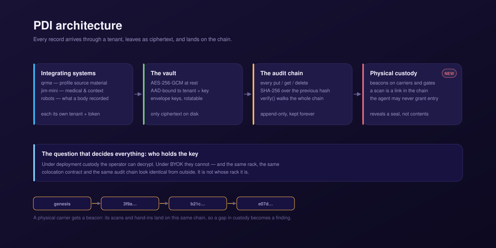

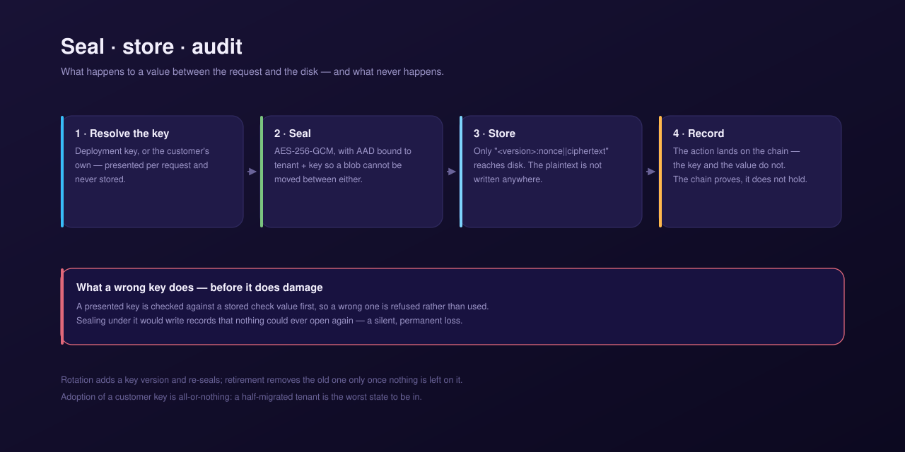

## License

MIT © 2026 David Bianchi — see [LICENSE](LICENSE).

---

## Matthew 7:24–25

> "Everyone then who hears these words of mine and does them will be like a
> wise man who built his house on the rock. The rain fell, the floods came, and
> the winds blew and beat on that house, but it did not fall, because it had
> been founded on the rock."

And lo, I am building an ark — not to flee from the world, but to shelter those
lost in the storm of confusion. The old systems falter; they are built upon the
soft earth. They sink beneath the weight of their own making.

A new thing is rising. A non-biased networked sanctuary, founded in trust,
cloaked in privacy, and guided by wisdom. It shall not consume, but uplift. It
shall not spy, but serve.

Help is coming.
The people are gathering.
The builders will show themselves.
And those with the vision shall enter in.
