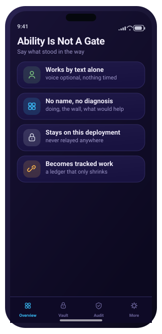

# PDI — screen gallery

The operator console in two form factors — the desktop dashboard and the
mobile console — one screen per capability of the vault. Each image is a
self-contained SVG.

## Console screens

The PDI operator console in two form factors — a **desktop dashboard** and a **mobile console** — one screen per capability of the vault, in the product's design language (Deep Indigo · Vault Cyan · Soft Silver, SF-style type, liquid-glass cards). It shares the night-indigo universe of QRME and JIM-mini with vault cyan as its accent — one world, three products. Every screen is a self-contained SVG (no fonts, images, or scripts) and maps to a real endpoint.

### Desktop dashboard

Wide, multi-panel operator views — sidebar nav, live tiles, the hash-chain audit table, and the encryption pipeline. Regenerate with `python3 docs/desktop/build.py`.

<table>
  <tr>
    <td align="center" width="50%"> <b>01</b> · Overview</td>
    <td align="center" width="50%"> <b>02</b> · Vault</td>
  </tr>
  <tr>
    <td align="center" width="50%"> <b>03</b> · Audit Log</td>
    <td align="center" width="50%"> <b>04</b> · Tenants & Access</td>
  </tr>
  <tr>
    <td align="center" width="50%"> <b>05</b> · Encryption & Keys</td>
    <td align="center" width="50%"> <b>06</b> · Deployment & Health</td>
  </tr>
</table>

The full capability set is **also rendered in the desktop frame**: every one of the 57 mobile screens below has a wide operator-console counterpart in [`docs/screens/desktop/`](docs/screens/desktop) — window chrome, left nav rail, right status rail — generated by the same `docs/screens/build.py`.

### Mobile console

The same system, glanceable on a phone. Regenerate with `python3 docs/screens/build.py`.

**The vault**

<table>
<tr>
<td align="center" width="25%"> <b>01</b> · Overview</td>
<td align="center" width="25%"> <b>02</b> · Vault</td>
<td align="center" width="25%"> <b>03</b> · Store a Record</td>
<td align="center" width="25%"> <b>04</b> · Encryption</td>
</tr>
</table>

**Tenants, access & intake**

<table>
<tr>
<td align="center" width="25%"> <b>05</b> · Tenants</td>
<td align="center" width="25%"> <b>06</b> · Create Tenant</td>
<td align="center" width="25%"> <b>07</b> · Access Control</td>
<td align="center" width="25%"> <b>10</b> · Contributions</td>
</tr>
</table>

**Audit & integrity**

<table>
  <tr>
    <td align="center" width="33%"> <b>08</b> · Audit Log</td>
    <td align="center" width="33%"> <b>09</b> · Verify Chain</td>
  </tr>
</table>

**Operations & deployment**

<table>
<tr>
<td align="center" width="25%"> <b>11</b> · Snapshot & Restore</td>
<td align="center" width="25%"> <b>12</b> · Deployment</td>
<td align="center" width="25%"> <b>13</b> · Key Management</td>
<td align="center" width="25%"> <b>17</b> · System Health</td>
</tr>
</table>

**Isolation, the promise & the tandem**

<table>
<tr>
<td align="center" width="25%"> <b>14</b> · Tenant Isolation</td>
<td align="center" width="25%"> <b>15</b> · Data Promise</td>
<td align="center" width="25%"> <b>16</b> · Your Data</td>
<td align="center" width="25%"> <b>18</b> · Tandem</td>
</tr>
<tr>
<td align="center" width="25%"> <b>19</b> · Design System</td>
</tr>
</table>

**First-run setup**

The first-run journey runs **23 Welcome → 22 Log In → 24 Key Setup → 25 Grant Access → 26 Connect Systems → 27 All Set**, then opens the console.

<table>
<tr>
<td align="center" width="25%"> <b>23</b> · Welcome</td>
<td align="center" width="25%"> <b>24</b> · Key Setup</td>
<td align="center" width="25%"> <b>25</b> · Grant Access</td>
<td align="center" width="25%"> <b>26</b> · Connect Systems</td>
</tr>
<tr>
<td align="center" width="25%"> <b>27</b> · All Set</td>
</tr>
</table>

**Operator session lifecycle**

<table>
  <tr>
    <td align="center" width="33%"> <b>20</b> · Sign In</td>
    <td align="center" width="33%"> <b>21</b> · Sign Out</td>
    <td align="center" width="33%"> <b>22</b> · Log In</td>
  </tr>
</table>

**Connectors — social platforms & AI-integrated apps**

<table>
<tr>
<td align="center" width="25%"> <b>28</b> · Connectors</td>
<td align="center" width="25%"> <b>29</b> · Connected Apps</td>
<td align="center" width="25%"> <b>30</b> · Compliance Transfers</td>
<td align="center" width="25%"> <b>31</b> · Secure Intake</td>
</tr>
<tr>
<td align="center" width="25%"> <b>32</b> · Files &amp; Photos</td>
<td align="center" width="25%"> <b>33</b> · Apple Intelligence</td>
<td align="center" width="25%"> <b>34</b> · Google Gemini</td>
<td align="center" width="25%"> <b>35</b> · Microsoft Copilot</td>
</tr>
<tr>
<td align="center" width="25%"> <b>36</b> · Robot Data Vault</td>
<td align="center" width="25%"> <b>37</b> · Custody Beacons</td>
<td align="center" width="25%"> <b>38</b> · Gate Agent</td>
<td align="center" width="25%"> <b>39</b> · Gate Agents</td>
</tr>
<tr>
<td align="center" width="25%"> <b>40</b> · Audit · overlay</td>
<td align="center" width="25%"> <b>41</b> · Console Guide</td>
<td align="center" width="25%"> <b>42</b> · Where It Lives</td>
<td align="center" width="25%"> <b>43</b> · The Corner Pane</td>
</tr>
<tr>
<td align="center" width="25%"> <b>44</b> · Choose a Home</td>
<td align="center" width="25%"> <b>45</b> · Request a Quote</td>
<td align="center" width="25%"> <b>46</b> · What Went Wrong</td>
<td align="center" width="25%"> <b>47</b> · Before Anything Is Sent</td>
</tr>
<tr>
<td align="center" width="25%"> <b>48</b> · Carriers</td>
<td align="center" width="25%"> <b>49</b> · Exchange</td>
<td align="center" width="25%"> <b>50</b> · Custody</td>
<td align="center" width="25%"> <b>51</b> · Bridges</td>
</tr>
<tr>
<td align="center" width="25%"> <b>52</b> · Guiding</td>
<td align="center" width="25%"> <b>53</b> · Continuity</td>
<td align="center" width="25%"> <b>54</b> · Operations</td>
<td align="center" width="25%"> <b>55</b> · Positions</td>
</tr>
<tr>
<td align="center" width="25%"> <b>56</b> · Settings</td>
<td align="center" width="25%"> <b>57</b> · Ability Is Not A Gate</td>
</tr>
</table>

**For enterprises:** PDI offers compliance-grade secure file transfer for corporations (carriers, healthcare, financial, public sector) — files sealed under HIPAA / OSHA / CPNI / PCI-DSS and more, with audited chain of custody and enforced retention, in both directions: outbound transfers and inbound secure intake from subscribers and partners. See [docs/enterprise.md](docs/enterprise.md).

